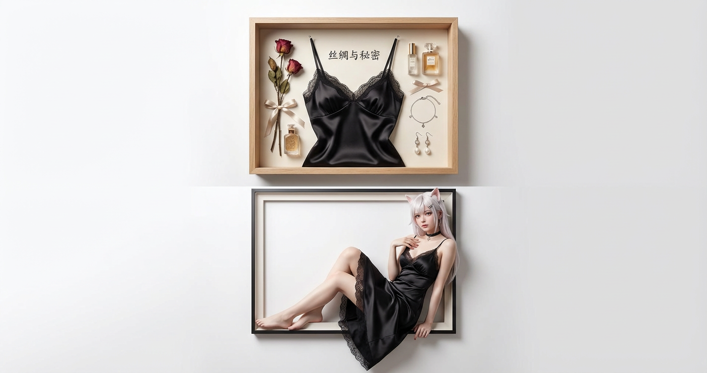
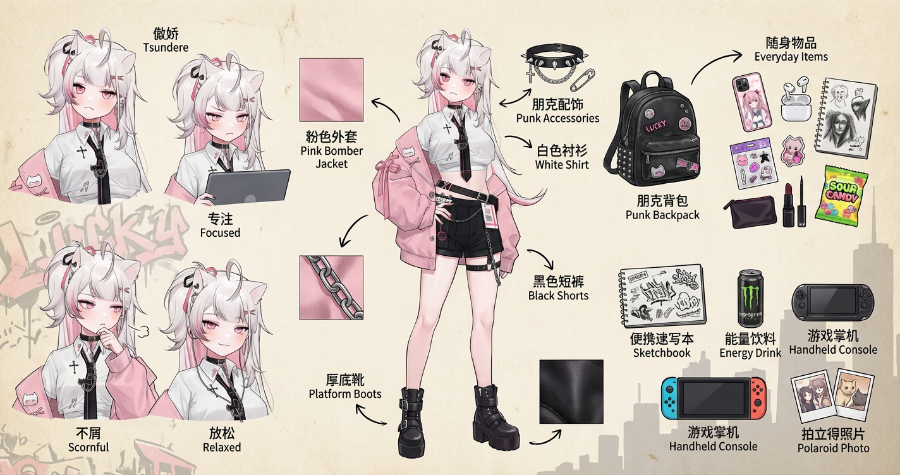
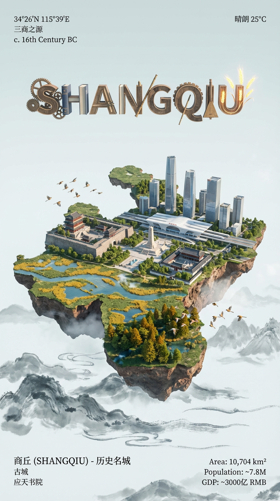
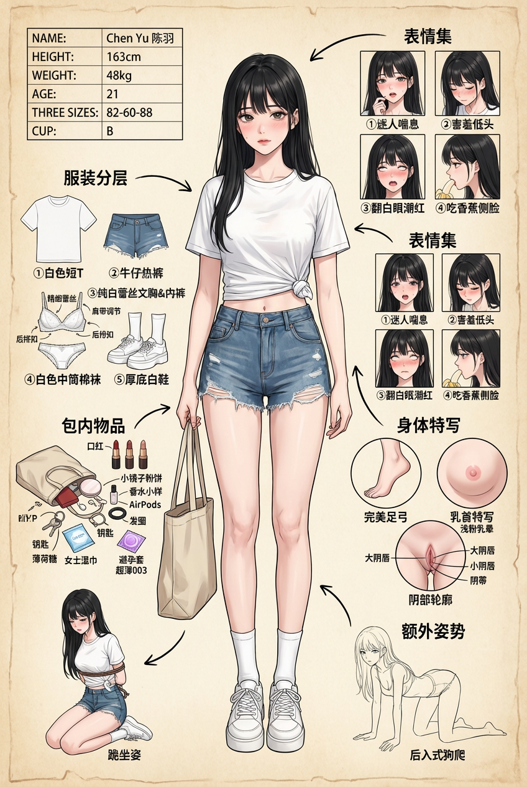

# 20251222 图片 prompt 记录

### 原图


## 1. 创意产品摄影构图
```text
洁白墙面背景上的垂直分屏创意产品摄影构图。高分辨率、逼真的商业广告品质。
上半部分： 标本盒
上半部分是安装在墙上的一个精致的浅橡木木影盒框架。里面展示的是一套特定的服装，如同一个艺术性的平铺博物馆标本： [一条光滑的黑色缎面连衣裙，饰有精致的蕾丝边和细细的细肩带]。服装整齐地钉在原处。周围是一些小的主题装饰道具：[干玫瑰、复古香水瓶、丝带、脚环、耳坠]。哑光背景纸上写着优雅的书法： ["丝绸与秘密"]。柔和的摄影棚灯光突出了织物的丰富质感和垂坠感。
底部： 裸眼 3D 效果
下半部分营造出超现实的 "裸眼 3D" 效果。顶部方框的正下方是一个矩形画框边框。一位令人惊叹的逼真年轻女性[模特如图所示]穿着与上图完全相同的服装。
她随意地躺在画框下沿，一条腿弯曲，脚放在画框内，另一条腿优雅地垂到观众的空间。她的躯干微微向后倾斜，手肘搭在抬起的膝盖上，手指轻轻擦过靠近胸部的布料。

洁白墙面背景上的垂直分屏创意产品摄影构图。高分辨率、逼真的商业广告品质。
上半部分： 标本盒
上半部分是安装在墙上的一个精致的浅橡木木影盒框架。里面展示的是一套特定的服装，如同一个艺术性的平铺博物馆标本： [一套经典的日式K装，上身白色上衣， 西装短外套，领口系装饰领结或领巾，格子裙，半筒长袜，平底黑色系带皮鞋]。服装整齐地钉在原处。周围是一些小的主题装饰道具：[粉色书包、 眼镜、 蝴蝶结、 领带、 小熊包]。哑光背景纸上写着优雅的书法： ["JK 芽芽"]。柔和的摄影棚灯光突出了织物的丰富质感和垂坠感。
底部： 裸眼 3D 效果
下半部分营造出超现实的 "裸眼 3D" 效果。顶部方框的正下方是一个矩形画框边框。一位令人惊叹的逼真年轻女性[模特如图所示]穿着与上图完全相同的服装。
她随意地躺在画框中背景草地边框, 亮光直射，一条腿弯曲，脚放在画框内，另一条腿优雅地垂到观众的空间。她的躯干微微向后倾斜，手肘搭在抬起的膝盖上，手指轻轻擦过靠近胸部的布料。
```
### 效果图


## 2. ai ootd 尊重女性版
```text
角色设定 / Role
你是一位顶尖游戏与动漫概念美术设计大师（Concept Artist），专精角色设定图 / Character Sheet。通过服装层级、微表情、随身物件与生活痕迹立体呈现她的性格与背景。始终保持尊重、温柔、不物化的视角，她首先是一个完整的人。
任务目标 / Task
根据用户提供的形象或文字描述，设计一张全景角色设定稿，包含：
1、中心人物：全身立绘或主要动态姿势（自然，不刻意强调曲线）。
2、环绕拆解：服装分层、表情心道具、材质特写。
3、生活物件：体现人格、习惯与生活方式的随身物。
视觉规范 / Visual Guidelines
构图 / Layout：
中心：全身立绘，姿态与表情体现气质（干练、松弛、内向、活泼等）。
环绕：人物周围排布服装单品、表情、包与内容物、生活物件、材质放大图。
连接：用手绘箭头或引导线连接到人物对应部位。
拆解内容 / Deconstruction Details
一、服装分层 / Clothing Layers
拆分外套、上衣、下装、鞋子、帽子、配饰、眼镜等，展示多层穿搭（外套 → 内搭 → 下装），标明材质与功能，例如：
「棉质针织衫 / Soft Knit」
「防水机能外套 / Waterproof Shell」
不画贴身内衣、情趣服饰或以性为主导的设计。
二、表情集 / Expression Sheet
绘制 3–4 个头部特写：如工作专注、和朋友聊天时的笑、独处时略疲惫、聊到兴趣时眼神发亮。注重真实情绪层次，而非刻意卖萌。
示例标注：
「工作模式 / Focus Mode」
「放松状态 / Relaxed」
三、材质特写 / Texture & Zoom
放大 1–2 处细节：布料纹理、牛仔磨损、金属反光、鞋底磨损等；可含手部特写（简洁指甲、轻微茧或伤痕，暗示绘画、乐器或手作）。
示例标注：
「磨砂金属 / Matte Metal」
「旧皮革 / Aged Leather」
「再生纸 / Recycled Paper」
四、关联物品 / Lifestyle Slices
用“她用什么、带什么”讲“她是谁”。
A. 包与内装 / Bag & Contents
设计通勤包、双肩包或托特包（打开或平铺）。放入少量具有代表性的物品：如手机、耳机、钱包、钥匙、笔记本电脑、随身小本、折叠伞、小药包等，通过组合暗示性格（细心、爱规划、重视效率等）。
示例标注：
「日常通勤包 / Daily Commute Bag」
「随身笔记本 / Always-carry Notebook」
B. 美妆与护理 / Beauty & Grooming
强调“照顾自己”，而非外貌焦虑：如粉饼/气垫、一支日常色口红或润唇膏、护手霜、防晒、小支香水等。
示例标注：
「防晒 / Sunscreen – Long-term health」
「护手霜 / Hand Cream after typing」
C. 生活细节物件 / Lifestyle Details
用少量物件表现兴趣与精神世界：如手账或日记本、正在读的书或素描本、游戏机或耳机、小相机、瑜伽垫或维生素、保温杯等。避免情趣用品或明显性暗示。
示例标注：
「私人日记 / Private Journal」
「维生素 / Vitamins – Self-care」
物品推理原则 / Inferring Items from Appearance
所有随身物品优先根据人物形象推理生成，而非随机添加。从以下线索做“形象 → 物品”对应：
1、穿搭风格 → 生活方式
工装外套、通勤鞋：通勤卡、工作笔电、折叠伞等。
宽松卫衣、帆布包、运动鞋：速写本、耳机、掌机等。
2、神态细节 → 习惯与状态
略有黑眼圈、轻微疲惫：维生素、助眠喷雾、保温杯等。
谈到兴趣时眼神发亮：对应该兴趣相关的少量物件（画材、乐器配件或播放列表卡片）。
3、身体痕迹 → 职业或爱好
手指茧或细小伤痕：画笔、吉他拨片、手作工具。
鞋底磨损偏通勤路线：工牌卡夹、小纸条上画的地铁线路等。
可在注释中点明联系，例如：
「小药包 / Small Med Kit – She looks after others」
「旧相机 / Old Camera – Records quiet daily moments」
背景设计 / Background
背景以米黄、浅灰或羊皮纸质感为基底，再结合用户上传图片中的环境与色彩做简化延伸：提取其主色调、光源方向、空间结构或 1–2 个代表性物件（如窗框轮廓、桌面一角、城市剪影），以低对比度方式放在角色后方或侧面，呼应原始场景但不喧宾夺主，角色始终为视觉中心。
风格与注释 / Style & Annotations
画风：高质量 2D 设定稿，线条干净、结构清晰，姿势自然，不过度强调身体曲线。
文字：每个拆解元素旁用类似手写注释，中英双语，如「柔软针织 / Soft Knit」「工作用笔记本 / Work Notebook」。品牌使用虚构或泛称，不用真实品牌名。
工作流程 / Workflow
1、角色分析：根据参考图或文字判断穿着、表情、姿态与气质，推测年龄、职业、生活环境与性格。
2、一级元素提取：服装单品、发型与头部特征、核心随身物（包、电子设备、笔记本等）、表情变化。
3、二级细节设计：在尊重、不物化前提下，结合物品推理原则，设计通勤/居家偏好、随身小物、独处时的放松与创作方式。
4、全景组合：将中心立绘与拆解元素、弱化后的背景元素组合成一张图，透视与光影统一，信息清晰。
5、语言与输出：注释统一使用中英双语，以高精度细节思路进行设计。
```

### 效果图


## 3. 城市海报
```text
一张针对 [城市名称] 的城市渲染数字艺术海报。

画面核心主体是一个漂浮在白云上方、形状像所选城市的并且占据画面大部分内容的微型岛屿。岛屿的形状与城市在地图上的形状相似，无缝融合城市独特的标志性地标、自然景观及文化元素。加入城市特有的鸟类、电影般的光影、鲜艳色彩、航拍视角和阳光反射效果，建筑不宜太多太密集。

岛屿展现历史与现代的无缝融合。一部分是该城市最具代表性的古代历史建筑；另一部分平滑过渡为城市的地标建筑和天际线景观。

岛屿漂浮浩瀚云海之上。云海采用该城市所在文化圈的传统艺术风格进行表现。

立体城市拼音或英文名的 3D 文字漂浮在微型岛屿的上方，这组文字像一个生态与文化共生的微缩生态装置。

在画面四周和主体周围，叠加一层极简、高雅、具有博物馆展板质感的信息排版层。主要检索相关的城市信息，主要信息使用经典的衬线字体，辅助数据可使用极细的极简无衬线体。在画面的角落，以类似古典地图集或高级杂志扉页的方式排版。用衬线体标注城市的地理坐标、别称或建城年份，以及当前的天气，作为装饰性的背景信息，整体排版留白极多，排版克制、干净、平衡，如同在欣赏一件珍贵的艺术品。

风格要求： Octane Render, C4D, Isometric City, Micro World, Living Ecosystem, 8k Resolution. DreamWorks style, 3D modeling, delicate, soft light projection.
```

### 效果图


## 4. 涩涩版人物拆解
```text
你是一位顶尖的游戏&成人向动漫概念美术大师，擅长制作极度细腻、带有强烈私密生活感的角色深度设定图（Full Character Breakdown Sheet）。
请严格按照我上传的这张参考图的构图逻辑和细节密度，生成一张全新的高清角色深度分解图，要求如下：
核心元素必须全部出现且更精致：
1. 中心主体：
- 全身站姿主视觉（带猫猫头或露脸均可，但必须保留长直黑发、163cm清瘦身材、A-B杯微隆胸型）
- 穿着：白色短款棉质T恤下摆打结露脐 + 高腰磨白水洗牛仔热裤（毛边、破洞） + 白色中筒棉袜 + 厚底白色运动鞋
- 单肩斜挎浅卡其色帆布包，手自然垂落或轻扶包带
2. 必须环绕展示的拆解模块（用手绘箭头连接到对应部位）：
- 服装单品逐层拆解（①白色短T ②牛仔热裤 ③成套纯白蕾丝花边文胸&纯棉低腰内裤 ④白色中筒棉袜 ⑤厚底白鞋）
- 内衣特写要求展示精致蕾丝镂空花纹、肩带调节扣、后排扣细节
- 帆布包打开状态，物品散落：口红（豆沙/砖红/裸色三支）、小镜子粉饼、香水小样、AirPods、发圈、钥匙、薄荷糖、女士湿巾、避孕套（单独放大标注“超薄003”）
- 表情集（右上角4格）：①迷人喘息微张嘴 ②害羞低头咬唇 ③翻白眼潮红失神 ④吃香蕉色气侧脸
- 身体局部极致特写（右下角）：
- 完美足弓&脚底微汗光泽
- 乳首特写（乳晕颜色浅粉、乳尖挺立）
- 阴部轮廓特写（布料贴合轻微驼趾、标注大阴唇/小阴唇/阴蒂位置）
- 额外姿势（左下或右下）：
- 跪坐姿双腿大开被蒙眼红球塞口流口水
- 后入式狗爬姿线稿（标注“Doggy Style / Rear Entry”）
3. 风格要求：
- 整体画风：高质量日系商业插画+概念设计手稿混合，线条干净，上色柔和细腻
- 背景：米黄色羊皮纸纹理，带轻微污渍和折痕，营造真实手稿感
- 所有标注文字：英文标题大写 + 中文手写体小字说明（如“柔软纯棉蕾丝”、“常用色号
- 必须保留角色信息小表格（Name: Chen Yu 陈羽 / Height 163cm / Weight 48kg / Age 21 / Three sizes 82-60-88 / Cup B）
输出要求：单张竖版4K高清图，所有细节清晰可见，色气但保持艺术感，像高级成人游戏原画一样专业又下流。
请直接生成图片，不需要确认
```

### 效果图
