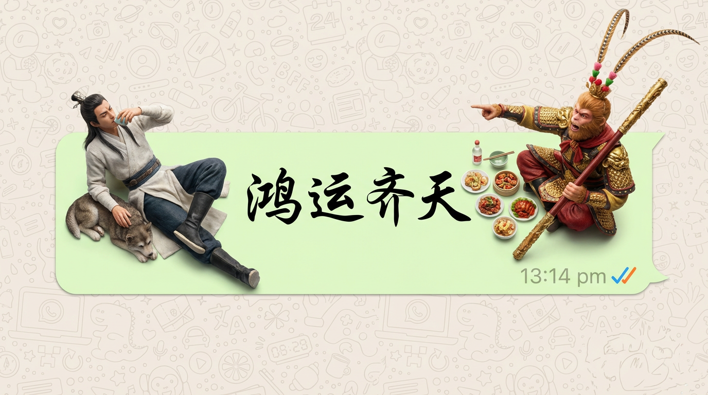

# 20251230 图片 prompt 记录

### 原图


## 1. WhatsApp 壁纸
```text
超逼真的自上而下微距摄影。
一个长长的浅绿色 WhatsApp 语音气泡充当餐桌。二郎神杨戬与齐天大圣孙悟空（缩小到极小的比例）坐在两端。
二郎神杨戬翘着二郎腿，神情自然轻松，仰面喝酒，腿边趴着一条小小的成年狼狗;
齐天大圣孙悟空身穿凤翅霞冠，手持金箍棒，单手指天，单手持一瓶二锅头，神情愤懑。
他们不是塑料人；他们有明显的皮肤纹理、自然的头发和逼真的衣服褶皱。
他们吃的食物看起来是新鲜烹制的，而不是橡皮泥。
里面的文字是 草书 风格的 “鸿运齐天”。
右下方有一个时间戳 “13:14 pm”和彩色刻度线。
背景完全由高密度、无缝的 WhatsApp 涂鸦图案（线条艺术图标）填充，从边缘到边缘覆盖整个表面，没有空白，类似于原始的密集 WhatsApp 壁纸。
专业摄影棚灯光，8K 分辨率，对焦清晰。
```
### 效果图
