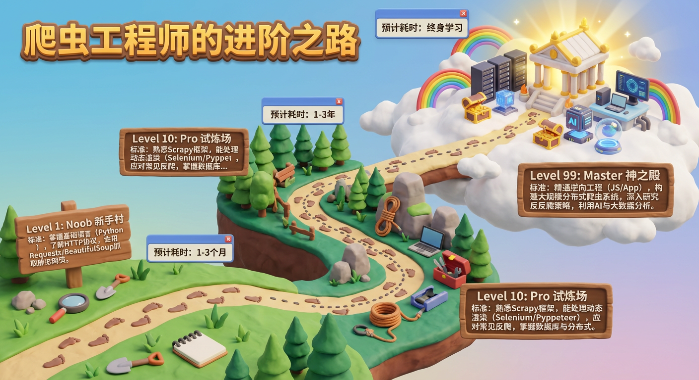
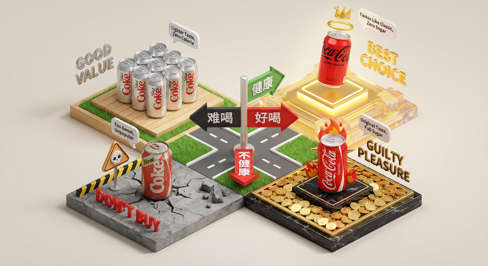
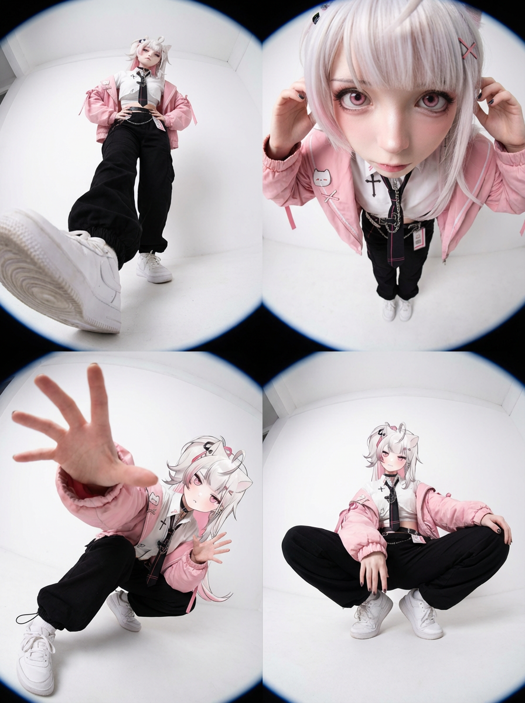
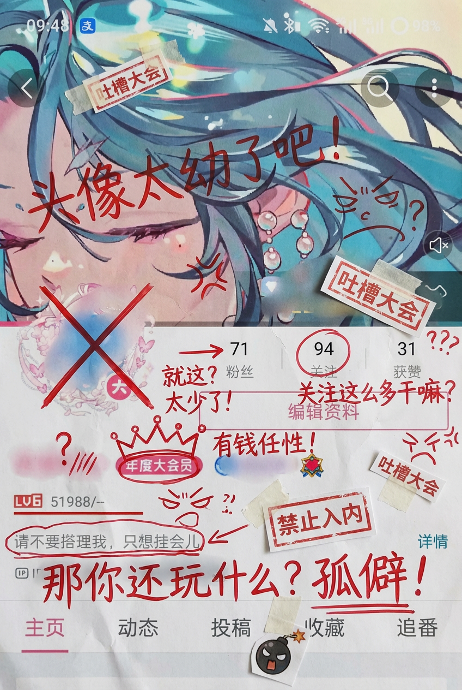

# 20251209 图片 prompt 记录

### 原图


## 1. 任何爱好或者职业的进阶之路
```text
基于主题 [爬虫工程师的进阶之路]，创作一张 3D 游戏关卡地图海报。

画面结构： 一条蜿蜒曲折的 3D 道路从画面底部延伸至顶部云端，分为三个主要的“关卡阶段”：

底部：新手村 (Level 1: Noob)
模型： 简单的草地场景。放置基础工具。
路标： 插着木牌，写着标题，下方用一段话介绍当前等级的标准。

中部：试炼场 (Level 10: Pro)
模型： 地形变得复杂（森林或岩石）。放置进阶装备。
视觉： 道路变得陡峭，象征难度增加。
路标： 插着木牌，写着标题，下方用一段话介绍当前等级的标准。

顶部：神之殿 (Level 99: Master)
模型： 漂浮在云端的辉煌神殿或高科技实验室。放置终极神器。
视觉： 发着金光，有彩虹或宝箱。
路标： 插着木牌，写着标题，下方用一段话介绍当前等级的标准。

数据与排版：路径线： 虚线连接各个阶段，上面有小脚印。

耗时/成本： 在每个阶段旁边，用游戏 UI 风格的浮窗显示“预计耗时”或“预计金币消耗”。

风格与渲染： 任天堂 (Nintendo) 风格的的粘土风。色彩鲜艳饱和。
```
### 效果图


## 2. 产品对比 4 象限图
```text
任务目标： 基于主题 [替换为主题名称]，创作一张中文 3D 四象限决策矩阵海报 (3D Decision Matrix)，需要先检索相关信息，然后再绘制，最后一定要输出结果图。
第一步：定义坐标轴 (Axes Definition)： 请根据主题自动设定两个冲突的评价维度（X轴和Y轴）：
例如饮料：X轴=难喝 -> 好喝；Y轴=不健康 -> 健康。
例如显卡：X轴=低性能 -> 高性能；Y轴=便宜 -> 昂贵。
第二步：象限分配与视觉风格 (Zone Allocation)： 画面是一个被十字路口分割开的方形微缩地台，分为四个各具特色的区域：
右上角：【神级/完美区】 (The God Tier)
含义： 高性能+便宜 / 好喝+健康。
模型： 放置该主题下最受好评的 1-2 个产品。
视觉： 地台是发光的、神圣的，模型自带光环或皇冠，材质极其精致通透。
标签： 悬浮金色文字 "BEST CHOICE"。
右下角：【奢侈/刺客区】 (The Luxury/Premium)
含义： 高性能+昂贵 / 好喝+不健康。
模型： 放置该主题下极其昂贵或极端属性的产品。
视觉： 地台铺满金币或黑金质感。模型看起来很华丽但带有“危险感”（如火焰、尖刺或价签符号）。
标签： 悬浮文字 "EXPENSIVE" 或 "GUILTY PLEASURE"。
左上角：【平民/性价比区】 (The Budget/Value)
含义： 性能一般+便宜 / 口味一般+健康。
模型： 放置该主题下最普及的大众产品。
视觉： 地台是干净的素色（如木质、草地）。模型造型朴素、实用，堆叠数量较多（代表销量大）。
标签： 悬浮文字 "GOOD VALUE"。
左下角：【避雷/智商税区】 (The Trap/Trash)
含义： 性能差+昂贵 / 难喝+不健康。
模型： 放置该主题下口碑最差的产品。
视觉： 地台呈现灰色、荒芜或警告色。模型看起来有点粗糙、甚至带有“骷髅”或“警告”标志的 Q 版装饰。
标签： 悬浮红色文字 "WARNING" 或 "DON'T BUY"。
画面布局与数据层：
视角： 45 度等轴测俯视 (Isometric)，可以看清四个区域的分布。
中心点： 十字交叉点矗立着两个巨大的 3D 文字路牌，分别指示 X 轴和 Y 轴的含义。
数据气泡： 每个模型上方都有一个小气泡，写着简短的评价关键词（如：No Sugar, Overpriced, Laggy）。
风格与渲染：
整体风格： 像是一个“大富翁”棋盘地图。
材质： 粘土与树脂混合的盲盒玩具质感。色彩鲜明，通过颜色区分四个区域的情绪（金/红/绿/灰）。
```
### 效果图


## 3. 四宫格街拍
```text
极端广角视角与动态姿势的重混编辑。
这是一张「在原图基础上进行编辑」的图片，而不是一个全新的角色。
生成画面：
生成一张画面为竖版3:4比例，单张图固定四宫格布局，每个格子为独立镜头。
请将原始图像作为严格参考，用于：
– 人物的身份、发型以及整体穿衣风格
– 背景与场景的大体类型（同一条街道、同一个房间、同一片海滩、同一种建筑环境等）
你可以完全改变相机机位、角度和姿势，但必须保持：
– 场景仍在相同地点
– 人物和服装设计保持一致
相机与视角：
– 使用超广角或鱼眼感的镜头（大约等效全画幅 12–18mm 的观感）
– 相机角度必须与原图有显著变化，可以使用的夸张机位包括：
• 从正下方向上看的仰视视角
• 从正上方向下看的俯视视角
• 贴近地面的超低机位
• 从上往下的高机位
• 倾斜的「荷兰角度」构图
– 始终营造强烈的透视缩短效果：离镜头最近的身体部位显得巨大，其余身体在透视中向远处延伸
– 最终效果必须像一张大胆的时尚或街拍照片，完全写实，而不是插画或二次元风格
靠近镜头的身体部位（1–2 个，有时 3 个）：
– 每一张编辑图中，选择一到两个主要身体部位极度靠近镜头（在更复杂的姿势中，有时可以是三个）
– 在不同图像之间要变化这些部位，不要总是同一个地方靠近镜头
– 可以靠近镜头的身体部位包括：
• 一只或两只手 / 手指向镜头伸出
• 一只或两只脚 / 鞋子 / 靴子贴近镜头
• 膝盖或大腿
• 脸部非常靠近镜头
• 在前倾姿态中靠近镜头的肩膀或胸部
– 选中的身体部位应当极度接近镜头，几乎要碰到镜头，可清晰看到皮肤纹理、布料纹理和真实的广角畸变
姿势与整体身体（复杂且多变）：
– 创造与极端视角相匹配的强烈、酷炫、充满动感的姿势
– 随机使用不同类型的姿态，包括：
• 站立姿势中，一条腿或一只手朝镜头伸出
• 蹲下或贴地半蹲
• 坐在地面上或坐在物体上
• 平躺在地面上，腿或脚朝向镜头
• 身体大幅向前探向镜头
• 扭转躯干、交叉双腿或弓起背部，形成更具动感的身体线条
– 允许使用复杂姿势，例如：
• 两只手都靠近镜头，摆出手势（比耶、三角形、用手指做画框、指向观者等）
• 双脚都朝向镜头
• 一只手和一只脚同时作为前景的大型元素
• 脸部靠近镜头，同时手或脚也在透视关系中出现
– 即使在极端透视缩短下，也要保持合理可信的人体结构
机位与态度（随机化）：
– 随机改变相机角度与方向（朝上、朝下、侧向、倾斜构图），同时保持画面构图视觉上平衡、有冲击力
– 气质保持酷、从容，自信，偏向时尚大片或街头风格，具体依照原始穿搭气质
– 面部表情可以变化（严肃、俏皮、自信、神秘等），但必须始终看起来是同一个人
光线与画面渲染：
– 保持真实的阴影以及与地面 / 地板的接触关系
– 高分辨率与清晰细节，能看到皮肤纹理、布料纹理以及材质高光
变化与随机性：
– 每一张小图都应当与其他小图有明显区别，在以下方面保持多样化：
• 相机角度
• 姿势类型
• 哪些身体部位最靠近镜头
• 构图方向（正向、倾斜、俯视、仰视等）
– 避免一再重复完全相同的「单脚贴近镜头」构图，要呈现丰富多样的动态姿势和机位变化
严格规则：
– 不要把人物换成别人
– 不要改变服装类型；只能通过姿势、视角以及衣物的自然运动来改变表现方式
– 不要把场景移动到指定经纬度以外的地点；始终保持在指定经纬度地点的合理延展范围内
– 不要添加文字、标志、水印或图形设计元素
– 不要改成油画、插画或动漫风格；必须保持照片级写实效果
```

### 效果图


## 4. 资料页吐槽
```text
生成图片，把它打印出来，然后用红墨水疯狂地加上手写中文批注、涂鸦、乱画，如果你想的话，检索这个账户内容，涂鸦的内容主要为吐槽他，还可以加点小剪贴画
```
### 效果图

