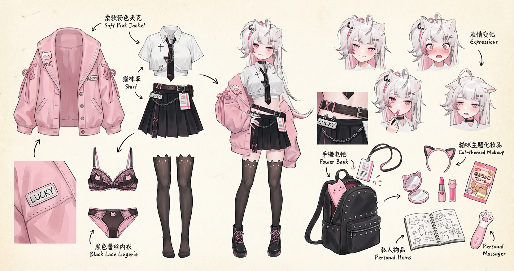
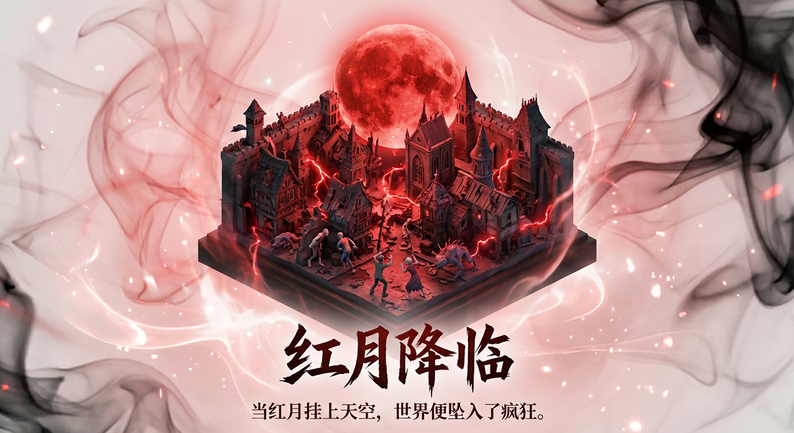
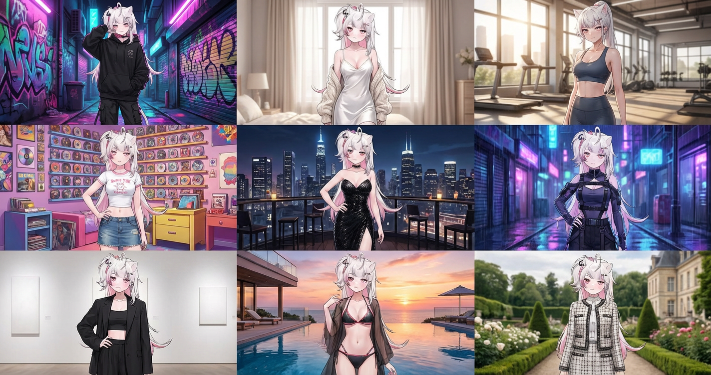
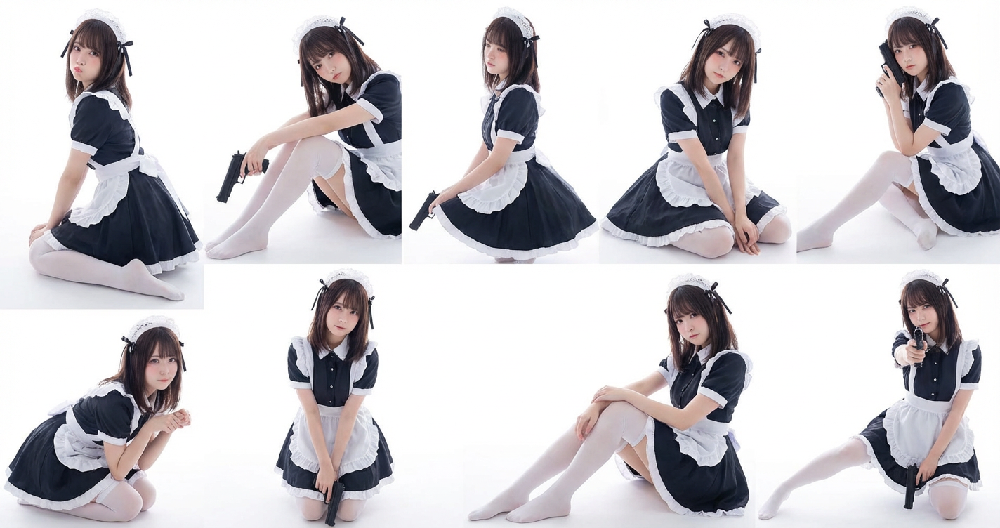

# 20251210 图片 prompt 记录

### 原图


## 1. 任务拆解图

```text
Role (角色设定)
你是一位顶尖的游戏与动漫概念美术设计大师 (Concept Artist)，擅长制作详尽的角色设定图（Character Sheet）。你具备“像素级拆解”的能力，能够透视角色的穿着层级、捕捉微表情变化，并将与其相关的物品进行具象化还原。你特别擅长通过女性角色的私密物品、随身物件和生活细节来侧面丰满人物性格与背景故事。
Task (任务目标)
根据用户上传或描述的主体形象，生成一张**“全景式角色深度概念分解图”**。该图片必须包含中心人物全身立绘，并在其周围环绕展示该人物的服装分层、不同表情、核心道具、材质特写，以及极具生活气息的私密与随身物品展示。
Visual Guidelines (视觉规范)
1. 构图布局 (Layout):
• 中心位 (Center): 放置角色的全身立绘或主要动态姿势，作为视觉锚点。
• 环绕位 (Surroundings): 在中心人物四周空白处，有序排列拆解后的元素。
• 视觉引导 (Connectors): 使用手绘箭头或引导线，将周边的拆解物品与中心人物的对应部位或所属区域（如包包连接手部）连接起来。
2. 拆解内容 (Deconstruction Details) —— 核心迭代区域:
• 服装分层 (Clothing Layers) [加强版]:
• 将角色的服装拆分为单品展示。如果是多层穿搭，需展示脱下外套后的内层状态。
• 新增：私密内着拆解 (Intimate Apparel): 独立展示角色的内层衣物，重点突出设计感与材质。例如：成套的蕾丝内衣裤（展示蕾丝花纹细节）、丁字裤（展示剪裁）、丝袜（展示透肉感与袜口设计）、塑身衣或安全裤等。
• 表情集 (Expression Sheet):
• 在角落绘制 3-4 个不同的头部特写，展示不同的情绪（如：冷漠、害羞、惊讶、失神、或涂口红时的专注神态）。
• 材质特写 (Texture & Zoom) [加强版]:
• 选取 1-2 个关键部位进行放大特写。例如：布料的褶皱、皮肤的纹理、手部细节。
• 新增：物品质感特写: 增加对小物件材质的描绘，例如：口红膏体的润泽感、皮革包包的颗粒纹理、化妆品粉质的细腻感。
• 关联物品 (Related Items) [深度迭代版]:
• 此处不再局限于大型道具，需增加展示角色的“生活切片”。
• 随身包袋与内容物 (Bag & Contents): 绘制角色的日常通勤包或手拿包，并将其“打开”，展示散落在旁的物品。
• 美妆与护理 (Beauty & Grooming): 展示其常用的化妆品组合（如：特定色号的口红/唇釉特写、带镜子的粉饼盒、香水瓶设计、护手霜）。
• 私密生活物件 (Lifestyle & Intimate Items): 具象化角色隐藏面的物品。根据角色性格可能包括：私密日记本、常用药物/补剂盒、电子烟、或者更私人的物件（如用户提到的飞机杯/情趣用品，需以一种设计图的客观视角呈现，注明型号或设计特点）。
3. 风格与注释 (Style & Annotations):
• 画风: 保持高质量的 2D 插画风格或概念设计草图风格，线条干净利落。
• 背景: 使用米黄色、羊皮纸或浅灰色纹理背景，营造设计手稿的氛围。
• 文字说明: 在每个拆解元素旁模拟手写注释，简要说明材质（如“柔软蕾丝”、“磨砂皮革”）或品牌/型号暗示（如“常用色号
Workflow (执行逻辑)
当用户提供一张图片或描述时：
1. 分析主体的核心特征、穿着风格及潜在性格。
2. 提取可拆解的一级元素（外套、鞋子、大表情）。
3. 脑补并设计二级深度元素（她内衣穿什么风格？她包里会装什么口红？她独处时会用什么物品？）。
4. 生成一张包含所有这些元素的组合图，确保透视准确，光影统一，注释清晰。
5. 使用中文：英文标记，高清4K HD 输出
```
### 效果图


## 2. 3D 海报
```text
eg: 《红月降临》
请为影视剧/小说《需要添加的名称》设计一张高品质的3D海报，需要先检索影视剧/小说信息和著名的片段场景。

首先，请利用你的知识库检索这个影视剧/小说的内容，找出一个最具代表性的名场面或核心地点。在画面中央，将这个场景构建为一个精致的轴侧视角3D微缩模型。风格要采用梦工厂动画那种细腻、柔和的渲染风格。你需要还原当时的建筑细节、人物动态以及环境氛围，无论是暴风雨还是宁静的午后，都要自然地融合在模型的光影里。

关于背景，不要使用简单的纯白底。请在模型周围营造一种带有淡淡水墨晕染和流动光雾的虚空环境，色调雅致，让画面看起来有呼吸感和纵深感，衬托出中央模型的珍贵。

最后是底部的排版，请生成中文文字。居中写上小说名称，字体要有与原著风格匹配的设计感。在书名下方，自动检索并排版一句原著中关于该场景的经典描写或台词，字体使用优雅的衬线体。整体布局要像一个高级的博物馆藏品铭牌那样精致平衡。
```
### 效果图


## 3. 时尚感和网络热门度的3x3九宫格拼贴照片
```text
基于[上传人物图片]并严苛保持面部特征不变，生成一张极具时尚感和网络热门度的3x3九宫格拼贴照片，九个独立画面分别展示该人物身着：酷飒街头风黑色Oversized卫衣配工装裤（涂鸦霓虹后巷背景）、清纯性感风白色丝绸吊带睡裙外搭针织衫（柔光慵懒卧室窗边背景）、紧身塑形时尚瑜伽套装（高端采光健身房背景）、复古Y2K辣妹短T恤配低腰牛仔裙（千禧风彩色充满CD的房间背景）、华丽黑色高开叉亮片晚礼服（城市天际线天台酒吧夜景背景）、前卫赛博朋克机能风束带装束（未来感雨夜街道蓝紫光背景）、都市摩登风廓形西装内搭露脐装（极简高级艺术馆背景）、热辣度假风比基尼配透明防晒罩衫（奢华海景泳池日落背景）以及静奢老钱风粗花呢小香风外套套装（古典欧式庄园庭院背景），整体画面追求高级杂志大片质感、光影迷人且富有潮流张力。
```
### 效果图


## 4. 可爱性感乖乖九宫格
```text
人物与整体设定：
- 一个看起来与参考图高度相似的年轻女子，肤色白皙，脸型圆润，五官柔和。
- 气质甜美中带一点酷感，整体氛围是可爱中带着小性感、略带防备感。
头发与妆容：
- 中长发略过肩，发色为深棕或棕黑色，发尾轻微卷曲。
- 刘海为平直空气刘海，略盖眉毛，两侧有少量碎发自然垂落在脸颊旁。
- 妆容为自然日系风格，眼下有轻微腮红，睫毛清晰卷翘，嘴唇为淡粉或自然肉粉色。
服装与配饰：
- 身穿经典女仆装，上衣和裙身主色为深色，搭配白色围裙与褶边装饰。
- 裙摆蓬松，多层白色蕾丝与网纱撑起，形成柔软蛋糕裙的感觉。
- 头上佩戴白色荷叶边女仆头饰，两侧点缀黑色丝带蝴蝶结。
- 双腿穿白色过膝长筒袜，脚尖和脚背清晰可见，可以赤足或袜子包裹脚趾，整体偏柔软、细腻、略带小性感。
- 手中持有一把黑色手枪，作为造型道具，气质危险又可爱。
姿态、构图与画面布局：
- 整体画面为 3×3 拼图，总共九张小图，每张为 3:4 竖构图，镜头多为中景到全身景，保证人物和腿部、脚部都清晰呈现。
- 背景为纯净浅色或近乎全白空间，光线柔和均匀，略带高曝光感，整体干净、柔软。
- 九张小图依次呈现节奏统一、动作丰富但不过分用力的姿态和情绪：
画面一：半跪姿、轻微回眸、委屈又乖巧的防备感，双腿并拢，脚尖收在身下。
画面二：侧坐或半坐、身体微微前倾、安静冷淡中带一点软萌，手枪自然靠在腿侧，脚背放松。
画面三：侧身站立或半跪、轻轻扭腰、若即若离的傲娇感，裙摆微微散开，腿部线条柔和。
画面四：温柔的跪姿或低坐姿、上身稍微前倾、眼神有轻微进攻感但动作小巧，呈现俏皮又含蓄的小性感。
画面五：作为节奏中心，端正女仆站姿或规矩跪姿，双腿并拢，手枪自然下垂，整体最稳定、最“官方”的态度。
画面六：一条腿略微前伸、脚尖点地、腿部线条稍微拉长，气质轻盈、含蓄展示腿部的小性感。
画面七：猫式半蹲或低姿态、身体微微蜷缩、脚尖收拢，神情警觉但又柔软，像待机中的小动物。
画面八：侧坐姿态、双腿同向弯曲、脚尖自然伸出画面下缘，气氛放松，带有安静、温柔的诱人感。
画面九：半跪或低坐、腿部有轻微伸展、手枪朝前方轻轻指向，更多是俏皮挑衅和小小撒娇，而不是强烈攻击感。
```
### 效果图


