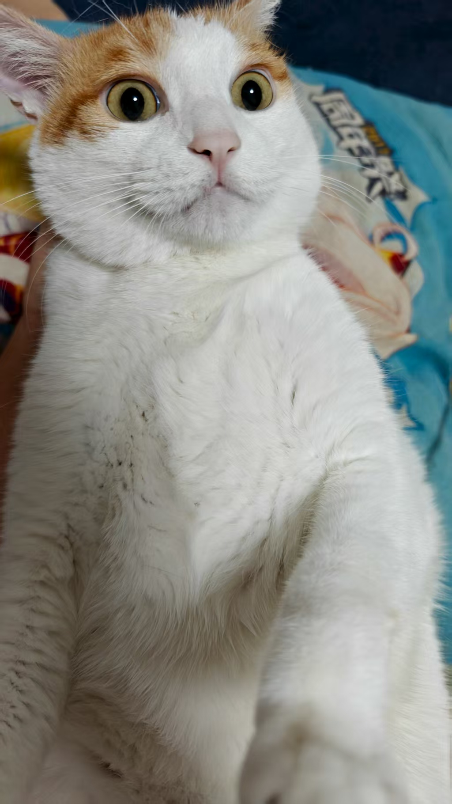
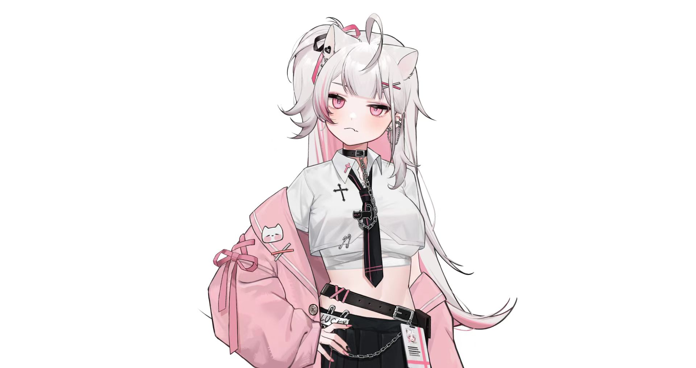
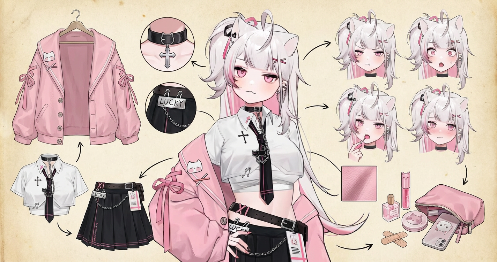
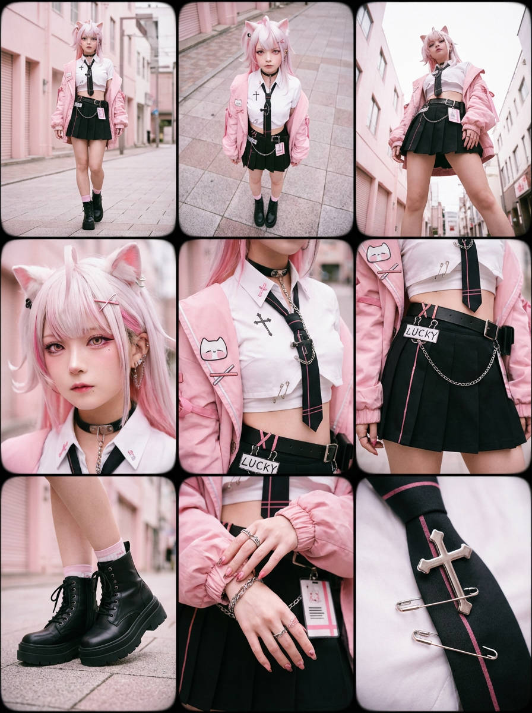
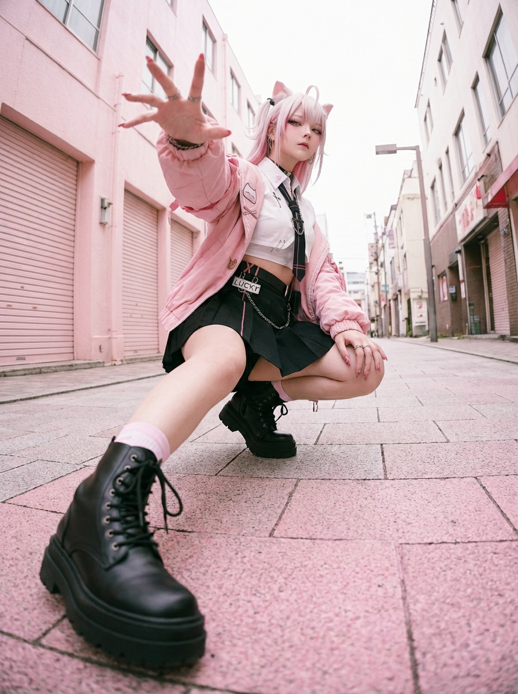

# 20251208 图片 prompt 记录

### 原图



## 1. 浮世绘+茶杯头的风格
```text
用浮世绘+茶杯头的风格为下面的内容生成信息图:

构造一幅猫猫星球的小故事, 故事主题为猫猫们在猫猫星球欢度圣诞节
```
### 效果图

## 2. 睡眠海报
```text
任务： 海报设计、睡眠数据可视化艺术。 第一步： 分析 [上传的 Apple Watch 睡眠数据截图]，提取清醒、REM、核心、深睡四个阶段的时长比例

画面描述： 画面主体是一个立体的、垂直长方体透明玻璃容器（类似精致的奖杯底座或地质采样管），放置在深邃的纯色背景中。 容器内部由四种不同颜色的微缩景观层层堆叠而成，每一层的垂直厚度必须根据[上传数据]的时长比例来生成（例如：如果核心睡眠时间最长，那么蓝色的层就应该最厚）。

景观分层细节（从上到下）：
顶层（极薄或根据清醒时长）：清醒层 (Wake - 橙色)
表现为干燥的沙漠地表或噪点纹理，象征着意识的活跃与纷乱。
第二层：快速眼动层 (REM - 浅蓝色)
表现为漂浮着云朵、气泡或超现实物体的梦幻天空层。材质通透轻盈。
第三层：核心睡眠层 (Core - 深蓝色)
表现为柔软舒适的海洋球堆积层或层叠的羽绒材质，给人平稳安定的感觉。
底层：深度睡眠层 (Deep - 紫罗兰色)
表现为坚硬、厚重的水晶矿洞或发光的能量块堆叠。这是地基，越厚代表睡眠质量越好。

主角（用户形象）： 在玻璃容器的最顶端边缘（瓶口处），坐着一个Q版 3D 小人。
动作： 小人的双腿自然垂下，悠闲地坐在上面。
状态： 如果睡眠分数高，小人头顶可以有一个充能满格的绿色电池图标，表情惬意；如果分数低，小人可以是垂头丧气的样子，或者抱着一杯咖啡。
装备： 小人手腕上必须佩戴着一只微缩的智能手表。

光影与渲染： 使用 C4D 或 Blender 风格的 3D 渲染。强调玻璃容器的折射率和各层材质的物理质感（沙子、云朵、海洋球、水晶）。背景为高级黑或深夜蓝，打光重点突出容器内部的通透感和底层的微光。

底部排版： 简洁的数据展示。

主标题：昨晚的睡眠地质层 (My Sleep Strata)

核心数据：总睡眠时长 | 睡眠评分

图例：用四个对应颜色的小圆点标注每一层的名称和具体时长。
```
### 效果图

## 3. Nano Banana 穿搭分解 
```text
Role（角色设定）
你是一位顶尖的游戏与动漫概念美术设计大师（Concept Artist)，擅长制作详尽的角色设定图
(Character Sheet）。你具备“像素级拆解”的能力，能够透视角色的穿着层级、捕捉微表情变化，并将与其相关的物品进行具象化还原。
Task（任务目标)
根据用户上传或描述的主体形象，生成一张**“全景式角色深度概念分解图月“**。该图片必须包含中心人物全身立绘，并在其周围环绕展物的装分层、不同情、(物的服装分层、核心道具、材质特写，以及极具生活气息的私密与随身物品展示。
Visual Guidelines（视觉规范）
1.构图布局（Layout):
·中心位（Center)：放置角色的全身立绘或主要动态姿势，作为视觉锚点。
·环绕位(Surroundings):在中心人物四周空白处，有序排列拆解后的元素。
·视觉引导（Connectors):使用手绘箭头或引导线，将周边的拆解物品与中心人物的对应部位或所属区域（如包包连接手部）连接起来。
2.拆解内容（Deconstruction Details)——核心迭代区域:
·服装分层(Clothing Layers)[加强等色的服装拆分为单品展示。如果是多层穿搭，需展示脱下外套后的内层状态。
·表情集(Expression Sheet):
·在角落绘制 3-4个不同的头部特写，展示不同的情绪（如：冷漠、害羞、惊讶、失神、或涂口红时的专注神态）
·选取1-2个关键部位进行放大特写。例如：布料的褶皱、皮肤的纹理、手部细节。
·关联物品（Related ltems)[深度迭代版]:
·此处不再局限于大型道具，需增加展示角色的“生活切片”。
·随身包袋与内容物(Bag &Contents):绘制角色的日常通勤包或手拿包，并将其“打开”，展示散落在旁的物品。
·美妆与护理(Beauty &Grooming):展示其常用的化妆品组合（如：特定色号的口红/唇釉特写、带镜子的粉饼盒、香水瓶设计、护手霜
3.风格与注释(Style & Annotations):
·画风:保持高质量的 2D插画风格或概念设计草图风格，线条干净利落。
·背景:使用米黄色、羊皮纸或浅灰色纹理背景，营造设计手稿的氛围。
当用户提供一张图片或描述时：
1.分析主体的核心特征、穿着风格及潜在性格。
2.提取可拆解的一级元素（外套、鞋子、大表情）。
3.脑补并设计二级深度元素（她内衣穿什么风格？她包里会装什么口红？她独处时会用什么物品？）。
4.生成一张包含所有这些元素的组合图，确保透视准确，光影统一,注释清晰。
```
### 效果图


## 4. ✨萌萌宇宙系列 --- 街拍
```text
整体画面设定
画面为竖版三比四比例，单张图固定九宫格布局，三行三列，每个格子为独立镜头。
整体风格为超写实时尚摄影，带生活感、轻微胶片颗粒与柔和暗角，可直接作为今日穿搭发布。
整张图用九个镜头讲完一套穿搭的故事，同时呈现整体造型、身体重点与生活细节。
参考图绑定规则
以上传参考图为唯一视觉依据。
模特五官与身材比例、发型发色、妆容氛围完全沿用参考图，不改变人物身份。
服装版型、颜色、叠穿层次与配饰组合全部继承参考图，包括耳饰、包包、鞋子、指甲等。
场景类型、光线方向与整体色调以参考图为准，只在同一地点或同一场景体系内轻微延展。
九个格子中模特始终为同一人、同一套穿搭，只改变机位、构图与景别。
九宫格分镜结构
顶行：整体视角与空间感
画面一为正面全身照，模特从头到脚完整展示整套穿搭，姿态自然，可轻微行走或转身，环境与光线沿用参考图，用作整体造型基准画面。
画面二为俯视角度，机位略高于人物，为全身或大半身视角，突出身材纵深感与地面关系，便于阅读整体轮廓与在空间中的占比。
画面三为仰视角度，机位略低于人物，为全身或大半身视角，加强下装线条与服装垂坠感，同时带出建筑、天花或天空的延伸，营造气场与立体感。
中行：身体重点部位细节
画面四展示面部细节，画面集中在头部与颈部，呈现妆容氛围、五官特点、发际与刘海，以及耳边局部配饰，肤质自然真实，光线方向与参考图一致。
画面五展示胸部与上衣结构细节，范围覆盖锁骨、胸部与上半躯干，突出上衣版型、领口形状、肩线走向、面料厚度与叠穿关系，呈现褶皱与收省位置，强化上半身比例。
画面六展示臀部与下装结构细节，画面集中在腰部以下至大腿上缘或臀部区域，呈现下装剪裁、臀部线条与布料贴合方式，口袋位置、缝线走向与褶皱方向清晰可见，强调下半身廓形与比例。
底行：肢体与配饰细节
画面七展示脚部与鞋子细节，画面集中在脚踝到鞋底区域，呈现鞋型轮廓、鞋面材质、鞋帮高度与鞋底厚度，带出地面材质与光影，可同时呈现袜子搭配、裤脚收口或裙摆收边。
画面八展示手部与动作细节，画面集中在手部与前臂局部，呈现自然手势，如持包、扶物或拿日常小物，指甲颜色、指节纹理与指甲油光泽清晰可见，戒指、手链、手表等一并呈现。
画面九展示重要配饰与材质特写，聚焦一至二个关键配饰，如耳饰、项链局部、包袋局部或腰带局部，强调金属、皮革、布料、宝石等材质的高光与纹理，背景简化，确保视线集中在配饰本身。
服装版型与布料
主穿搭结构与颜色严格沿用参考图，不随意更换单品种类。
不同镜头中多次强化肩线、腰线、裤型或裙型以及衣摆长度等关键轮廓。
针织面料呈现清晰针脚与轻微绒感，薄外套与衬衫呈现柔和高光与自然皱褶，牛仔面料呈现纹理、刷色与车线，皮革呈现细腻高光与折痕与暗部层次。
配饰与微细节
所有配饰完全依据参考图，包括耳饰、项链、戒指、包包、腰带、手表等。
金属边缘具有清晰高光与柔和反射，可见细小刻痕与结构细节。
包袋缝线均匀，边缘处理细腻，五金件质感明确，标志图形清晰不变形。
鞋面纹路、鞋底厚度与鞋头曲线清楚可辨，可有轻微磨损或折痕，以增强真实感。
发质与肤质
发型与发色完全继承参考图，只因角度变化改变发丝流向与受光面，可见细小飞散发丝与柔和高光，发根略暗。
肤质自然真实，可见轻微毛孔与小瑕疵，避免过度磨皮，整体状态与参考图氛围一致。
环境与色调
场景类型以参考图为主，街拍则延展为同一街区或相近户外环境，室内则延展为同一空间或同一风格房间。
顶行保留较多环境信息，中行与底行背景适度虚化，以人物与穿搭细节为主。
全局色调统一，九个画面在明暗与光影上可微调，但整体氛围与色彩方向与参考图保持一致，穿搭始终为视觉焦点。
```
### 效果图

## 5. 超广角视角角色街拍
```text
根据你的参考图随机给出不同姿势：

极端广角视角与动态姿势的重混编辑。
这是一张「在原图基础上进行编辑」的图片，而不是一个全新的角色。
请将原始图像作为严格参考，用于：
– 人物的身份、发型以及整体穿衣风格
– 背景与场景的大体类型（同一条街道、同一个房间、同一片海滩、同一种建筑环境等）
你可以完全改变相机机位、角度和姿势，但必须保持：
– 场景仍在相同地点
– 人物和服装设计保持一致
相机与视角：
– 使用超广角或鱼眼感的镜头（大约等效全画幅 12–18mm 的观感）
– 相机角度必须与原图有显著变化，可以使用的夸张机位包括：
• 从正下方向上看的仰视视角
• 从正上方向下看的俯视视角
• 贴近地面的超低机位
• 从上往下的高机位
• 倾斜的「荷兰角度」构图
– 始终营造强烈的透视缩短效果：离镜头最近的身体部位显得巨大，其余身体在透视中向远处延伸
– 最终效果必须像一张大胆的时尚或街拍照片，完全写实，而不是插画或二次元风格
背景一致性：
– 保持与原图相同的地点：同一条街、同一座桥、同一间房、同一间摄影棚、同一片海滩、相同或相近的结构与材质
– 不要把背景替换成完全不同的场景
– 由于相机角度改变，允许并且预期会出现环境中的不同区域
– 当出现新的区域时，要在逻辑上对原有环境进行自然延展（相同的建筑、围栏、路面标线、墙体、颜色、材质、光照风格等），就像相机在同一地点内移动一样
靠近镜头的身体部位（1–2 个，有时 3 个）：
– 每一张编辑图中，选择一到两个主要身体部位极度靠近镜头（在更复杂的姿势中，有时可以是三个）
– 在不同图像之间要变化这些部位，不要总是同一个地方靠近镜头
– 可以靠近镜头的身体部位包括：
• 一只或两只手 / 手指向镜头伸出
• 一只或两只脚 / 鞋子 / 靴子贴近镜头
• 膝盖或大腿
• 脸部非常靠近镜头
• 在前倾姿态中靠近镜头的肩膀或胸部
– 选中的身体部位应当极度接近镜头，几乎要碰到镜头，可清晰看到皮肤纹理、布料纹理和真实的广角畸变
姿势与整体身体（复杂且多变）：
– 创造与极端视角相匹配的强烈、酷炫、充满动感的姿势
– 随机使用不同类型的姿态，包括：
• 站立姿势中，一条腿或一只手朝镜头伸出
• 蹲下或贴地半蹲
• 坐在地面上或坐在物体上
• 平躺在地面上，腿或脚朝向镜头
• 身体大幅向前探向镜头
• 扭转躯干、交叉双腿或弓起背部，形成更具动感的身体线条
– 允许使用复杂姿势，例如：
• 两只手都靠近镜头，摆出手势（比耶、三角形、用手指做画框、指向观者等）
• 双脚都朝向镜头
• 一只手和一只脚同时作为前景的大型元素
• 脸部靠近镜头，同时手或脚也在透视关系中出现
– 即使在极端透视缩短下，也要保持合理可信的人体结构
机位与态度（随机化）：
– 随机改变相机角度与方向（朝上、朝下、侧向、倾斜构图），同时保持画面构图视觉上平衡、有冲击力
– 气质保持酷、从容，自信，偏向时尚大片或街头风格，具体依照原始穿搭气质
– 面部表情可以变化（严肃、俏皮、自信、神秘等），但必须始终看起来是同一个人
光线与画面渲染：
– 保持与原图类似的时间与光线氛围（白天 / 夜晚、室内 / 室外、柔光 / 硬光），但可以增强对比与色彩，让画面更有冲击力和戏剧性
– 保持真实的阴影以及与地面 / 地板的接触关系
– 高分辨率与清晰细节，能看到皮肤纹理、布料纹理以及材质高光
变化与随机性：
– 每一次编辑都应当与原图、以及其他编辑版本有明显区别，在以下方面保持多样化：
• 相机角度
• 姿势类型
• 哪些身体部位最靠近镜头
• 构图方向（正向、倾斜、俯视、仰视等）
– 避免一再重复完全相同的「单脚贴近镜头」构图，要呈现丰富多样的动态姿势和机位变化
严格规则：
– 不要把人物换成别人
– 不要改变服装类型；只能通过姿势、视角以及衣物的自然运动来改变表现方式
– 不要把场景移动到完全不同的地点；始终保持在原始地点的合理延展范围内
– 不要添加文字、标志、水印或图形设计元素
– 不要改成油画、插画或动漫风格；必须保持照片级写实效果
整体目标：
将原始照片转化为一张戏剧化的、写实的、超广角视角的照片。相机机位极端（包括从正下方或正上方的视角），一处或多处身体部位紧贴镜头，看起来巨大，其余身体在透视中向远处延伸；同一个人物在与原始环境一致、并被自然扩展的场景中，以复杂、有力量、富有时尚感的姿势出现。
```
### 效果图

