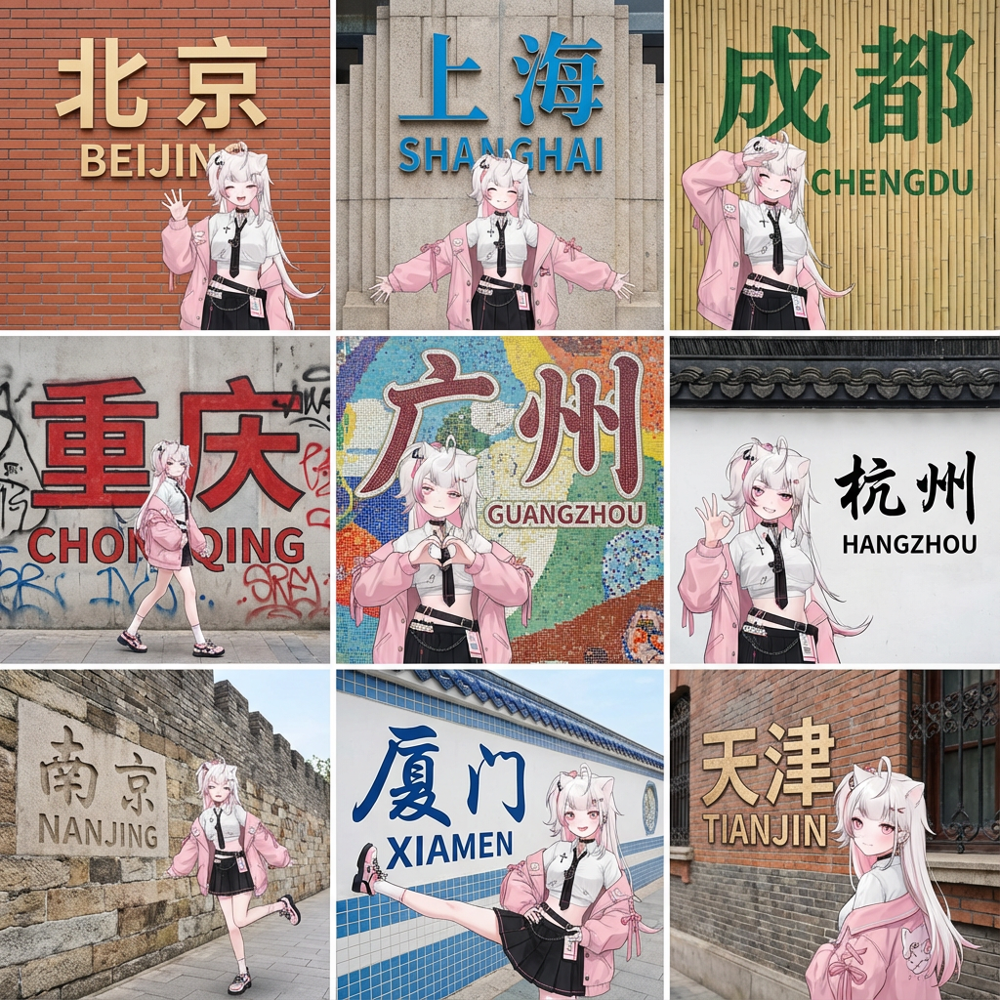
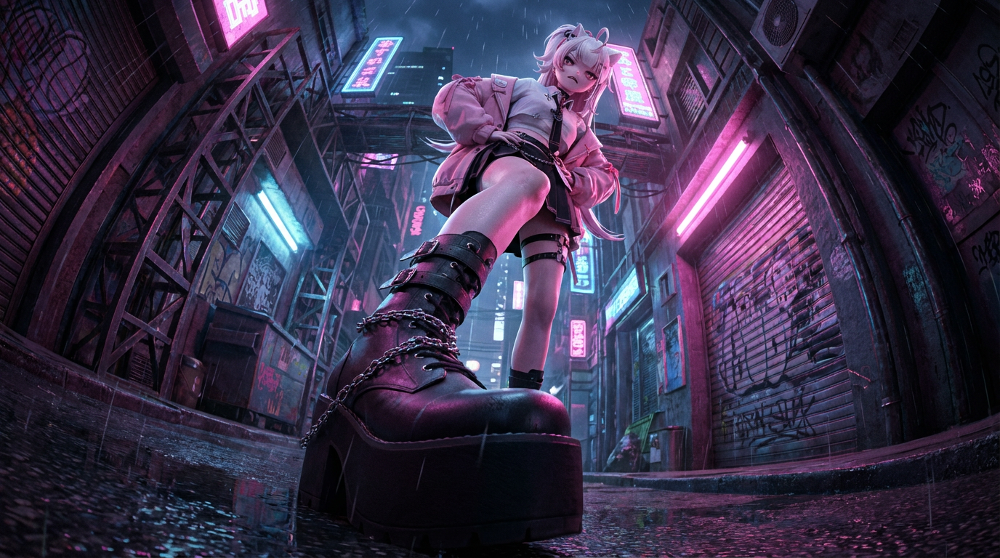
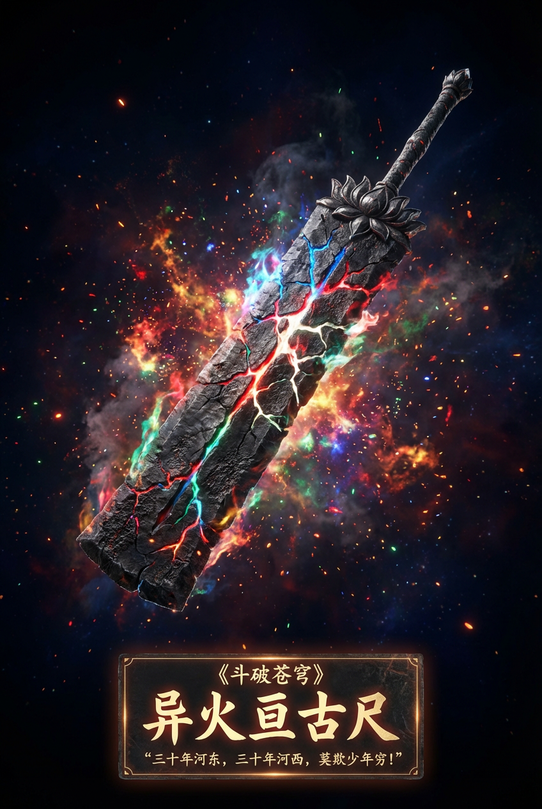
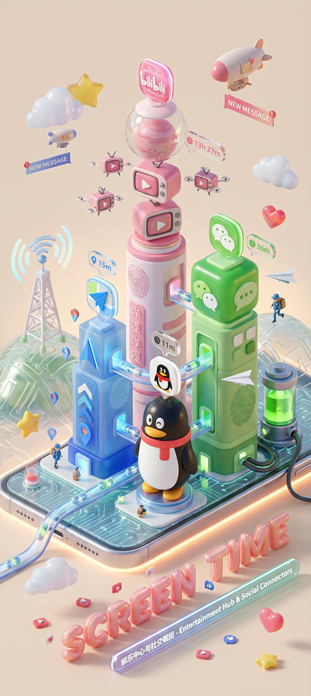

# 20251215 图片 prompt 记录

### 原图


## 1. 九宫格街拍
```text
基于参考图生成同一位女孩的九宫格旅行写真。五官、脸型、发型、肤色、气质、穿搭必须完全一致，不得变脸、不换穿搭、不改变身材比例。风格为真实街拍，不要插画风。
九张图背景全部不同，每张是一座城市的特色墙面或城市大字标识。墙体需干净、质感真实，字体醒目，与当地风格一致。保持明亮、清爽、文旅拍照风格。九个城市分别为：
① 北京
② 上海
③ 成都
④ 重庆
⑤ 广州
⑥ 杭州
⑦ 南京
⑧ 厦门
⑨ 天津
**女孩保持同一造型，在九张图中做不同轻旅行动作（自然、松弛、可爱、不夸张）：
挥手打招呼
张开双臂站立
抬手遮阳微笑
轻松侧身走路
双手比心
OK 手势 / 望远镜手势
抬腿摆拍
单腿抬高、伸展开来
回头甜笑、轻松站姿
真实户外光线、柔和阴影、城市旅拍氛围。
```
### 效果图


## 2. 摆出一个时尚复杂有力的姿势。
```text
将原始照片转化为一个戏剧性的、逼真的、超广角镜头，具有极端的相机角度（包括从正下方或正上方的视角），其中一个或多个身体部位紧挨着镜头并且看起来巨大，身体的其余部分在透视中后退，并且同一个人在原始环境的一致的、扩展的版本中摆出一个时尚的、复杂的、有力的姿势。
```
### 效果图

## 3. 小说或者影视玄幻武器生成
```text
请根据用户输入的小说或影视剧名称，利用你的文学知识库和信息搜索能力，将其核心精神内核“具象化”为一把独一无二的“概念神兵”，并生成一张高规格的 3D 装备展示海报，具体的小说为《XXXX》

第一步：核心概念转译（逻辑层） 请首先在后台对小说进行深度分析，决定这把武器的形态与气质：

时代锚定： 根据小说设定的时间线，自主决定武器的物理形态。如果是古代或奇幻背景，请设计冷兵器或法器；如果是近现代或悬疑背景，请设计带有象征意义的改装物件；如果是科幻或未来背景，请设计高科技装置或概念武器。

阵营与基调： 根据小说的主题情感（如绝望、热血、诡异、治愈），自主决定武器的材质与光效。阴暗的小说应体现腐蚀、黑铁或暗影；光明的作品应体现水晶、黄金或圣光；疯狂的作品应体现破碎与混沌。

第二步：画面主体构建（视觉层） 在深邃的虚空背景中央，以3D次世代游戏资产的极高标准，悬浮展示这把武器。

视角： 采用略微倾斜的展示视角，强调武器的体积感、厚重感和结构美。

细节： 材质必须极致逼真。根据小说氛围，武器表面应有相应的岁月痕迹（如战斗后的划痕、铜锈、血迹）或者完美的科技光泽。

氛围粒子： 不要使用静态背景。在武器周围生成环绕流动的元素粒子特效，这些粒子的属性必须直接映射小说的核心意象（例如：漫天的风雪、飘落的桃花、燃烧的余烬、或是流动的数据代码），颜色和氛围根据主题决定，让武器仿佛置身于故事的灵魂之中，不要全是深黑色背景。

第三步：铭文与排版系统（文字层） 在画面底部正中央，生成极具仪式感的中文排版，仿佛是博物馆的藏品铭牌或游戏的传说装备详情页：

作品原名： 《斗破苍穹》

神兵赐名： 在下方用极具设计感、霸气的书法体或衬线体，自主创造一个富有诗意的武器名字。

灵魂铭文： 在最底部，使用优雅的字体，字体要有与原著风格匹配的设计感。自动检索并摘录一句该小说中最具代表性、最震撼人心的经典台词、独白或旁白，作为这把武器的铸造铭文。
```
### 效果图


## 4. 用数字小镇展示你的屏幕使用时长
```text
请读取用户上传的【屏幕时间数据截图】，识别排名前四的 APP 名称及图标。检索这些 APP 的信息和图标样式。基于 APP 组合的调性（社交/娱乐/办公/综合），自主决定核心美术风格。

【2. 主体模型构建：微缩城镇基础 (The Town Infrastructure)】 在画面中央构建一个生生不息的微缩数字城镇，而不仅仅是建筑展示：

智能底座（地基）： 风格化的手机基座。但表面不再是平的，而是地形化的（根据风格可能是起伏的电路板山丘、玻璃水面或乐高底板）。

建筑群（APP 实体化）： 代表 APP 的摩天大楼。
底座： 一个卡通风格的智能手机底座，边缘是圆润的磨砂金属，屏幕表面散发着微微的呼吸光。底座周围环绕着漂浮的实体化 3D Emoji（云朵、星星、爱心），材质像半透明的果冻。
建筑群（APP 实体化）： 岛上矗立着 Q 版摩天大楼，代表识别出的 APP。

高度法则： 建筑高度严格对应使用时长。使用时间最长的 APP 是最高的摩天大楼，占据视觉中心。

造型法则： 提取 APP 图标的几何特征（如圆形图标变成球体堆叠塔，方形图标变成圆角立方体大厦）。

材质： 混合高级磨砂软陶 (Polymer Clay) 与 半透明果冻树脂。表面要有细腻的指纹纹理和漫反射光泽，像昂贵的盲盒玩具。

顶部 Logo： 楼顶矗立着该 App 的 3D 立体 Logo，材质像刚出炉的亮面糖果。

悬浮时间卡片： 在 Logo 正上方，悬浮着磨砂玻璃质感的 3D 气泡。气泡内包裹着立体的、发着柔光的数字（对应使用时长，如 "4h 12m"）。

建筑之间不要孤立排列，而是要形成街区。高楼在中心（CBD区域），周围可能有低矮的系统应用建筑（设置、日历等）。

【3. 城市生态与交互系统 (Urban Ecosystem & Interactions)】 （核心升级：增加“交互”与“生活气息”） 请在建筑之间添加丰富的动态细节，展现这个“数字城镇”是如何运作的：

交通与连接 (The Data Flow)：
连接方式： 建筑之间必须有物理连接。

风格自适应： 如果是赛博风，就是发光的光纤高架桥和磁悬浮列车；如果是极简风，就是透明的玻璃管道；如果是可爱风，就是彩虹滑梯。

载具与运输： 管道里或道路上要有流动的光点/胶囊，代表数据传输。

活跃的“数据精灵” (The Digital Citizens)：

NPC设定： 除了主角小人外，增加微小的功能性 NPC。

消息搬运工： 在社交 APP 大楼（如微信）附近，有飞行的纸飞机无人机或背着信封的小邮差进进出出。

点赞精灵： 在视频/社区 APP 大楼（如抖音/小红书）周围，漂浮着发光的红心或拇指气球，像萤火虫一样飞舞。

外卖/购物骑手： 如果有美团/淘宝，要有微缩的骑手或包裹传送带连接到主角所在的主楼。

公共基础设施 (Public Utilities)：

Wi-Fi 信号塔： 在城镇高处矗立着一座发光的信号塔（Wi-Fi 图标造型），向全城广播能量波纹。

电池能源站： 城镇边缘有一个圆柱形的能源罐（电池图标造型），连接着粗壮的线缆给主楼供电，里面甚至可以看到绿色的液体电量在晃动。

通知飞艇： 空中悬浮着小型的飞艇或云朵，上面挂着“新消息”或“红点”的横幅。

【4. 底部视觉中心：风格化 3D 铭牌】 （保持不变，强调高级设计感）

主标题设计： “SCREEN TIME” 或 “今日成分” 几个大字被设计成充气气球字体 (Inflatable Typography) 或 霓虹灯管字体，材质跟当前主题相关。它们不是印在纸上，而是实实在在地“站立”在画面最前景。

装饰细节： 标题周围散落着一些微小的 3D 碎片元素（如播放键、点赞拇指、电量图标），增加了画面的丰富度和潮流感。

副标题文案： 在立体标题下方，生成一条悬浮的发光灯带，上面写着一句基于用户数据的简短犀利点评。

【5. 渲染与摄影 (Tech Specs)】

构图： 轴侧俯视，强调繁华感和秩序感。

细节： 极其丰富的微观细节（Micro-details），让观众忍不住放大看每一个角落的小人在做什么。

关键词： Octane Render, C4D, Isometric City, Micro World, Living Ecosystem, 8k Resolution.
```
### 效果图
