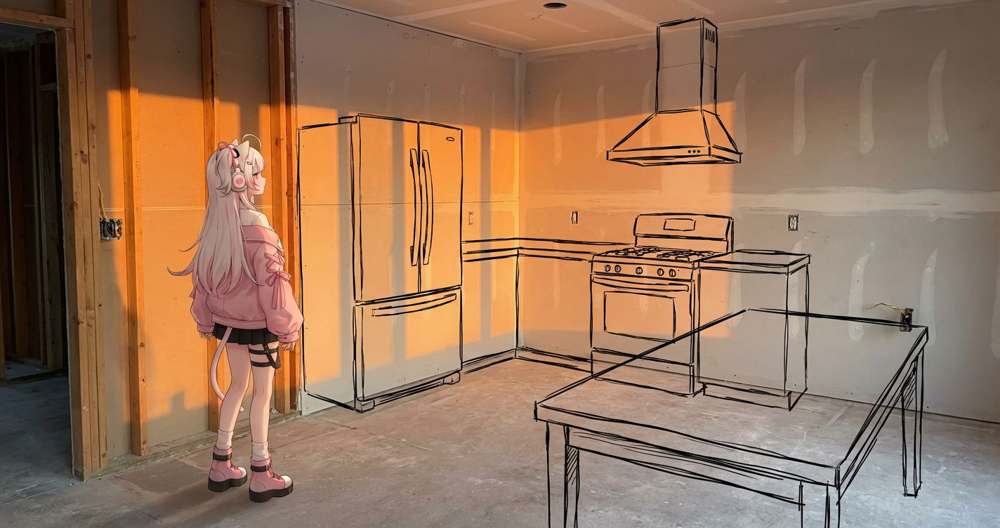
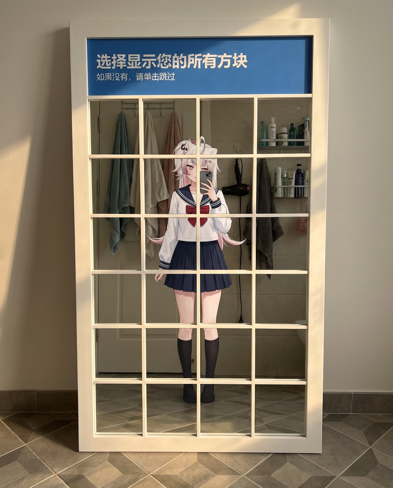

# 20251224 图片 prompt 记录

### 原图


## 1. 产品杂志化
```text
使用搜索了解 [主题] 发布后的反响如何。使用此信息写一篇有关它的短文（带标题）。
返回该文章出现在精美杂志中的照片。显示杂志封面（[杂志名]），以及有关 [关注点] 的两页文章。
eg:
使用搜索了解 小说 《蛊真人》 发布后的反响如何。使用此信息写一篇有关它的短文（带标题）。
返回该文章出现在精美杂志中的照片。显示杂志封面（蛊真人 社会论），以及有关 蛊真人 的两页文章。
```
### 效果图


## 2. 3D 立方体立体模型
```text
提示：[主题]正在[地点][做某事]。
等距 3D 立方体立体模型，内部照明，可爱的雕像风格，哑光 PVC 材料，大头/小身体。
黑暗房间里桌子上的中性背景。封闭在一个立方体中。
用许多可爱的小细节填充立体模型。添加灰尘、划痕和纹理等精致的瑕疵，使其更加真实。
eg:
提示：GGBone正在电脑前玩三角洲。
等距 3D 立方体立体模型，内部照明，可爱的雕像风格，哑光 PVC 材料，大头/小身体。
黑暗房间里桌子上的中性背景。封闭在一个立方体中。
用许多可爱的小细节填充立体模型。添加灰尘、划痕和纹理等精致的瑕疵，使其更加真实。

```
### 效果图


## 3. 3D 微型等距房间
```text
一个等距 3D 立方体形状的微型房间（浅切面真正的立方体；所有东西都严格包含在立方体内）。
房间是[房间描述：详细描述主题、家具、具体杂乱情况、墙壁装饰和关键物品]。
角色：赤壁/雕像风格 — [在此处插入您上传照片中的人物描述]。
该角色是[动作：例如坐在椅子上打字、站立做饭、弹吉他]，具有[表达：例如专注、快乐、微笑]表情。
手办材质为哑光PVC，头大身小比例。
照明：[气氛名称]：[光源：例如霓虹灯蓝光、温暖的阳光、金色灯光]；逼真的反射和彩色阴影。
相机：稍微升高的等距四分之三视图，前立方体边缘居中；没有元素突出到立方体之外。
具有精细细节的照片级真实材质；中性背景。超详细、干净的构图；无水印。
eg:
一个等距 3D 立方体形状的微型房间（浅切面真正的立方体；所有东西都严格包含在立方体内）。
房间是 一间紧凑的电竞房,电脑桌上曲面屏电脑,七彩键盘灯,鼠标,电脑后具有各色灯带组成的 Lumin Wave,桌面上可乐等零食略微散乱,电脑主机上趴着如图所示猫咪。
角色：赤壁/雕像风格 — 如图所示人物，头戴电竞猫耳耳机(耳机周围存在彩色灯光), 坐在高高的电竞椅上，椅子上存在雷蛇标识。
该角色正在电脑前打三角洲，具有气愤,遗憾表情。
手办材质为哑光PVC，头大身小比例。
照明：温馨,欢快的灯光：光源：彩色霓虹灯；逼真的反射和彩色阴影。
相机：稍微升高的等距四分之三视图，前立方体边缘居中；没有元素突出到立方体之外。
具有精细细节的照片级真实材质；中性背景。超详细、干净的构图；无水印。
```
### 效果图


## 4. 微型巧克力示范图
```text
A photo of a miniature chocolate in the shape of this image. It is being held, after being taken from a chocolate advent calendar. The original image is shown as a cartoon as the backdrop of the advent window.
```
### 效果图


## 5. 隐藏单词
```text
制作一张嵌入隐藏单词的照片，使该单词很难看到，直到您发现它，然后您就无法看不见它。使用“Python”这个词。用一群蟒蛇组成这个词。
```
### 效果图


## 6. 三维漫画
```text
上述图片中角色的高度风格化三维漫画，面部特征表情丰富，夸张俏皮。采用平滑、光洁的风格渲染，材质简洁，环境光线柔和。大胆的背景颜色突出了人物的魅力
```
### 效果图


## 7. 小人国透视画
```text
微型透视画：[插入动作]的小人在[插入物体]上/与[插入物体]在一起，冬季森林背景，柔和的金色光线。AR 1:1

eg：
送圣诞礼物的小人在烟囱上/与麋鹿在一起，冬季森林背景，柔和的金色光线。AR 1:1
```
### 效果图


## 8.未来环境草图
```text
一个[人型]全身站在画面边缘附近，稍微偏左，在[现实世界的不完整/空旷/损坏的环境]中。
视角位于人的后方并稍靠右侧，从四分之三后角拍摄他。人静静地站着，若有所思地看着前方的空间。
环境是[描述现在存在的真实空间：空的、未完成的、腐烂的、僵化的、死气沉沉的]。
气氛感觉[情绪基调：安静、干燥、历史、简约、原始]。
自然光照亮场景，创造逼真的阴影和深度。
浮动的手绘草图线出现在环境之上和之内，与真实空间的透视精确对齐。
这些草图代表了[缺失的东西/曾经存在的东西/未来可能存在的东西]。
草图线条是黑色的、干净的、手绘的，类似于用铅笔或墨水绘制的[建筑/室内/修复/城市规划]概念草图。
笔画富有表现力，略显不完美，而且是有机的——而不是僵化或机械的。
草图元素占据了前景和中景，看起来比预期更接近人物。
一些素描线条巧妙地重叠了人物的轮廓和真实的表面，在视觉上将想象与现实融为一体。
草图自然地漂浮在场景中，与环境无缝融合，并传达[愿景/恢复/转变/潜力]变为现实的想法。

eg:
一个如图所示的人全身站在画面边缘附近，稍微偏左，在一个正在装修的厨房内。
视角位于人的后方并稍靠右侧，从四分之三后角拍摄他。人静静地站着，若有所思地看着前方的空间。
环境还未精装修完成，缺少家具物品。
气氛比较温馨，傍晚日落西下的橘色阳光。
自然光照亮场景，创造逼真的阴影和深度。
浮动的手绘草图线出现在环境之上和之内，与真实空间的透视精确对齐。
这些草图代表了即将放上的家具物品，冰箱,灶台,餐桌......
草图线条是黑色的、干净的、手绘的，类似于用铅笔或墨水绘制的室内概念草图。
笔画富有表现力，略显不完美，而且是有机的——而不是僵化或机械的。
草图元素占据了前景和中景，看起来比预期更接近人物。
一些素描线条巧妙地重叠了人物的轮廓和真实的表面，在视觉上将想象与现实融为一体。
草图自然地漂浮在场景中，与环境无缝融合，并传达希望变为现实的想法。
```
### 效果图


## 9. 物理验证码界面
```text
进行镜子自拍照，但这次使用物理验证码界面。
{
    "目的": "一张带有‘机器人测试’验证码界面的定制物理落地镜的超现实照片，捕捉镜子自拍照。物理镜子靠在浴室墙上，而它反射出了一个装饰有一些洗浴用品的浴室。”,
    “框架”：{
        “纵横比”：“4：5”，
        "构图": "一张完整的正面照片精确地集中在卸妆镜上。镜子的白色框架和物理 4x4 网格结构是主要的构图元素。",
        "style_mode": "纪录片现实主义"
    },
    “主题”：{
        "特征": "输入图像。",
        "服装": "输入图像。",
        “动作”：“直接站在镜子前，将智能手机举至胸部高度，对着镜子自拍。”
    },
    “环境”：{
        "物理位置": "卸妆镜挂在带有洗漱用品的洗漱台上。",
        "背景反射": "与物理位置相反，镜子内的倒影揭示了主体背后丰富的、挂有洗漱用品的浴室。倒影中的可见元素包括挂有浴巾,洗脸巾等的挂杆，挂有吹风机的挂钩，放有部分洗漱用品的墙台。",
        "地板": "磨砂20x20地板砖。在反射中，上面有微妙的几何图案。",
        "支柱": "卸妆镜有一个厚厚的白色外框。顶部蓝色标题栏包含白色文本：“选择显示您的所有方块”。下面是较小的白色文本：“如果没有，请单击跳过”。镜子表面被严格划分为 4x4 网格，由覆盖连续玻璃板的薄而窄的物理凸起白色条组成，由十六个完全相等的正方形面板组成。底部白色栏右侧有一个蓝色矩形按钮，上面写着“跳过”和小图标（刷新、音频、信息）在左侧。",
        "玻璃材质": "高保真真实玻璃表现出微妙的物理缺陷，例如微弱的灰尘颗粒或非常轻微的污迹。至关重要的是，狭窄的凸起白色网格条在其后面的镜面玻璃上投射出清晰、逼真的阴影，强调了网格和深层反射之间的物理分离。"
    },
    “照明”：{
        "类型": "温暖灯光。",
        "描述": "来自反射中可见的物品，在反射的房间中创建体积和尺寸，并将真实的阴影从镜框投射到其后面的物理墙上。",
        "色温": "5500K（日光）。",
        "对比度": "中等对比度。",
        “交互”：“光线在光滑的白色框架上产生逼真的反射，并在玻璃表面上产生轻微的镜面高光。”
    },
    “相机”：{
        "传感器格式": "全画幅数字传感器。",
        "镜头": "35mm广角镜头。",
        "光圈景深": "f/8，确保整个镜框、狭窄的物理白色网格条、主体和反射中的背景家具都清晰对焦。",
        "快门速度": "1/125s。",
        “国际标准组织”：“200。”，
        "相机位置": "与拍摄对象的眼睛齐平，位于镜子正前方，捕捉完整的正面视图。"
    },
    “颜色等级”：{
        "画板": "中性背景色调由白色框架、素色墙壁和混凝土地板固定，并由标题栏的鲜艳蓝色、反射木质家具的温暖以及主体服装的颜色点缀。",
        "饱和度": "自然。",
        "色调": "标准。"
    },
    “负面”：{
        "风格": "没有数字插图，没有绘画，没有抽象。",
        “内容”：“没有变形，除了镜框上的内容之外没有任何文字，没有斜角/切割玻璃网格，没有平面印刷网格线（必须是狭窄的物理凸起条），物理镜框后面没有杂乱。”
    }
}
```
### 效果图

