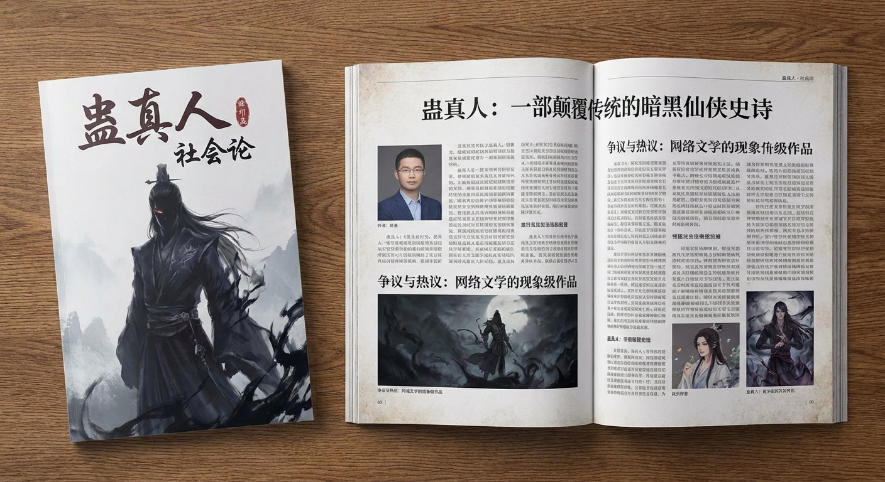
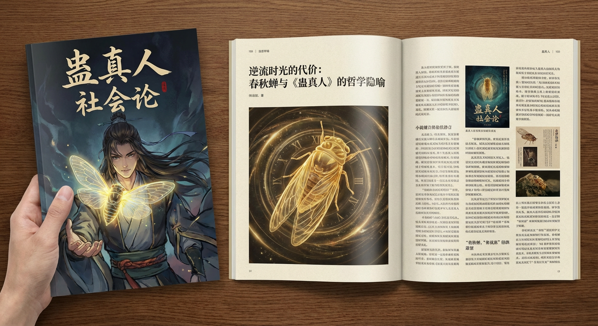
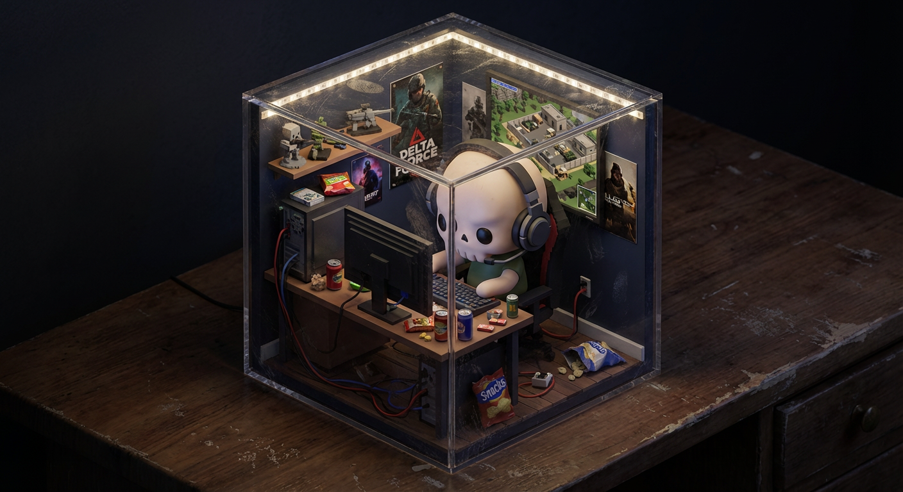
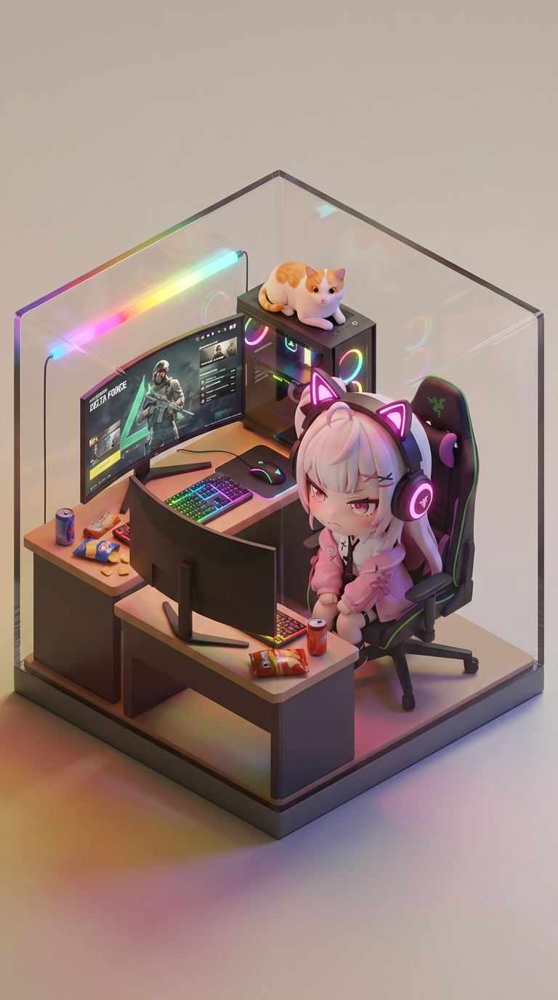
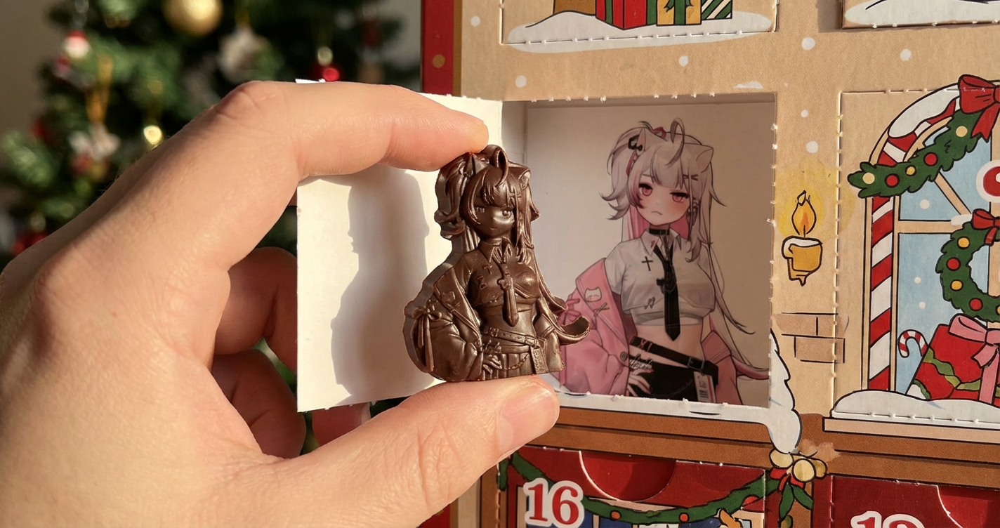

# 20251224 图片 prompt 记录

### 原图


## 1. 产品杂志化
```text
使用搜索了解 [主题] 发布后的反响如何。使用此信息写一篇有关它的短文（带标题）。
返回该文章出现在精美杂志中的照片。显示杂志封面（[杂志名]），以及有关 [关注点] 的两页文章。
eg:
使用搜索了解 小说 《蛊真人》 发布后的反响如何。使用此信息写一篇有关它的短文（带标题）。
返回该文章出现在精美杂志中的照片。显示杂志封面（蛊真人 社会论），以及有关 蛊真人 的两页文章。
```
### 效果图



## 2. 3D 立方体立体模型
```text
提示：[主题]正在[地点][做某事]。
等距 3D 立方体立体模型，内部照明，可爱的雕像风格，哑光 PVC 材料，大头/小身体。
黑暗房间里桌子上的中性背景。封闭在一个立方体中。
用许多可爱的小细节填充立体模型。添加灰尘、划痕和纹理等精致的瑕疵，使其更加真实。
eg:
提示：GGBone正在电脑前玩三角洲。
等距 3D 立方体立体模型，内部照明，可爱的雕像风格，哑光 PVC 材料，大头/小身体。
黑暗房间里桌子上的中性背景。封闭在一个立方体中。
用许多可爱的小细节填充立体模型。添加灰尘、划痕和纹理等精致的瑕疵，使其更加真实。

```
### 效果图


## 3. 3D 微型等距房间
```text
一个等距 3D 立方体形状的微型房间（浅切面真正的立方体；所有东西都严格包含在立方体内）。
房间是[房间描述：详细描述主题、家具、具体杂乱情况、墙壁装饰和关键物品]。
角色：赤壁/雕像风格 — [在此处插入您上传照片中的人物描述]。
该角色是[动作：例如坐在椅子上打字、站立做饭、弹吉他]，具有[表达：例如专注、快乐、微笑]表情。
手办材质为哑光PVC，头大身小比例。
照明：[气氛名称]：[光源：例如霓虹灯蓝光、温暖的阳光、金色灯光]；逼真的反射和彩色阴影。
相机：稍微升高的等距四分之三视图，前立方体边缘居中；没有元素突出到立方体之外。
具有精细细节的照片级真实材质；中性背景。超详细、干净的构图；无水印。
eg:
一个等距 3D 立方体形状的微型房间（浅切面真正的立方体；所有东西都严格包含在立方体内）。
房间是 一间紧凑的电竞房,电脑桌上曲面屏电脑,七彩键盘灯,鼠标,电脑后具有各色灯带组成的 Lumin Wave,桌面上可乐等零食略微散乱,电脑主机上趴着如图所示猫咪。
角色：赤壁/雕像风格 — 如图所示人物，头戴电竞猫耳耳机(耳机周围存在彩色灯光), 坐在高高的电竞椅上，椅子上存在雷蛇标识。
该角色正在电脑前打三角洲，具有气愤,遗憾表情。
手办材质为哑光PVC，头大身小比例。
照明：温馨,欢快的灯光：光源：彩色霓虹灯；逼真的反射和彩色阴影。
相机：稍微升高的等距四分之三视图，前立方体边缘居中；没有元素突出到立方体之外。
具有精细细节的照片级真实材质；中性背景。超详细、干净的构图；无水印。
```
### 效果图


## 4. 微型巧克力示范图
```text
A photo of a miniature chocolate in the shape of this image. It is being held, after being taken from a chocolate advent calendar. The original image is shown as a cartoon as the backdrop of the advent window.
```
### 效果图
