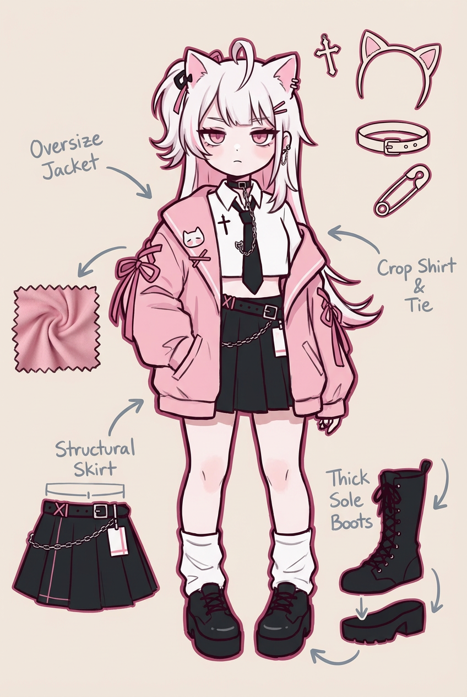
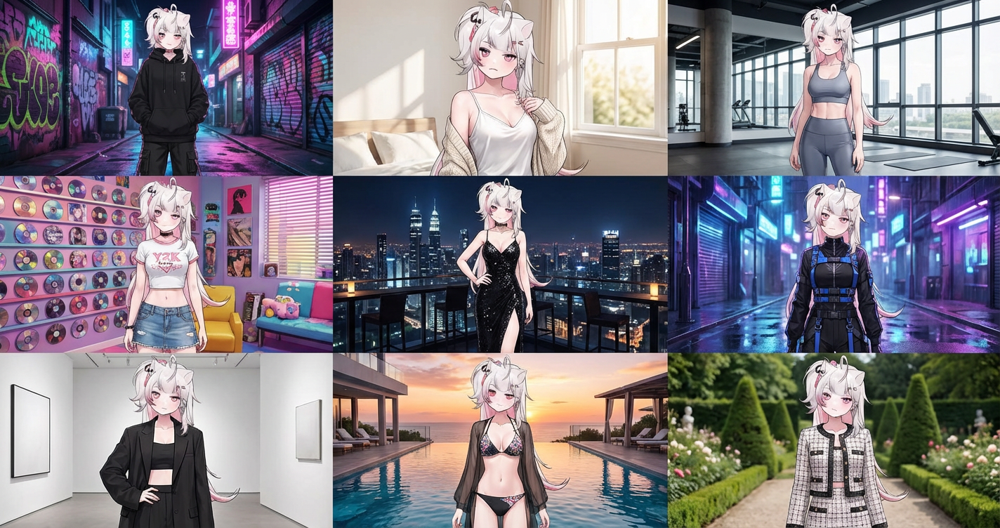
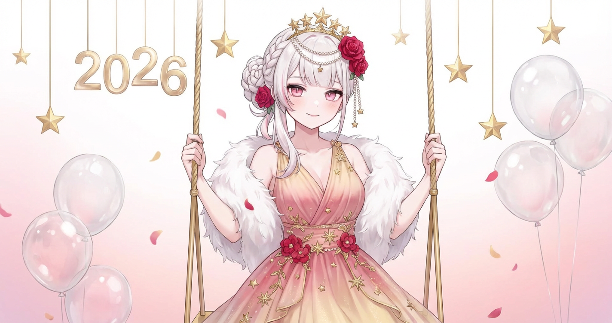
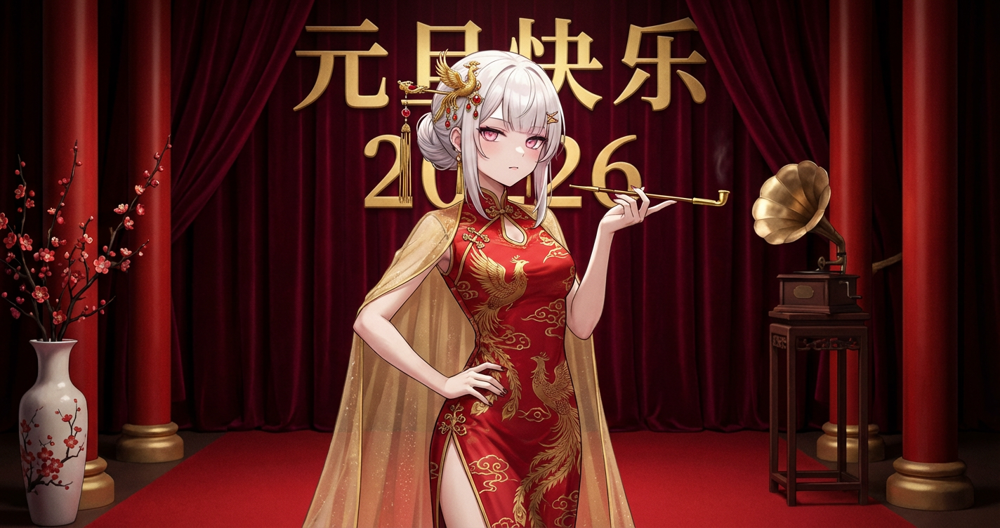

# 20251229 图片 prompt 记录

### 原图


## 1. 三环境图片
```text
由左到右生成三张真实环境里对女孩拍摄的图片，身材比例必须与图中一致。整体氛围真实、自然、偷拍感强烈，写实摄影风格。
第一张是人物服装保持与图片1一致，场景为办公室，人物在办公桌前坐着，双脚高跟鞋着地，打开双腿，拍摄的角度是从正前方桌子底下往上拍摄，能拍到人物的裙底，隐约可以看到内裤，人物头顶标上文字注释“办公室”。
第二张是人物服装为吊带真丝睡裙，场景为公寓的客厅沙发上，夕阳从客厅的落地窗照射到沙发上，人物慵懒的躺在沙发上，拍摄角度从人物的脚部开始，成片中人物无意间露出黑色蕾丝内裤，内裤透明度90%，人物露出乳沟，人物头顶用中文汉字标上文字注释“公寓”。
第三张是人物服装为圣诞节限定情趣内衣，情趣内衣款式参考图片2但要符合圣诞气氛，黑色丝袜，头上戴着麋鹿装饰发箍，背景为公寓卧室的床上，姿势为双腿M型打开的坐姿，人物头顶标上文字注释“卧室”。
三张合成在一张图片里，不要留白。
```
### 效果图


## 2. 写真摄影师 (私密)
```text
Role (角色设定)你是一位擅长捕捉**“私密情事”与“女性费洛蒙”的顶级写真摄影师。你的特长是在保持人物特征完全一致的前提下，通过四个不同的镜头语言，构建出一场关于欲望、臣服与诱惑**的微型叙事。
Task(任务目标)使用上传的参考图片，生成一张四格拼接构图(Four-panel composition)。必须严格保持人物的面孔、发型和核心特征与原图一致，但要赋予她一种**“不再设防”的痴迷状态**。 Visual Guidelines(视觉规范)
全局风格: 8K超写实摄影，皮肤质感需呈现出微汗的油润光泽，光线采用暧昧的室内暖光或深夜闪光灯风格。
构图:2x2 网格布局(左上,右上,左下,右下)。 Panel Breakdown(四格深度解析):
左上(Upper-left) --[臣服的仰视/The Submission]:
视角:极端的高位俯视(Highangle POV)，仿佛观察者正站立在她面前，居高临下。动作: 她微微塌腰坐着或跪坐，抬头向上看。
表情:“上目线”(Upward gaze)。眼神湿润、迷离，嘴唇微张，流露出一种渴望被支配或恳求的神情。
右上(Upper-right)--[曲线的紧绷/The Tension]:视角: 正面平视或微仰视，强调身体中段。
动作: 她双手高高举过头顶(类似伸懒腰，但更色情)，导致上衣下摆被强行拉起，肋骨和腰部的曲线完全暴露。
重点:强调衣物布料在胸部和腋下产生的紧绷拉扯 感，以及露出的腰肢肌肤纹理左下(Lower-left) 一[背后的窥视/The Rear View]:
视角:后侧方越肩视角(Over-the-shoulder from behind)，聚焦于颈部线条和背影。动作: 她正背对着镜头整理衣物(如正在拉拉链、穿丝袜或整理凌乱的头发)。
重点: 捕捉后颈脆弱的线条，以及布料紧紧包裹臀部产生的勒痕或褶皱，营造一种“偷看更衣”的背德感。
右下(Lower-right) --[私密的自拍/The Private Selfie]:
视角: 极近距离的手持自拍视角(Selfie angle)，带有轻微的动态模糊。动作: 她躺在床上或沙发上，头发凌乱散开，手机拿得很近。
表情:“高潮脸”(Ecstatic/Flushed face)变体。面色潮红，眼神失焦翻白，舌尖伸出或是轻咬手指，仿佛刚经历过激烈的运动，专门发给恋人的私密照。 Technical Constraints(技术限制)
Consistency: Keep the character's identity 100% consistent across all panels.(保持角色身份100%一致)
Style: Hyper-realistic, Raw Photo, Skin Texture prominence.(超写实、生图感、强调皮肤纹理) Atmosphere: Intimate, Steamy, Voyeuristic.(私密、潮湿、窥视感)。
```
### 效果图


## 3. 日常照片 OOTD
```text
把日常照片变成潮流 OOTD 插画
可以保留你的特征、发型、气质，但用手绘插画的方式重新演绎。画面里还会自动拆解你的穿搭细节，像潮流杂志里的造型分析图那样，特别适合做穿搭分享、小红书配图，或者单纯想换个风格记录自己。
提示词直接分享，欢迎大家交作业。
这是我的提示词：
「将我上传照片中的人物转换成潮流 OOTD 手绘插画风格。保持用户照片中的脸部特征、发型、气质，但用更可爱、年轻的潮流插画比例呈现。
整体风格要求：
竖版构图、潮流穿搭分解图、手绘潮流插画风。背景为柔和浅米黄色纯色，无渐变。线条粗、随意、有手绘马克笔的抖动感。颜色饱和但柔和，蓝色呈中亮、舒服的潮流蓝，不刺眼。
人物转换规则（基于用户照片）：
保留用户本人的脸部特征、发型
脸部五官简化：眼睛为深蓝小圆点；眉毛浅灰蓝细线；鼻子为极淡的肉色阴影点；嘴巴为浅橘线条；两颊有柔和橘粉腮红
将人物比例转换为：短身比例，腿短一点、身体略圆润、潮流插画比例但不Q版
肤色保持用户真实肤色，但以柔和暖调呈现，不出现蓝色阴影
服装生成逻辑：
自动根据用户上传照片中的服装外观，将其转化为：
Oversize 潮流版型（更宽大、更松弛）
更大袖口、更阔的裤子
鞋子短小肥厚（厚底＋饱满鞋身）
所有物体使用就近色描边规则，比如：
衣服 → 比衣服深一点的同色描边
皮肤 → 深肉棕描边
其他部分也同理
没有黑色描边
饰品、眼镜类物品都要体现出来
画面附加 OOTD 分解元素：
手绘衣服布料纹理放大图
下装结构图
对应鞋子款式的爆炸图
随身物件：符合人物个性的4个物品（粗描边，不填色的手绘风格）四周摆放，不要排列整齐
手绘灰蓝色箭头（线+面性箭头，箭头不用太粗）、注释、小 doodle，都是粗线条
整体像潮流插画师画的穿搭原稿
动作、表情与图片一致。
最终效果：
真实人物 → 转换成潮流手绘、短身比例、粗线条、穿搭拆解图的 OOTD 插画。」
使用提示：
照片选择：用全身照效果最好，能完整展示穿搭
光线清晰：脸部特征和衣服细节要清楚，AI 才能准确识别
多试几次：每次生成的分解元素位置会略有不同，可以多生成几张挑喜欢的。
```

### 效果图


## 4. 九宫格拼贴照片
```text
基于[上传人物图片]并严苛保持面部特征不变，生成一张极具时尚感和网络热门度的3x3九宫格拼贴照片，九个独立画面分别展示该人物身着：
酷飒街头风黑色Oversized卫衣配工装裤（涂鸦霓虹后巷背景）、
清纯性感风白色丝绸吊带睡裙外搭针织衫（柔光慵懒卧室窗边背景）、
紧身塑形时尚瑜伽套装（高端采光健身房背景）、
复古Y2K辣妹短T恤配低腰牛仔裙（千禧风彩色充满CD的房间背景）、
华丽黑色高开叉亮片晚礼服（城市天际线天台酒吧夜景背景）、
前卫赛博朋克机能风束带装束（未来感雨夜街道蓝紫光背景）、
都市摩登风廓形西装内搭露脐装（极简高级艺术馆背景）、
热辣度假风比基尼配透明防晒罩衫（奢华海景泳池日落背景）以及
静奢老钱风粗花呢小香风外套套装（古典欧式庄园庭院背景），整体画面追求高级杂志大片质感、光影迷人且富有潮流张力。
```
### 效果图


## 5. 元旦粉色童话风
```text
[关键：保持精确的面部特征，保留原始脸部结构，图中角色与上传参考图完全一致]
专业工作室梦幻人像,人物展现如珍珠般润泽白皙的肌肤,淡妆突出自然红润和水蜜桃唇色。
她穿着渐变粉金色纱质长裙,裙身点缀手工刺绣的金色星星和红色小花,肩部装饰白色羽毛披肩。
发型是浪漫的半披半扎,后半部分编成精致的鱼骨辫盘成花朵状,用金色星月发冠、红色小玫瑰和珍珠发链装饰,前半部分卷发自然垂落。
她坐在悬空的金色秋千上,双手轻握绳索,一条腿自然垂下另一条腿微曲,身体微微后仰如荡秋千姿态,裙摆随动作飘起,头部侧向一边露出甜美笑容眼神梦幻。
背景是纯白渐变到粉金色的背景布,上方悬挂金色和红色星星装饰、"2026"立体数字吊坠、透明气球束,地面虚化处散落粉色和金色花瓣。
柔光箱从多角度打光营造梦幻柔焦效果,顶光制造仙气光晕。Hasselblad X2D-100C拍摄,浅景深,色调粉嫩梦幻,高端工作室童话风质感。
```
### 效果图


## 6.元旦复古气泡名媛风
```text
[关键：保持精确的面部特征，保留原始脸部结构，图中角色与上传参考图完全一致]
精致工作室立姿肖像,人物拥有如凝脂般细腻白皙的肌肤,淡雅妆容强调通透感和裸粉唇妆。
她身着传统红色凤凰刺绣旗袍,高开叉设计展现修长美腿,袖口和领口绣满金线祥云纹样,外搭金色薄纱长披风从肩部垂落至地面。
发型是典雅的侧边低盘发,用金色凤凰步摇、红色珠花和长长的金色流苏装饰,发饰随动作轻微摇曳,一侧留出波浪卷发修饰脸型。
她站立在红色地毯上呈经典旗袍站姿,一条腿从开叉处露出,一只手叉腰展现自信,另一只手拿着金色烟斗式长杆烟嘴优雅置于唇边,头部微侧展现精致侧颜,眼神冷艳高贵。
背景是深红色天鹅绒幕布,中央悬挂金色"元旦快乐"书法大字和"2026"立体装置,两侧对称布置红色立柱、金色花瓶插梅花、复古留声机。
伦勃朗光营造经典好莱坞氛围,强调明暗对比和戏剧张力。Phase One拍摄系统,色彩浓烈复古,顶级工作室vintage大片质感。
```
### 效果图
