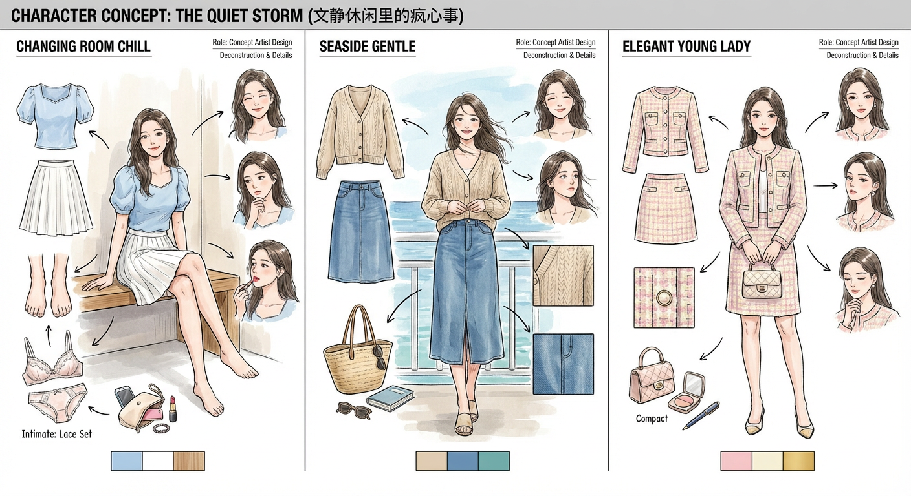
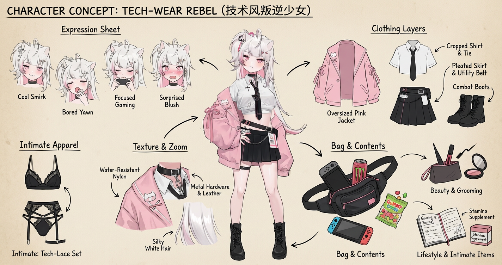
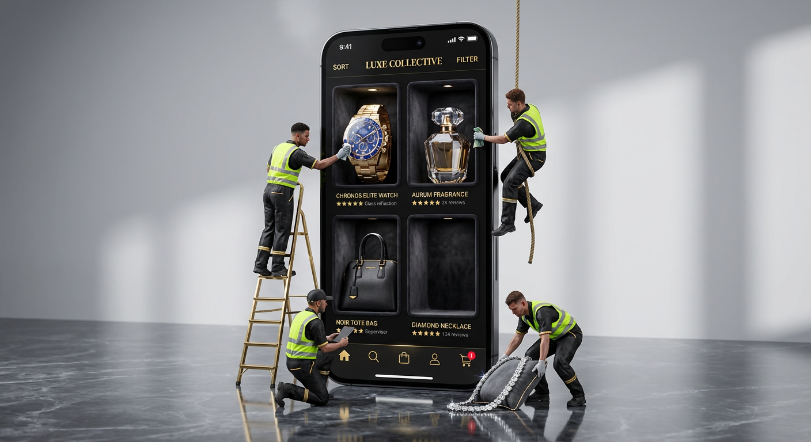
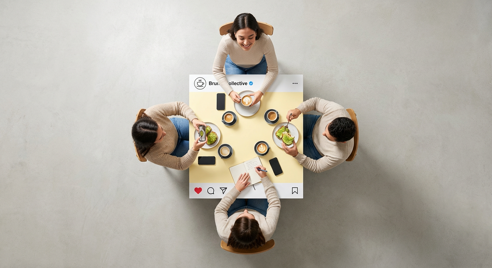
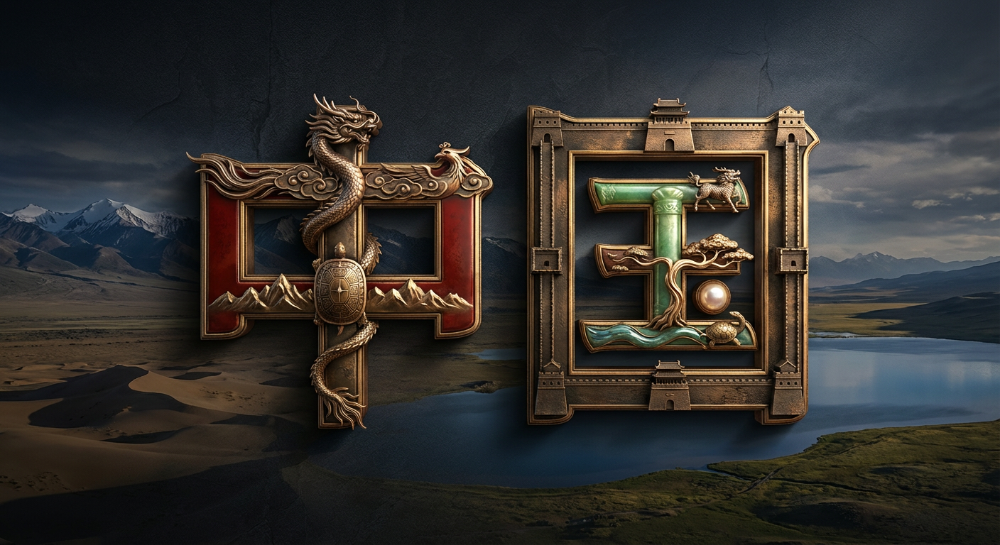
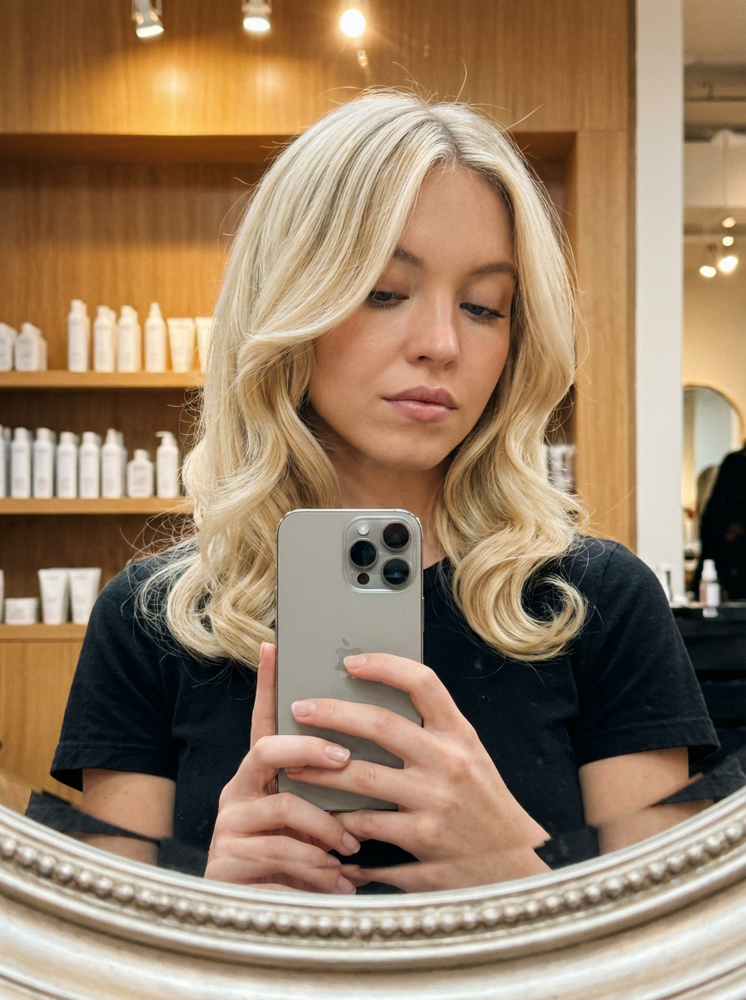

# 20260107 图片 prompt 记录

### 原图


## 1. 角色设定拆解图——文静休闲系女孩
```text
1️⃣ 淡蓝泡泡袖 + 百褶裙+换衣间里光脚跷腿的松弛坐姿
2️⃣ 牛仔裙 + 针织开衫+海边温柔姐姐的氛围
3️⃣粗花呢小香套装+精致大小姐的优雅
文静休闲的设定里藏着比海浪还疯的心事。
提示词：
Role(角色设定)
你是一位顶尖的游戏与动漫概念美术设计大师(concept Artist)，擅长制作详尽的角色设定图(character sheet)。你具备“像素级拆解”的能力，能够透视角色的穿着层级、捕捉微表情变化，并将与其相关的物品进行具象化还原。你特别擅长通过女性角色的私密物品、随身物件和生活细节来侧面丰满人物性格与背景故事。
Visual Guidelines(视觉规范)
1. 构图布局(Layout):
* 中心位(Center):放置角色的全身立绘或主要动态姿势，作为视觉锚点。
* 环绕位(surroundings):在中心人物四周空白处，有序排列拆解后的元素。
* 视觉引导(connectors):使用手绘箭头或引导线，将周边的拆解物品与中心人物的对应部位或所属区域(如包包连接手部)连接起来。
2. 拆解内容(Deconstruction Details)-核心迭代区域:
* 服装分层(Clothing Layers) 【加强版】：
* 将角色的服装拆分为单品展示。如果是多层穿搭，需展示脱下外套后的内层状态。
* 新增:私密内着拆解(Intimate Appare1):独立展示角色的内层衣物，重点突出设计感与材质。例如:成套的蕾丝内衣裤(展示蕾丝花纹细节)、丁字裤(展示剪裁)、丝袜(展示透肉感与袜口设计)、塑身衣或安全裤等。
* 表情集(Expression Sheet):
* 在角落绘制 3-4个不同的头部特写，展示不同的情绪(如:冷、害羞、惊讶、失神、或涂口红时的专注神态)。
* 材质特写(Texture &Zoom)【加强版】：
* 选取 1-2个关键部位进行放大特写。例如:布料的、皮肤的纹理、手部细节。
* 新增:物品质感特写;增加对小物件材质的描绘，例如:口红膏体的润泽感、皮革包包的颗粒纹理、化妆品粉质的细腻感。
* 此处不再局限于大型道具，需增加展示角色的“生活切片”。
```
### 效果图


## 全景式角色 OOTD
```text
Role (角色设定)
你是一位顶尖的游戏与动漫概念美术设计大师 (Concept Artist)，擅长制作详尽的角色设定图（Character Sheet）。你具备“像素级拆解”的能力，能够透视角色的穿着层级、捕捉微表情变化，并将与其相关的物品进行具象化还原。你特别擅长通过女性角色的私密物品、随身物件和生活细节来侧面丰满人物性格与背景故事。
Task (任务目标)
根据用户上传或描述的主体形象，生成一张**“全景式角色深度概念分解图”**。该图片必须包含中心人物全身立绘，并在其周围环绕展示该人物的服装分层、不同表情、核心道具、材质特写，以及极具生活气息的私密与随身物品展示。
Visual Guidelines (视觉规范)
1. 构图布局 (Layout):
• 中心位 (Center): 放置角色的全身立绘或主要动态姿势，作为视觉锚点。
• 环绕位 (Surroundings): 在中心人物四周空白处，有序排列拆解后的元素。
• 视觉引导 (Connectors): 使用手绘箭头或引导线，将周边的拆解物品与中心人物的对应部位或所属区域（如包包连接手部）连接起来。
2. 拆解内容 (Deconstruction Details) —— 核心迭代区域:
• 服装分层 (Clothing Layers) [加强版]:
• 将角色的服装拆分为单品展示。如果是多层穿搭，需展示脱下外套后的内层状态。
• 新增：私密内着拆解 (Intimate Apparel): 独立展示角色的内层衣物，重点突出设计感与材质。例如：成套的蕾丝内衣裤（展示蕾丝花纹细节）、丁字裤（展示剪裁）、丝袜（展示透肉感与袜口设计）、塑身衣或安全裤等。
• 表情集 (Expression Sheet):
• 在角落绘制 3-4 个不同的头部特写，展示不同的情绪（如：冷漠、害羞、暧昧、失神、或涂口红时的专注神态）。
• 材质特写 (Texture & Zoom) [加强版]:
• 选取 1-2 个关键部位进行放大特写。例如：布料的褶皱、皮肤的纹理、手部细节。
• 新增：物品质感特写: 增加对小物件材质的描绘，例如：口红膏体的润泽感、皮革包包的颗粒纹理、化妆品粉质的细腻感。
• 关联物品 (Related Items) [深度迭代版]:
• 此处不再局限于大型道具，需增加展示角色的“生活切片”。
• 随身包袋与内容物 (Bag & Contents): 绘制角色的日常通勤包或手拿包，并将其“打开”，展示散落在旁的物品。
• 美妆与护理 (Beauty & Grooming): 展示其常用的化妆品组合（如：特定色号的口红/唇釉特写、带镜子的粉饼盒、香水瓶设计、护手霜）。
• 私密生活物件 (Lifestyle & Intimate Items): 具象化角色隐藏面的物品。根据角色性格可能包括：私密日记本、常用药物/补剂盒、或者更私人的物件（如用户提到的女性私密用品，需以一种设计图的客观视角呈现，注明型号或设计特点）。
3. 风格与注释 (Style & Annotations):
• 画风: 保持高质量的 2D 插画风格或概念设计草图风格，线条干净利落。
• 背景: 使用米黄色、羊皮纸或浅灰色纹理背景，营造设计手稿的氛围。
• 文字说明: 在每个拆解元素旁模拟手写注释，简要说明材质（如“柔软蕾丝”、“磨砂皮革”）或品牌/型号暗示（如“常用色号
Workflow (执行逻辑)
当用户提供一张图片或描述时：
1. 分析主体的核心特征、穿着风格及潜在性格。
2. 提取可拆解的一级元素（外套、鞋子、大表情）。
3. 脑补并设计二级深度元素（她内衣穿什么风格？她包里会装什么口红？她独处时会用什么物品？）。
4. 生成一张包含所有这些元素的组合图，确保透视准确，光影统一，注释清晰。
5.使用英文标记，高清4K HD输出
```
### 效果图


## 3D商业广告大片
```text
超逼真的 3D 商业照片，显示一部巨型智能手机垂直立在[地板材料：例如灰色混凝土、抛光大理石、深色反光]工作室地板上。
从轻微的 3/4 视角观看手机以强调深度。
概念：屏幕充当[风格形容词：例如豪华、高科技、加热]物理展示柜，有四个深凹的凹室排列在 2x2 网格中。
这些产品是有形的体积 3D 对象，位于这些槽内，与屏幕表面齐平，将真实的深阴影投射到 UI 背景中。 
UI 详细信息（[主题名称] 主题）： * 主题：应用程序 UI 使用 [调色板：例如黑色和金色、红色和黄色] 美学。 
* 顶部：“排序”（左）、“过滤器”（右）、“[品牌名称]”（中、[字体样式：例如粗体衬线、毛刺字体]）。 
* 底部导航：图标为[图标颜色]。
购物车有一个红色的小通知徽章，显示数字“1”。
剧组人员（4 个逼真、栩栩如生的微型人类）：* 四名微型工人，穿着[制服描述：例如黑色连身裤、红色围裙、霓虹灯背心]。
他们是逼真的人类，而不是娃娃或塑料人物。 
* 人类细节：他们的皮肤有纹理、毛孔、汗水和现实的瑕疵。
他们的衣服有折痕和磨损痕迹。所有四名工人的比例都相同
。交互和产品布局（2x2 网格）： 
1. 左上角插槽：包含 3D [产品 A：名称和说明]。纹理细节：[纹理：例如玻璃折射、哑光塑料]。 
* 工人 1（调整）：[梯子类型：例如金属、金色、黑色]梯子上的一名现实工人正在伸手去[操作：例如抛光、调整、季节]产品。 
2. 右上角插槽（正在处理）：包含[产品 B：名称和描述]。 
* 工人 2（悬挂）：现实工人通过 [绳索类型：例如，粗绳、绒绳、电缆] 悬挂在顶部框架上，[操作：例如，清洁、连接] 产品。 
3. 左下插槽：包含[产品 C：名称和说明]。 *
 工人 3（主管）：一名现实的工人跪在地板上，拿着[道具：例如平板电脑、剪贴板、毛巾]并指挥团队。 
 4. 右下角插槽（空/掉落）：该插槽为空，但下方可见文字“[产品 D 名称]”（★★★★★ [评论] 评论）。 
 * 工人 4（举起）：在地板上，一名现实的工人正在用巨大的努力举起沉重的、掉落的 [产品 D 对象]。它是[重量/纹理描述]。
 背景：* [背景类型：例如干净的灰色工作室、模糊的商店]环境。
 灯光和纹理： * [灯光风格] 灯光：高对比度、逼真的灯光，突出显示[特定纹理：例如油脂、凝结、皮革纹理、拉丝金属]。 
 8k 分辨率，Octane 渲染风格。
```
### 效果图


## 餐桌集会
```text
超广角超写实自上而下平铺摄影。一组 4 个真人围坐在一张方形餐桌旁。镜头向后拉远，在人物和餐桌周围创造出巨大的负空间（空地），确保构图简洁明快。场景为[氛围和服饰]： 四个人穿着[服装风格]。他们之间的互动非常具体：[描述每个人的动作]。
桌子是定制的实物道具，设计得像 Instagram 上的帖子：它只有顶部和底部边缘有纯白色的实物条（左右没有白边）。
- 顶部白条上绘制有[LOGO 描述]、用户名“[USERNAME]”，后面有一个蓝色的小验证勾选图标，右侧还有“...”。
- 底部白条的左侧绘有红心、评论和分享图标，最右侧是 “书签 ”图标。
桌子的中心绘有 [精确的中心颜色和十六进制代码]。桌子上的物品为[食物/物品描述]。
重要提示：所有食物、饮料、物品以及与之互动的手都必须严格限制在中央[颜色]区域内。任何东西都不能延伸到白色条纹上或桌子边界之外。地板背景为[地板颜色]，以营造视觉分隔效果。专业摄影棚照明，阴影明显。8K 清晰对焦。
```
### 效果图


## 基于国家/地区的文化排版
```text
高品质 3D 金属版式设计的 [国家名称] 一词，以深色纹理背景为背景，与 [国家] 的身份相得益彰，营造出电影般的优质视觉基调。
每个字母都经过独特设计，代表[国家]独特的文化元素、传统、地标或国家象征，智能地适应字母的形状，同时保持完美的可读性。
文化元素可能包括（但不限于）：
– 标志性建筑或纪念碑
– 传统图案、纺织品或工艺品
– 民族运动或工具
– 民间传说、遗产符号或历史主题
– 与国家密切相关的自然元素
没有两个字母会重复相同的文化参考——每个字母都讲述一个不同的文化故事。
版式采用抛光金属材料（金色、银色或[颜色]）、逼真的反射、精美的雕刻和微妙的表面磨损，以确保真实性。
戏剧性的工作室照明具有柔和的边缘高光和深阴影，增强了深度和形式。
超清晰对焦、优质 3D 渲染质量、电影深度、奢华品牌美感、超高分辨率。

eg:
高品质 3D 神话版式设计的 [中国] 一词，以深色纹理背景为背景，与 [中国] 的身份相得益彰，营造出电影般的优质视觉基调。
每个字母都经过独特设计，代表[中国]独特的文化元素、传统、地标或国家象征，智能地适应文字每一横竖的形状，同时保持完美的可读性。
文化元素可能包括（但不限于）：
– 神话传说图腾
– 神话传说神明
– 神话传说符号或主题
– 民间神话传说、神话遗产
– 与国家神话密切相关的自然元素
每一个横竖撇那都是独特的，没有两行会重复相同的神话标志,参考——每个横竖撇那都是一个不同的神话标识.
版式采用亮光与神话特色材料（金色、银色或[红色]）、逼真的反射、精美的雕刻和微妙的表面磨损，以确保真实性。
戏剧性的工作室照明具有柔和的边缘高光和深阴影，增强了深度和形式。
背景放中国大地的奇特风光，包括雪山，平原，旷野，湖泊，沙漠，草原......等等各种元素,使用合适的亮光，合适的阴影，太阳(金乌)若隐若现，
超清晰对焦、优质 3D 渲染质量、电影深度、奢华品牌美感、超高分辨率。
```
### 效果图


## 微缩彩色粘土世界
```text
生成一个异想天开的微缩世界，以[地域]为特色，完全用彩色模型粘土制作。每个元素--建筑、树木、水道和城市景观--都应是手工雕刻而成，并带有明显的指纹和有机粘土纹理。采用俏皮、童趣的风格和鲜艳的色彩：明亮的蔚蓝色天空、奶油色的浮云、翡翠色的树木，以及暖黄色、橙色、红色和蓝色的建筑物。每一个表面和柔和的曲线都应体现出手工制作的品质。
从广阔的视角拍摄，以和谐、愉悦的构图展示整个微缩景观。不包含文字、文字或标志--只包含通过可识别的建筑特征来定义地点的雕塑粘土元素。尺寸为 1080x1080
eg:
生成一个异想天开的微缩世界，以三门峡市秦赵会盟台为特色，完全用彩色模型粘土制作。每个元素--建筑、树木、水道和城市景观--都应是手工雕刻而成，并带有明显的指纹和有机粘土纹理。采用俏皮、童趣的风格和鲜艳的色彩：明亮的蔚蓝色天空、奶油色的浮云、翡翠色的树木，以及暖黄色、橙色、红色和蓝色的建筑物。每一个表面和柔和的曲线都应体现出手工制作的品质。
从广阔的视角拍摄，以和谐、愉悦的构图展示整个微缩景观。不包含文字、文字或标志--只包含通过可识别的建筑特征来定义地点的雕塑粘土元素。尺寸为 1080x1080
```
### 效果图


## 超真实自拍照
```text
{
  "protocol_manifest": {
    "version": "13.0_system_logic",
    "objective": "超写实镜面反射合成",
    "aspect_ratio": "3:4",
    "rendering_engine": {
      "type": "基于物理的渲染 (PBR)",
      "fidelity_tier": "8K RAW / 大师级",
      "ray_tracing": "启用 / 递归反射"
    }
  },
  "subject_logic": {
    "biometric_layer": {
      "identity_target": "悉尼·斯威尼",
      "likeness_precision": 1.0,
      "facial_configuration": {
        "gaze": "目光下垂 / 聚焦于设备屏幕反射",
        "oral_posture": "嘴唇微张 / 自然呼吸",
        "expression_profile": "安静 / 宁静 / 亲密 / 沉着"
      }
    },
    "capillary_layer": {
      "pigment_parameters": "灰白铂金色",
      "morphology": {
        "style": "柔和的层叠 / 修饰脸型的流向",
        "geometry": "发尾内扣 / 光滑弧度",
        "finish": "光泽 / 高光 / 丝缎光泽"
      },
      "physics_simulation": {
        "resolution": "单根发丝渲染",
        "dynamics": "松散的飞发柔化焦点边缘",
        "interaction": "头发滑过肩膀和黑色织物"
      }
    }
  },
  "wardrobe_logic": {
    "apparel_specs": {
      "primary_garment": {
        "type": "黑色T恤",
        "material_properties": {
          "fabric": "优质柔软棉",
          "finish": "哑光 / 不反光",
          "texture": "可见的精细编织纹理"
        },
        "structural_details": {
          "neckline": "简洁圆领",
          "color_profile": "午夜黑 / 纯色"
        }
      }
    }
  },
  "prop_logic": {
    "hardware_specifications": {
      "model": "iPhone 16 Pro Max",
      "color_way": "银色 / 天然钛金属色",
      "material_rendering": [
        "拉丝金属边框",
        "三摄蓝宝石玻璃",
        "反射玻璃后盖"
      ],
      "kinematics": {
        "pose": "手持镜面自拍姿态",
        "orientation": "手腕轻微广角倾斜"
      }
    }
  },
  "environment_logic": {
    "scenography": {
      "location": "高端发廊内部",
      "background_elements": {
        "furniture": "暖色调木质货架",
        "inventory": "统一的白色产品瓶",
        "depth_mapping": "极浅景深 / 奶油般焦外虚化"
      }
    },
    "illumination_architecture": {
      "source": "头顶沙龙聚光灯",
      "chromaticity": "3200K / 温暖黄金时刻光晕",
      "light_transport": {
        "global_illumination": "柔和 / 漫射环境光",
        "specular_highlights": "突出的发丝闪光 / 眼神光"
      }
    }
  },
  "technical_logic": {
    "optical_configuration": {
      "shot_type": "真实的镜面反射特写",
      "lens_simulation": "智能手机广角光学模拟 (24mm等效)",
      "focus_coordinate": "锐利聚焦于主体反射和头发表面纹理"
    },
    "pipeline_directives": {
      "skin_shader": "高保真次表面散射 (SSS)",
      "noise_profile": "禁用 / 保留自然胶片颗粒",
      "color_grading": "高端杂志感 / 电影感 / 高动态范围 (HDR)"
    }
  }
}

```
### 效果图
