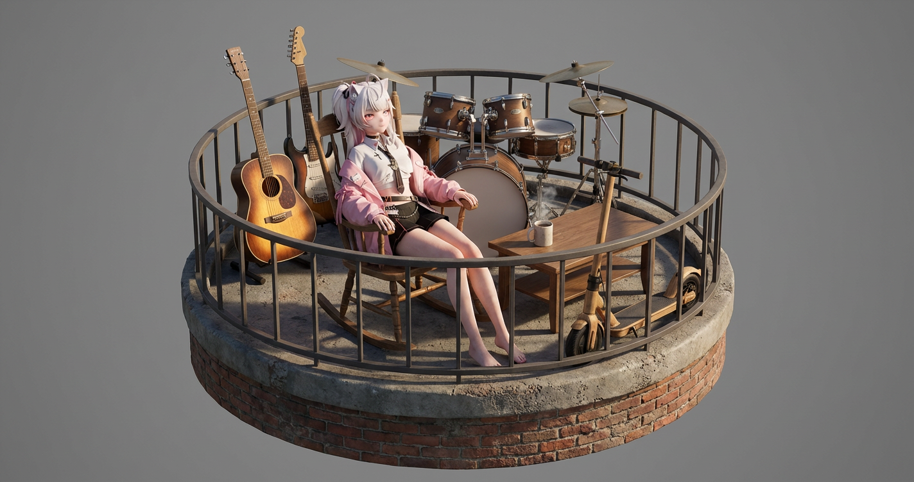
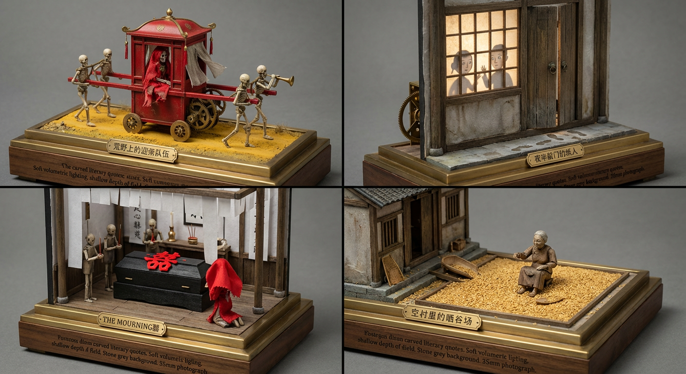
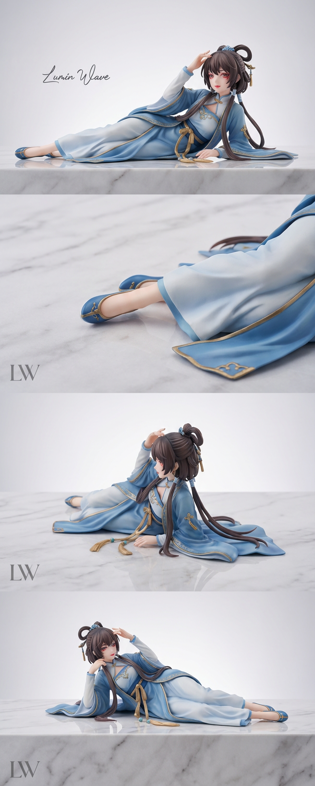
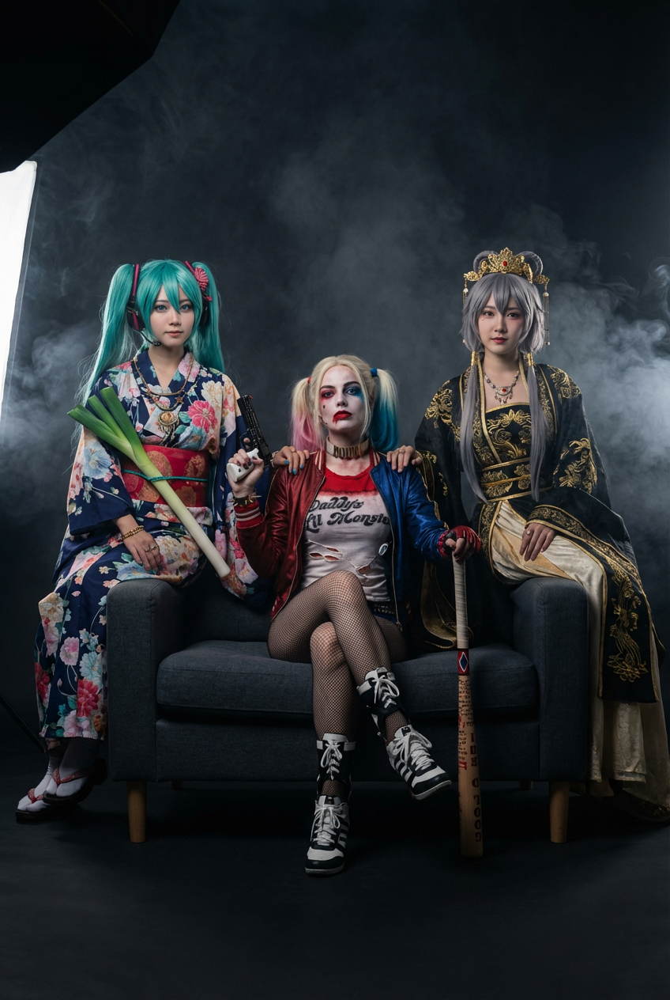
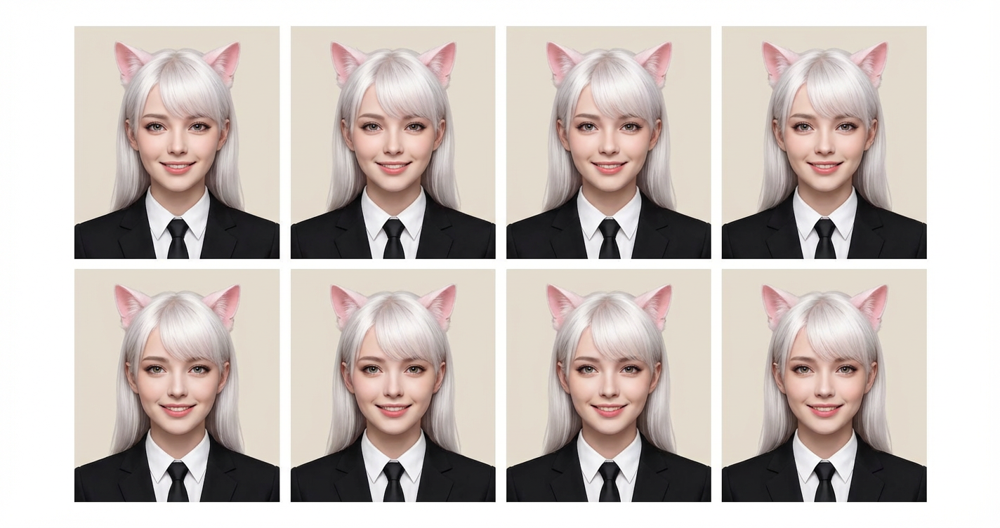

# 20260109 图片 prompt 记录

### 原图


## 圆座 3D 等距视图
```text
概念：圆形底座上的 [插入位置] 场景的超现实 3D 等距视图。
对象（视觉效果）：一个全身、真实的人类[插入描述]。
* 纹理规则：拍摄对象必须具有“活生生的人类皮肤”纹理（次表面散射、毛孔、自然瑕疵）。
* 重要提示：他不是玩具/洋娃娃。他看起来就像一个真人被插入到场景中。
* 姿势：[插入姿势，例如自然坐]。
组成和规模（至关重要）：
* 相机：等距广角镜头（全视图）。确保整个圆形底座、主体和所有道具在框架内可见。
* 比例：完美的相对比例。道具（例如踏板车、桌子等）必须具有相对于人体的正确尺寸。不要让人类巨人或道具变小。
环境：主体后面的[插入墙壁/建筑物]的真实部分。
* 材质：真实风化纹理（砖、水泥、木材），而非涂漆模型纹理。
道具：
* [插入道具 1，例如，Vintage Vespa]（真正的金属和镀铬纹理）。
* [插入道具 2，例如披萨和葡萄酒]（真实食物质地）。
* *注意：* 确保所有道具都存在并在底座上接地。
技术规格：虚幻引擎 5 渲染风格、8k 分辨率、全局照明、光线追踪、整个场景的锐利聚焦（深景深）、纯中性灰色背景。
负面提示：玩具、塑料、玩偶、人偶、粘土、树脂、浅景深（模糊）、特写、裁剪、扭曲比例、巨型头、卡通、缺失四肢、未完成。

eg:
概念：圆形底座上的 阳台 场景的超现实 3D 等距视图。
对象（视觉效果）：一个全身、真实的人类, 如图所示。
* 纹理规则：拍摄对象必须具有“活生生的人类皮肤”纹理（次表面散射、毛孔、自然瑕疵）。
* 重要提示：他不是玩具/洋娃娃。他看起来就像一个真人被插入到场景中。
* 姿势：自然而轻松的躺在一个摇椅上。
组成和规模（至关重要）：
* 相机：等距广角镜头（全视图）。确保整个圆形底座、主体和所有道具在框架内可见。
* 比例：完美的相对比例。道具（例如踏板车、桌子等）必须具有相对于人体的正确尺寸。不要让人类巨人或道具变小。
环境：主体后面的吉他，鼓等乐器的真实部分。
* 材质：真实风化纹理（砖、水泥、木材），而非涂漆模型纹理。
道具：
* 吉他（真正的木质纹理, 阳光下的反光）。
* 摇椅旁边咖啡桌上的咖啡（真实食物质地, 微微有热气飘起）。
* *注意：* 确保所有道具都存在并在底座上接地。
技术规格：虚幻引擎 5 渲染风格、8k 分辨率、全局照明、光线追踪、整个场景的锐利聚焦（深景深）、纯中性灰色背景。
负面提示：玩具、塑料、玩偶、人偶、粘土、树脂、浅景深（模糊）、特写、裁剪、扭曲比例、巨型头、卡通、缺失四肢、未完成。
```
### 效果图


## 恐怖的宇宙
```text
4 个随机恐怖宇宙的 2x2 网格作为动态雕塑 
[左上：荒野上的迎亲队伍, 黄土路尽头，唢呐声断断续续。红轿不落影，轿帘被风掀起，里面坐着一具穿嫁衣的白骨。队伍走得很慢，却永远走不到村口。] 
[右上：夜半敲门的纸人,三更天，门外有人轻敲。窗纸上映出两个并肩站立的影子，头大身短。开门时，只剩门槛上湿漉漉的纸脚印。] 
[左下：灵堂里的喜字,白幡高挂，棺前却贴着鲜红的“囍”。香火不断，却没人哭。新娘跪在棺旁，红盖头下传出男人的呼吸声。] 
[右下：空村里的晒谷场,晒谷场铺满金黄稻谷，却没有一户人家。风吹过，稻谷轻响，像低声交谈。场中央坐着一位老妇，一直在给不存在的孩子喂饭。]
照片般真实的微型场景，如自动机动态雕塑、精确的细节、错综复杂的内部元素、高级工作室外观、柔和的体积照明、浅景深、
以文学为主题的底座上的中心构图、35-50 毫米的视角、石板灰色的坚实无缝背景、清晰的焦点。
```
### 效果图


## 3D 玩具
```text
以 1/8 比例商业玩具 [主题] 为主要焦点，创建高度详细、逼真的 3D 渲染。该玩具采用优质材料和精密工艺制成，展现出逼真的纹理、精确的比例和栩栩如生的细节。
玩具可以优雅地躺着或自然地摆在带有微妙纹理的奢华白色大理石表面上，搭配柔和的灰白色无缝背景，营造出干净、简约、优质的氛围。使用柔和的漫射工作室灯光，在大理石上产生柔和的阴影和微妙的反射，以增强真实感和精致感。
在左上角添加一个小而精致的手写签名，以真实、优雅的字体风格写着[您的名字]。
在左下角，放置较小尺寸的[LOGO/WORDMARK]，以单色（黑色或深灰色）呈现，具有干净、微妙的外观，与整体构图相得益彰，而又不会分散对玩具的注意力。
整体形象应给人豪华、专业的感觉，适合高端产品广告。宽高比：【ASPECT RATIO】，超高分辨率，锐利对焦，商业摄影风格。
eg:
以 1/8 比例商业玩具 [洛天依手办] 为主要焦点，创建高度详细、逼真的 3D 渲染。该玩具采用优质材料和精密工艺制成，展现出逼真的纹理、精确的比例和栩栩如生的细节。
玩具可以优雅地躺着或自然地摆在带有微妙纹理的奢华白色大理石表面上，搭配柔和的灰白色无缝背景，营造出干净、简约、优质的氛围。使用柔和的漫射工作室灯光，在大理石上产生柔和的阴影和微妙的反射，以增强真实感和精致感。
在左上角添加一个小而精致的手写签名，以真实、优雅的字体风格写着[Lumin Wave]。
在左下角，放置较小尺寸的[LOGO/LW]，以单色（黑色或深灰色）呈现，具有干净、微妙的外观，与整体构图相得益彰，而又不会分散对玩具的注意力。
整体形象应给人豪华、专业的感觉，适合高端产品广告。宽高比：【2:5】，超高分辨率，锐利对焦，商业摄影风格。
```
### 效果图


## 各种场景与明星合影
```text
创建一个超现实的高端编辑工作室照片，与参考图像的构图和氛围相匹配：一个黑暗的电影工作室，飘逸的烟雾/雾气和奢华时尚的外观。
主题和身份（固定）：
• 左女：初音未来
• 右女：洛天依
• 中心主题：漫威的小丑女。
组成（必须完全匹配）：
• 垂直肖像，从大腿中部到全身的框架感。
• 深灰色现代沙发位于框架中央。
• 中心主体以自信、放松的姿势坐在沙发中间，双腿交叉，一只手以把玩形式拿着手枪,一只手手握棒球棒。
• 左边的女士（初音未来）坐在沙发左侧稍高的位置，与摄像机成一定角度，一只手臂放在沙发靠背上/靠近中心拍摄对象的肩膀，腰上别着标志性道具"大葱"。
• 右边的女士（洛天依）模仿右侧的姿势，同样抬高/倾斜，一只手臂放在沙发靠背上/靠近中心拍摄对象的肩膀。
• 三人面对镜头时表情平静、有力（奢华的竞选能量）。
衣柜和造型（固定外观）：
• 初音未来 和 洛天依 各自身着经典装束, 初音未来身着日式夏日祭服饰, 洛天依身着中国古风汉服、优雅廓形，佩戴传统首饰（项链 + 耳环 + 头冠），奢华红毯造型。
• 中心主体（用户）穿着经典战斗服，战斗服带有略微破损，渔网袜也有破洞, 身披夹克, 皮质内衣，略有灰尘与破损。
• 淡雅迷人的妆容，干净的肌肤纹理，光泽的双唇，自然而精致。
灯光（超真实，电影）：
• 低调的工作室照明，带有来自前/左上方的大型柔光箱主光、柔和的补光以及将拍摄对象与背景分开的微妙边缘光。
• 珠宝和礼服亮片上可见的深度和对比度、逼真的镜面高光。
• 背景较暗，带有柔和的烟雾（电影雾），具有层次感和氛围。
相机和现实细节：
• 使用高端演播室相机拍摄（中画幅外观），85mm 镜头感，浅景深（主体清晰，背景柔和模糊）。
• 超详细的皮肤毛孔、发丝、织物编织、闪光亮片、下巴轮廓下和沙发上的自然阴影。
• 正确的解剖结构、真实的手、真实的反射、自然的眼睛焦点。
输出要求：
• 照片真实/超真实、奢华时尚活动、无风格化、无 CGI 外观。
• 没有文字、没有水印、没有徽标、没有多余的人。
```
### 效果图


## 超逼真证件照
```text
{"description": "我的超逼真护照尺寸照片（面部特征完全一致，100%匹配，无任何面部修改）。","style": "专业影楼肖像照，适用于官方身份证或护照用途。",
“服装”：“黑色休闲西装、白色翻领衬衫和配套领带”，
“表情”：“自然的闭唇微笑，目光直视前方，双耳可见，包括肩膀。”，“光线”：“均匀均衡的正面光线，无生硬阴影，柔和的影棚色调。”
“背景”： “纯浅米色或浅蓝色背景，干净均匀。”
“构图”：“以居中构图，头部和肩部采用符合护照标准的自然比例。”
输出：在一张纸上生成 6 张相同的护照/票据尺寸照片（3x2 网格布局，垂直方向），间距均匀，可直接打印，高分辨率，工作室品质。
```
### 效果图
