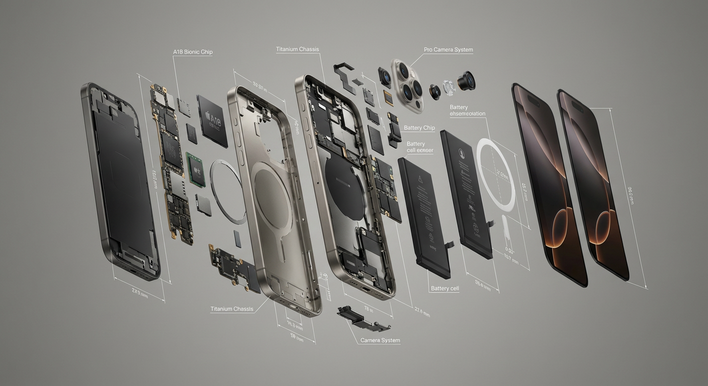
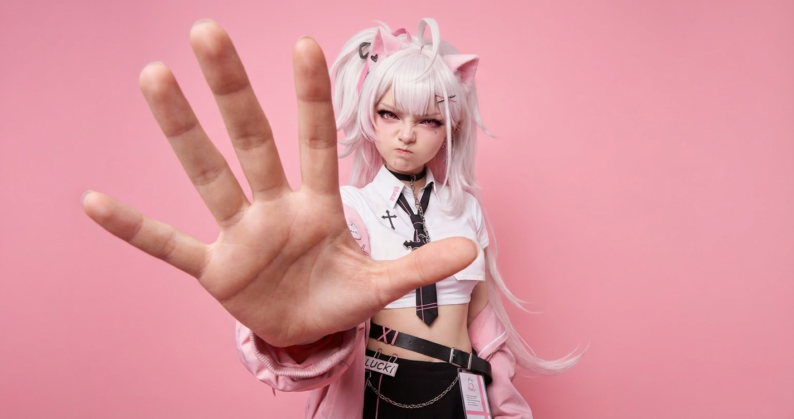

# 20260112 图片 prompt 记录

### 原图


## 任意物品拆解视图
```text
[特定标志性物体]的爆炸视图、漂浮在空中的拆卸部件、细节、高分辨率、逼真、摄影棚照明、中性背景、产品摄影、技术图纸元素、滚动布局、渲染三维物体、漂浮部件、详细机械设计。
eg:
iphone 16 的爆炸视图、漂浮在空中的拆卸部件、细节、高分辨率、逼真、摄影棚照明、中性背景、产品摄影、技术图纸元素、滚动布局、渲染三维物体、漂浮部件、详细机械设计。
```
### 效果图


## 奶凶女友
```text
使用输入人物照片作为严格的身份参考进行逼真编辑：
保持相同的脸部、面部特征、肤色、发型（颜色/刘海/长度/体积）、服装和配饰不变（没有换脸、没有新人、没有头发/服装变化）。
只改变表情/姿势/背景：撅起嘴唇，皱起眉头，有点生气/恼火，就像她开玩笑地生男朋友的气，并说“别再拍我了”。
近距离广角视角（18-28mm），身体微微前倾，一只手伸向镜头，仿佛抓住男友的手机/挡住镜头；
巨大的前景手占据画面的30-50%，手掌朝向相机，五个自然手指，逼真的解剖结构；脸部在后面，焦点清晰。
将背景替换为干净的纯粉色工作室背景（无缝，无纹理）。没有文字，没有水印，没有框架，没有多余的手指，没有变形的手，没有严重的模糊，没有风格的改变。
```
### 效果图
