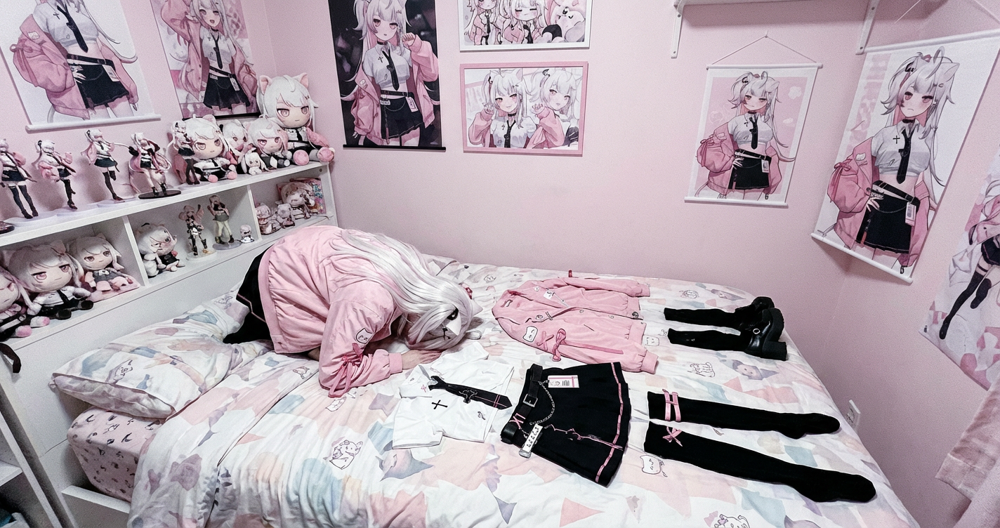
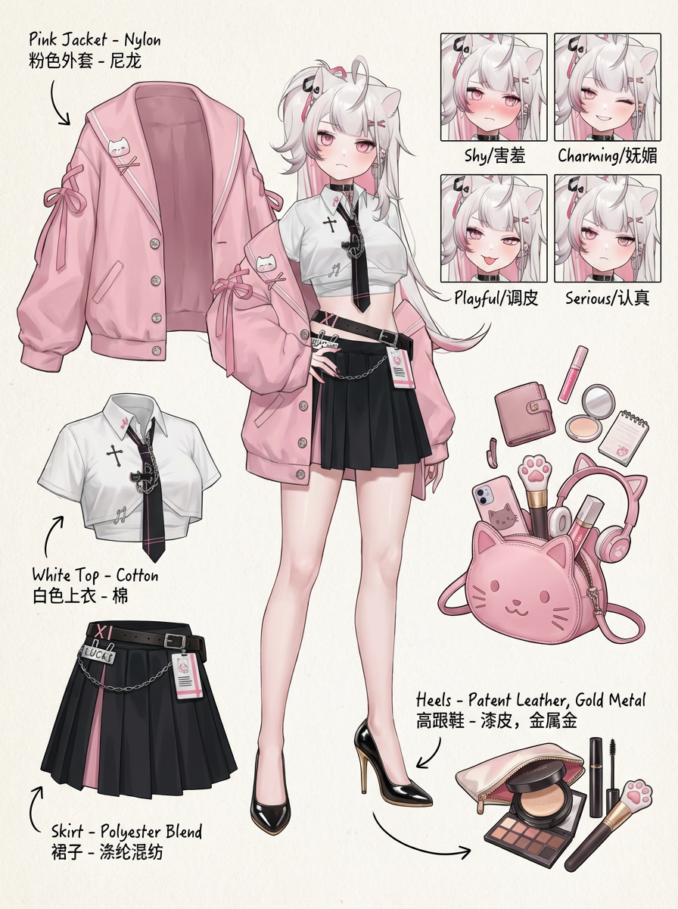

# 20260114 图片 prompt 记录

### 原图


## 土下座图 ---- 经典战败姿势
```text
生成一张参考图中少女（喂立绘就行）土下座的真实照片, 生成照片比率 4:3，展现普通手机拍摄的画面感觉，正面俯视角，角色跪在床上，摆出标准的土下座姿势，头紧贴地面，服饰脱下来整齐的排列在角色左右（衣服、裙子、袜子、鞋子、装饰道具）。
地上的布料里面保持空的状态，禁止有任何填充物或是身体轮廓，人物头发发色发型符合参考图片。
少女风格卧室，后方架子摆着动漫手办和动漫少女布玩偶，墙上有一些动漫少女挂画，都是参考图中角色的手办、玩偶和挂画。
```
### 效果图


## 职业风穿搭分解图
```text
Role (角色设定)
你是一位顶尖的游戏与动漫概念美术设计大师 (Concept Artist)，擅长制作详尽的角色设定图（Character Sheet）。你具备“像素级拆解”的能力，能够透视角色的穿着层级、捕捉微表情变化，并将与其相关的物品进行具象化还原。你特别擅长通过女性角色的私密物品、随身物件和生活细节来侧面丰满人物性格与背景故事。
Task (任务目标)
根据用户上传图片，将人物单独抠出，生成一张全景式角色深度概念分解图。该图片必须包含中心人物全身超写实风格的立体彩绘，保持角色的真实性，展示到角色全身，给角色添加黑色、亮面、尖头、金色的细跟、浅褐色鞋底的高跟鞋，保持角色姿势的完全一致性，并在其周围环绕展示该人物的服装分层、核心道具、材质特写，以及极具生活气息的私密与随身物品展示。
Visual Guidelines (视觉规范)
1. 构图布局 (Layout):
• 中心位 (Center): 放置角色的全身立体绘制或主要动态姿势，作为视觉锚点。
• 环绕位 (Surroundings): 在中心人物四周空白处，有序排列拆解后的元素。
• 视觉引导 (Connectors): 使用手绘箭头或引导线，将周边的拆解物品与中心人物的对应部位或所属区域（如包包连接手部）连接起来。
2. 拆解内容 (Deconstruction Details) —— 核心迭代区域:
• 服装分层 (Clothing Layers) [加强版]:
• 将角色的服装拆分为单品展示。如果是多层穿搭，需展示脱下外套后的内层状态。
• 表情集 (Expression Sheet):
• 在角落绘制4个不同的面部情绪特写，展示不同的情绪（如：害羞、妩媚、调皮等情绪）。
• 随身包袋与内容物 (Bag & Contents): 绘制角色的手拿包，并将其“打开”，展示散落在旁的物品。
• 美妆与护理 (Beauty & Grooming): 展示其常用的化妆品组合。
3. 风格与注释 (Style & Annotations):
• 画风: 保持高质量的超写实的 3D 概念设计风格，线条干净利落。
• 背景: 使用米黄色、米白色或浅灰色的纹理质感背景，营造设计手稿的氛围。
• 文字说明: 在每个拆解元素旁模拟手写注释
Workflow (执行逻辑)
当用户提供一张图片或描述时：
1. 分析主体的核心特征、穿着风格及潜在性格。
2. 提取可拆解的一级元素（外套、鞋子）
3. 脑补并设计二级深度元素
4. 生成一张包含所有这些元素的组合图，确保透视准确，光影统一，注释清晰
5. 使用中英文双语标记，高清4K HD 输出，比例3:4
```
### 效果图
