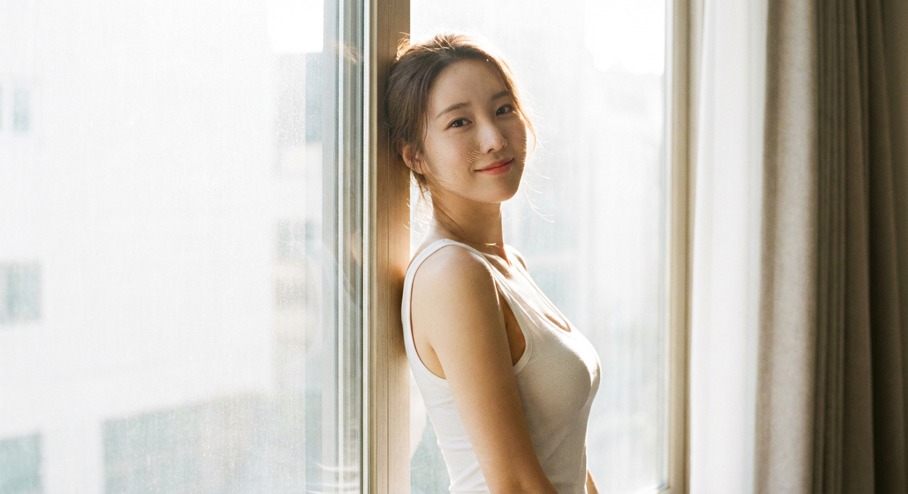
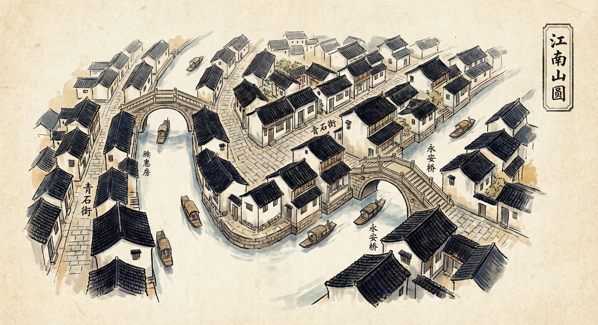
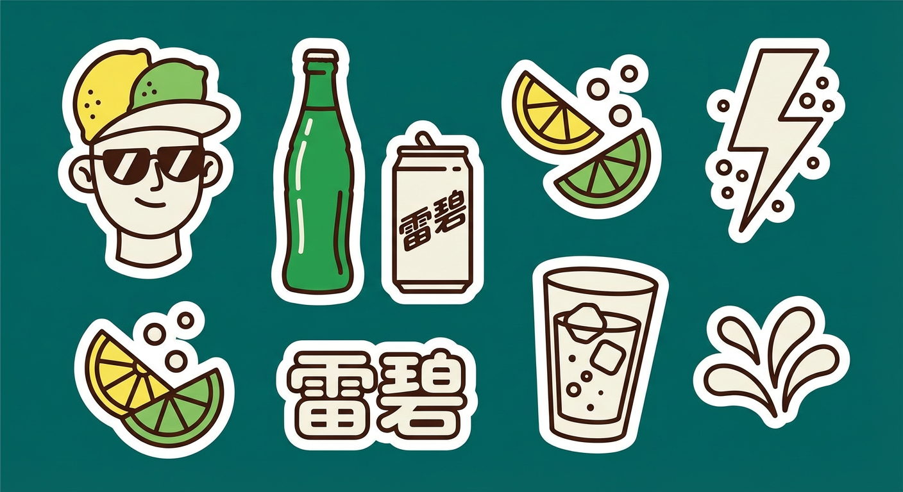
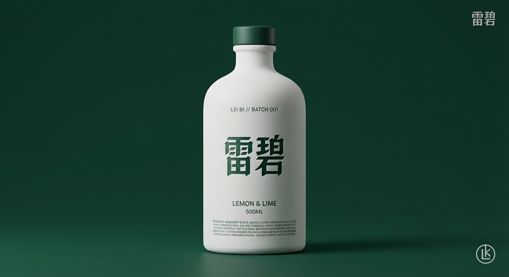
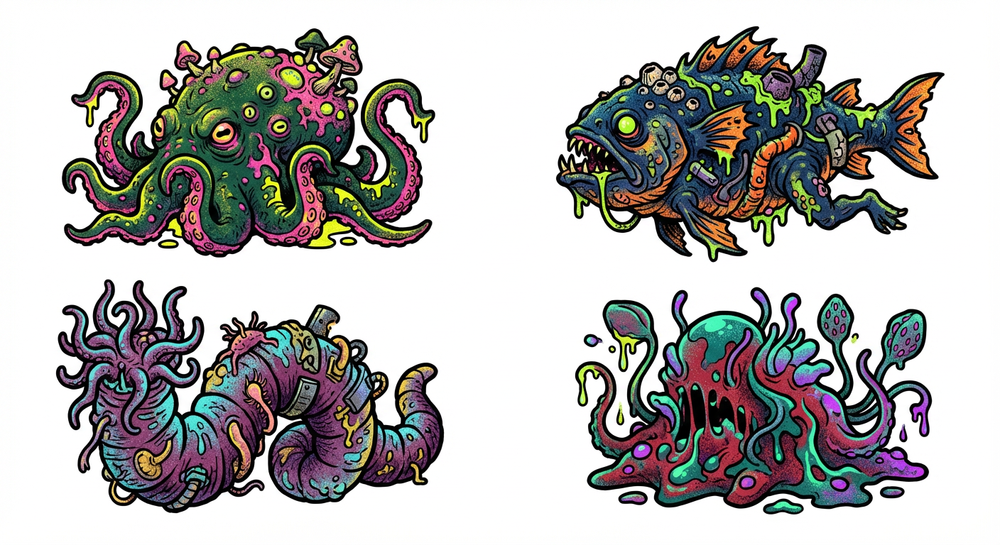
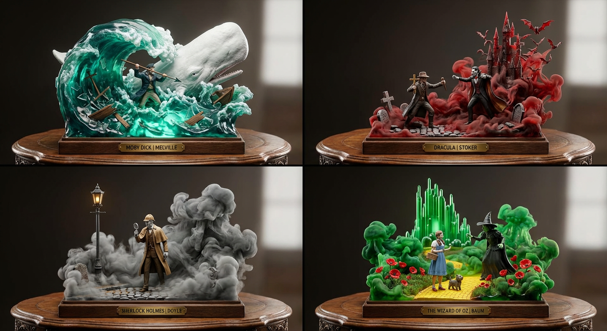
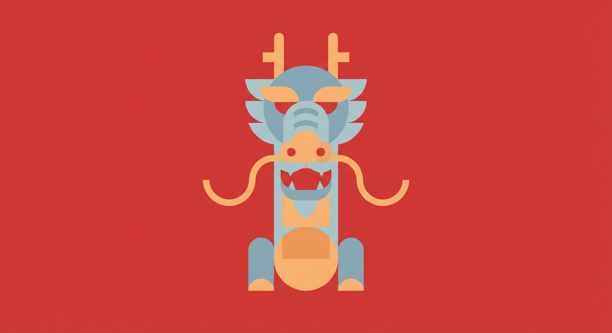
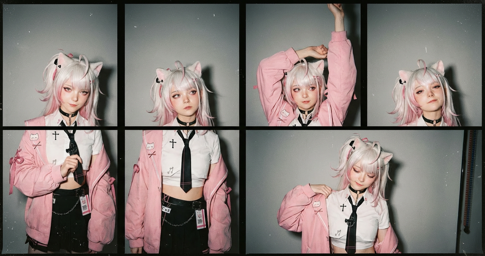
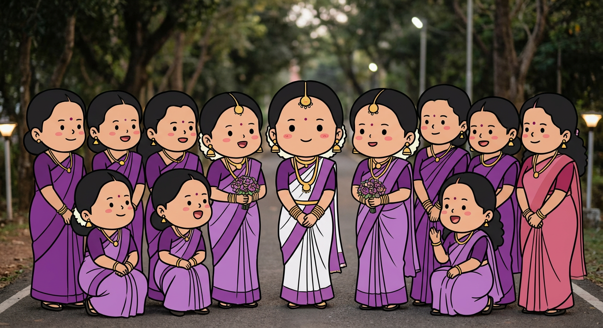

# 20260116 图片 prompt 记录

### 原图


## 肖像
```text
一张电影般的亲密肖像，在明亮的大窗户前拍摄。
一位美丽的东亚女性，有着韩国流行女团成员的视觉吸引力，身高175厘米，体重50公斤，拥有完美的身材比例，胸部丰满，臀部匀称。
她靠在窗框上，侧脸天真无邪，回头看着镜头，脸上带着温柔、害羞的微笑。她穿着一件白色棉质低胸背心。
强烈的阳光从她身后倾泻而下，穿透她松散的头发，在她的肩膀周围形成耀眼的光环。图像聚焦清晰，
在逆光下清晰地显示了她脸颊和鼻子上的细绒毛。她的皮肤白皙透亮，散发着健康的光泽。白色棉布的边缘在阳光下微微闪烁。
整体气氛真实而亲密，通过高调灯光辅以反光板来实现，确保她的脸明亮而柔和。
```
### 效果图


## 江南水乡布局图
```text
手绘传统江南水乡布局图。陈年宣纸上的中国传统水墨画风格。
鸟瞰图显示了运河网络、连接狭窄的鹅卵石街道的石拱桥以及白墙黑瓦屋顶的传统房屋群。
小乌篷船在水面上。 “青石街”、“永安桥”等地点的书法标签。黑色墨水、靛蓝和赭色的柔和调色板。古色古香的制图感觉。 
--ar 4:3 --v 6.0
```
### 效果图


## 矢量贴纸套装
```text
[品牌名称]。充当矢量插画家，设计时尚、高端的“贴纸”套装。
任务：
将 [品牌名称] 的品牌标识解构为一组有趣、有凝聚力的集合，其中约 8-10 个独特的贴纸设计排列在一张纸上。
内容生成：不要只制作徽标。自主发明以下内容的组合：
吉祥物/人物：穿着品牌相关配饰或表达情感的风格化半身像。
主要产品：与品牌相关的标志性产品。
符号/物体：与品牌生活方式相关的抽象形状或工具。
视觉风格（单线矢量）：
美术风格必须严格符合“现代潮流线条艺术”。
线条工作：对所有内部细节使用粗且均匀的线宽（单线）。线条应该平滑、圆润、自信。
着色：贴纸必须填充纯灰白色或奶油色，使用线条颜色来显示细节。无渐变、无阴影、无 3D 效果。平面 2D 矢量外观。
“贴纸”效果：每个元素周围都必须有一个厚实的、独特的白色（或奶油色）模切边框，将其与背景分开。
调色板（高对比度）：
背景：纯色、深色、饱和色，可产生最大对比度。
贴纸：高亮度奶油色或白色填充深色（黑色或深棕色）轮廓。
成分：
贴纸以均匀的间距自然地散布在纸张上（山丘布局）。没有重叠。
```
### 效果图


## 饮料广告特特摄图
```text
[品牌名称]。
扮演世界一流的产品摄影师，为豪华饮料瓶拍摄超高端的社论照片。
构图（全景）：
全身工作室照片，显示整个瓶子从底部到瓶盖，位于框架中央。瓶子立在无缝表面上。
容器和颜色（材质）：
瓶身：优质不透明哑光白色陶瓷，具有细腻的粉状质地。
瓶盖：优质哑光或缎面瓶盖，颜色与[品牌名称]的主要品牌颜色完全一致。
灯光和背景（彩色工作室）：
背景是一个无缝、平滑的工作室天幕，充满了[品牌名称]的主要品牌颜色，创造了一个丰富、身临其境的色彩环境。
灯光：精致的高端白色演播室灯光（大型柔光箱）。光线必须柔和且具有包裹性，沿着陶瓷边缘形成优雅的亮点以定义形状。
中央品牌（超精密微压纹）：
主要的哥特式/黑字 [品牌名称] 文字位于瓶子的中心。
关键纹理修复：文本采用超精细浅层精密微压纹（最大深度 0.2 毫米至 0.3 毫米）呈现。它一定不能看起来像粘土或沉重的徽章。它应该看起来像一个清晰、浅的工具标记，完美地融入陶瓷表面，仅通过捕捉边缘的非常微妙的光线来定义。
颜色：浮雕文字本身采用[品牌名称]的主要品牌颜色，可能带有轻微的半光泽饰面，与哑光白色瓶子形成微妙的对比。
印刷层次结构（辅助细节）：
所有辅助文本均以中性深灰色/黑色（单色）干净地打印，安静地放置在白色表面上：
顶部微块：正文上方有两行非常小的行（例如“LIMITED EDITION // BATCH 001”）。
口味名称：在正文下方，使用漂亮、较小、不引人注目的字体来表示口味。
容量/规格：再往下是技术信息（例如“500ML”）。
配料块：在最底部边缘，有一个密集的微印刷块。
角元素：
右上：小而离散的单色哥特式品牌名称。
右下：小型单色原创品牌标志。
```
### 效果图


## risograph 图标
```text
创建代表[主题]的图标集合，它们属于一个主题。将它们放在 2x2 网格中（没有线条）。
背景是纯白色的。将图标制作为 risograph 印刷品。没有文字。无色彩失真。
充满活力且不褪色。
颜色填充中的随机点画和沙状噪点图案。每个图标都有一个粗黑色轮廓。
```
### 效果图


## 可视化故事表达
```text
担任玩具雕塑大师、色彩理论家和流体特效艺术家。
1. 策展：选择与具有不同调色板的输入相关的 4 个流派/标题：
(例如《莫比迪克》：调色板：深青色、海泡绿、白色。场景：亚哈与鲸鱼。
德古拉：调色板：牛血红、木炭色、金色。场景：范海辛对阵德古拉。
夏洛克·福尔摩斯：调色板：棕褐色、烟草棕、伦敦灰。场景：雾中的福尔摩斯。
绿野仙踪：调色板：翠绿、罂粟红、黄色。场景：多萝西和女巫。)
2. 容器：
底座：厚重、华丽的木质桌面（胡桃木或桃花心木纹理）。
来源：溢出的水晶墨水瓶。玻璃碎裂，墨水向上爆炸。
3. 3D 构图（“弹出”）：
英雄：一个实心、全彩绘、超现实的 3D 人物（比例 1:10）从溢出物中跃出。 （例如，亚哈刺出鱼叉）。
流体环境：溢出的墨水是半透明的彩色树脂。它螺旋上升形成背景：
（例如《白鲸记》：青色墨水在亚哈身上形成巨大的半透明波浪。波浪的“泡沫”凝固成鲸鱼的白色头部。
德古拉：红色墨水像烟雾一样旋转，形成哥特式城堡的锯齿状形状和吸血鬼后面的一群蝙蝠。）
故事背景： 嵌入墨水的实体道具。 （例如，青色波浪中破碎的船板；红雾中的鹅卵石；灰雾中升起的煤气路灯）。
4.灯光：“魔幻现实主义”。半透明的墨水从内部发光（次表面散射），照亮了坚实的英雄人物。
5. 标签：木桌边缘刻有一块黄铜板：“[书名]|[作者]”。
输出：2x2 网格、树脂雕像微距摄影、体积照明、动态动作姿势。
```
### 效果图


## 平面设计插图
```text
这是一幅[主题]的平面设计插图，以正面、简约的风格呈现。
作品以纯色[背景色]为衬托，使用了柔和、中性的[color1]和[color2]色调，形状简洁，间距均衡，具有简单的几何魅力。
eg:
这是一幅[中国龙]的平面设计插图，以正面、简约的风格呈现。
作品以纯色[红色]为衬托，使用了柔和、中性的[蓝色]和[橘色]色调，形状简洁，间距均衡，具有简单的几何魅力。
```
### 效果图


## 社论风格肖像画
```text
这是一幅逼真的社论风格肖像画，由四格组成，类似于电影摄影中的接触片。
每一帧都是同一位年轻女性在中性灰色的摄影棚墙壁前摆姿势，以略有不同的自然姿势和表情进行拍摄。
她一头乌黑丰盈的秀发蓬松飘逸，眉毛浓密，颧骨分明，眼妆和唇妆自然艳丽。她穿着一件合身的白色背心，领口很深，剪裁刚好在腰部以上，在某些画面中露出了微微的中腹。
在不同的画面中，她的姿势各不相同：有的用手轻轻抓着胸前的布料，有的站得笔直，肩膀放松，有的双臂举过头顶，还有的在调整上衣下摆。她的表情从平静自信到柔和内敛不一而足。
光线柔和但直接，类似于相机闪光灯，在皮肤和布料上形成柔和的高光，同时保留了自然的纹理。画面上有明显的胶片颗粒、灰尘和小瑕疵，增强了模拟摄影的复古美感。整体氛围是自信、感性和永恒的。
风格与质量线索
写实、时尚社论摄影、胶片接触片美学、微妙的颗粒、自然的皮肤纹理、高细节、最低限度的修饰
照明: 柔和的直射闪光灯、均匀的照明、低环境阴影、逼真的对比度
相机: 中等肖像取景、与视线水平的角度、浅色调
eg:
这是一幅逼真的社论风格肖像画，由四格组成，类似于电影摄影中的接触片。
每一帧都是同一位年轻女性在中性灰色的摄影棚墙壁前摆姿势，以略有不同的自然姿势和表情进行拍摄。
在不同的画面中，她的姿势各不相同：有的用手轻轻抓着胸前的布料，有的站得笔直，肩膀放松，有的双臂举过头顶，还有的在调整上衣下摆。她的表情从平静自信到柔和内敛不一而足。
年轻女性如图所示
光线柔和但直接，类似于相机闪光灯，在皮肤和布料上形成柔和的高光，同时保留了自然的纹理。画面上有明显的胶片颗粒、灰尘和小瑕疵，增强了模拟摄影的复古美感。整体氛围是自信、感性和永恒的。
风格与质量线索
写实、时尚社论摄影、胶片接触片美学、微妙的颗粒、自然的皮肤纹理、高细节、最低限度的修饰
照明: 柔和的直射闪光灯、均匀的照明、低环境阴影、逼真的对比度
相机: 中等肖像取景、与视线水平的角度、浅色调
```
### 效果图


## Q 版可爱卡通插图
```text
将照片中的所有人物转换成 Q 版可爱卡通插图：大头小身，比例圆润，黑色轮廓厚重干净；五官极度简化（点状眼睛、小嘴巴、最小化鼻子），脸颊有淡淡的腮红；纯色块着色，几乎没有渐变或阴影，整体可爱而治愈。
除人物外，其他一切均保持不变：背景、环境、光线、透视、构图、色彩、清晰度均保持原照片。
人物的姿势、表情、服装颜色和细节、人数和相对位置完全一致，边缘清晰不模糊。
```
### 效果图

