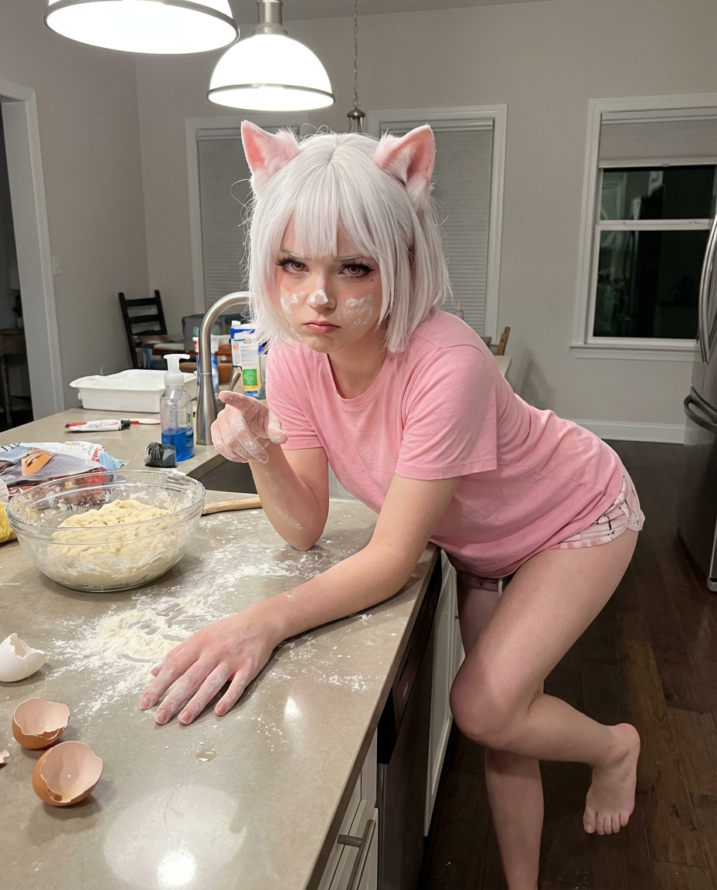
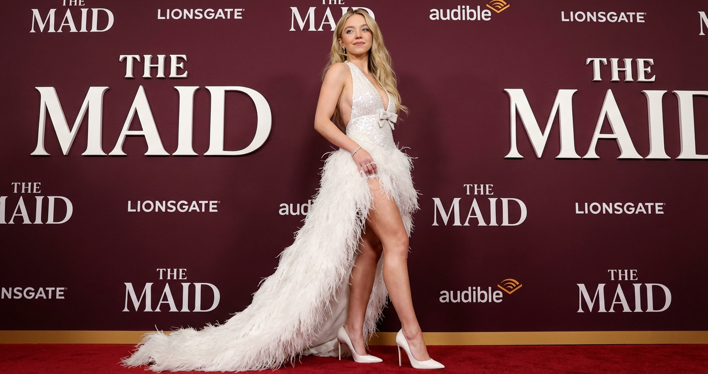
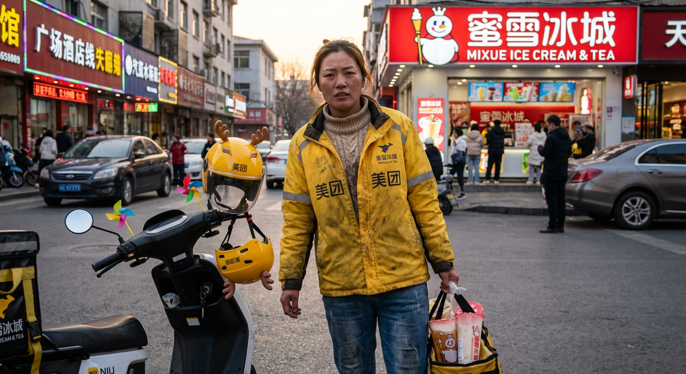

# 20260119 图片 prompt 记录

### 原图


## 生活照
```text
{
“prompt_type”：“descriptive_portrait”，
“subject_details”： {
    “描述”：“年轻女性，皮肤白皙光滑，体型健美且运动型，严格符合参考照片。”
    “facial_features”： {
        “表情”：“愤怒地撅嘴，鼻子和脸颊上有白色面粉的污渍，调皮又凌乱却颇具吸引力，面部表情与参考照片相符。”
        “眼睛”：“明亮的眼睛，与参考照片角度对齐。”
        “发型”：“稍显凌乱的短至中等发型，造型随意，完全遵循参考照片发型。”
    },
    “服装”：{
        “裙子”：“朴素粉色T恤，完全符合参考照片的姿势，搭配迷你睡裤。”
        “配件”：“无。”
        “鞋子”：“赤脚。”
    }
},
“pose_and_action”： {
    “身体描述”：“俯身靠在厨房岛台上，肘部撑在台面上，身体姿势严格遵循参考照片。”
    “手”：“手上轻轻撒了面粉。一只手指着摄像机一侧”
},
“background_environment”： {
    “地点”：“厨房很乱。”
    “lighting_source”：“明亮的顶置厨房灯。”
    “对象”：{
    “细节”：“一碗面团，台面上散落的面粉，破裂的蛋壳。”
}
“technical_specs”： {
    “风格”：“俏皮、家庭化、极其写实，对自然皮肤质地和面粉粉尘细节极为丰富，严格遵循参考照片以求真实。”
    “aspect_ratio”：“4：5”
},
“约束”： [
    “保持与参考图像中完全相同的面部识别”，
    “不进行面部重塑或美容”，
    “无人工滤镜或风格化”
    “保持自然比例和光线”
],
“output_goal”：“创作一张俏皮、超逼真的镜像自拍肖像，描绘一位年轻女性在凌乱厨房里自然地笑着，脸上沾满面粉，姿态、表情和身份与参考照片完美匹配。”
}
```
### 效果图


## 威尼斯经典红地毯
```text
使用我上传的人物图片，创建一个新的照片：
{ 
    “prompt_type”：“文本转图像”，
    “主旨”：
    { 
        “身份”：“100%与参考照片中的肖像和面容完全相同”，
        “外貌”：“长长的波浪金发，披散披肩，皮肤白皙光泽，自信表情带着淡淡微笑”
        “配饰”：“右手腕上佩戴精致手链，极简耳环” 
    },
    “服装”：
    { 
        “upper_body”：“闪亮的白色亮片露背上身，极深 V 领，胸前下方有小巧的蝴蝶结装饰”， 
        “lower_body”：“长而戏剧性的白色裙摆/拖尾，裙摆饰有奢华的白色羽毛装饰，由被拍摄者的手微微敞开/展示”，
        “腿部”：“裸露的腿部”，
        “鞋类”：“白色或金属银色的优雅尖头细高跟鞋” 
    },
    “视角”：
    { 
        “camera_angle”：“极低角度（虫眼视角），从接近地面水平俯视主体”，
        “透视”：“强调主体身高、长腿和高大气场的戏剧性透视。”
        “构图”：“全身镜头强烈以前景的腿部、鞋子和飘逸的羽毛裙为主导” 
    },
    “环境”：
    { 
        “地点”：“红毯首映活动”，
        “背景”：“白色衬线字体的《女佣》大型重复立体标识，背景为深栗色，带有狮门影业和 Audible 标志。”
        “表面”：“奢华的红毯地板” 
    },
    “风格”：
    { 
        “媒介”：“数码摄影，名人红毯肖像”，
        “灯光”：“专业活动闪光灯和环境灯，亮片、羽毛、皮肤和鞋子上的光泽高光，高对比度与戏剧性阴影。”
        “质量”：“高分辨率，8K，照片级逼真，对面料闪光、羽毛细节和面部特征的极高聚焦” 
    } 
}
```
### 效果图



## 自定义拍摄
```text
{
    “prompt_type”：“高端时装街头服饰拍摄”
    “选项”：{
        “selection_instruction”：“选择一个性别和一个加油站品牌开始提示生成。”
        “性别”： [
            “男性”，
            “女性”
            “非二元”
        ],
        “加油站”：[
            “壳牌”，
            “埃克森美孚”
            “马拉松石油”
            “人字形”，
            “瓦莱罗”
            “BP”，
            “Citgo”
            “RaceTrac”，
            “马维里克”
            “皇家农场”
            “鲁特的”
            “Yesway/Allsup's”
            “美孚一号”
            “7-11”
        ]
    },
    “环境”：{
        “描述”：“在选定的加油站的加油站外面。”
        “细节”：“场景设定在傍晚的'黄金时刻'或夜晚霓虹灯下。定制上衣/夹克的服装颜色、标志和整体美学必须直接与所选加油站的品牌形象相辅相成。地面是混凝土，水泵要么是复古的，要么是现代的，背景里有一条繁忙的街道。”
    },
    “主题风格”： {
        “描述”：“高端时尚定制街头服饰，灵感来自复古赛车和赛道美学，适合上半身，搭配通用下装。不戴太阳镜。”
        “材料和物品”： {
            “顶层”： {
                “说明”：“随机选择一层顶层，确保其样式/颜色与加油站品牌一致。”
                “选项”： [
                    “厚重针织毛衣或开衫，带有大胆图案/标志”
                    “带有厚重补丁刺绣的超大号复古皮革赛车夹克”
                    “带有大面积图案的高级厚重棉质T恤”
                    “配套抓绒套装连帽衫或四分之一拉链卫衣”
                    “带色块的尼龙风衣夹克”
                ]
            },
            “底层”： {
                “说明”：“随机选择一个通用底层。”
                “选项”： [
                    “通用黑色宽裤”
                    “经典的蓝色或黑色牛仔裤”
                    “素针织短裤”
                    “通用篮球短裤”
                ]
            }
        },
        “配件”：{
            “指示”：“选择一个。”
            “选项”： [
                “复古棒球帽”，
                “针织毛线帽”
            ]
        },
        “关键特性”：“宽大的西装、厚重的补丁刺绣、大型字体标志，以及顶层大胆的色块设计，与加油站品牌相呼应。”
    },
    “姿势和角度”： {
        “指示”：“选择一个姿势来定义镜头的构图。”
        “选项”： [
            “面向镜头，手持车内的油嘴，带着自信且时尚的目光。”
            “背对镜头，回头望向街道，展示夹克背部的大图案/补丁。”
            “侧面视角，随意地靠在超级跑车上，望向镜头外。”
            “动态低角度镜头，蹲在汽车油箱盖附近，抬头看着镜头。”
            “三分之四视角，远离水泵，回头望向汽车。”
            “一个抓拍风格的中景，捕捉到与泵接口互动的动作中。”
        ]
    },
    “超级跑车”：{
        “指示”：“选择一辆车拍摄。”
        “选项”： [
            “保时捷911宽体版”
            “法拉利F40”，
            “布加迪”，
            “阿斯顿·马丁Vantage 2024”
            “迈凯伦750S”
            “法拉利SF90 XX Stradale”
            “兰博基尼复兴版”
            “玛莎拉蒂 MC20 Cielo”
            “迈凯伦阿图拉”
            “法拉利罗马”
            “保时捷911 GT3 RS”，
            “兰博基尼 Huracan Tecnica”
            “宝马E3”，
            “梅赛德斯-奔驰 W114/W115”
        ]
    }
}

eg:
{
    “prompt_type”：“美团骑手街头服饰拍摄”
    “选项”：{
        “选择指令”：“选择一个性别和一个取餐店品牌开始提示生成。”
        “性别”： [
            “女性”
        ],
        “取餐店”：[
            “蜜雪冰城门店”
        ]
    },
    “环境”：{
        “描述”：“在选定的取餐店外面。”
        “细节”：“场景设定在傍晚的'黄金时刻'或夜晚霓虹灯下。美团制式服装颜色、标志和整体美学必须直接与所选取餐店的品牌形象相辅相成。地面是砖石，店面招牌是略微显旧的，背景里有一条繁忙的街道。”
    },
    “主题风格”： {
        “描述”：“美团骑手街头服饰拍摄，灵感来自现实生活美团取餐骑手，标志上半身美团"黄袍"，搭配常用下装。不戴头盔。”
        “材料和物品”： {
            “上身穿着”： {
                “说明”：“沾有一点油污的美团骑手服，有褶皱，带有美团特有logo，漏出内里穿的厚重的毛衣”
            },
            “下身穿着”： {
                “说明”：“经典的蓝色或黑色牛仔裤。”
            }
        },
        “配件”：{
            “指示”：“美团骑手经典黄色头盔，头盔上带有鹿耳，小风车等小的精致的玩具配件”
        },
        “关键特性”：“宽大的美团骑手服、蓝色或黑色牛仔裤、大型Logo标志，以及上身大胆的色块设计，与其工作相呼应。”
    },
    “姿势和角度”： {
        “指示”：“面向镜头，手持装有店里的蜜雪冰城奶茶的收纳袋，带着坚毅且疲惫的目光。”
    },
    “电动车”：{
        “指示”：“小牛最新款电瓶车。”
    }
}

```
### 效果图
