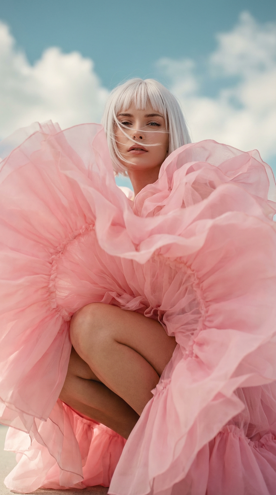
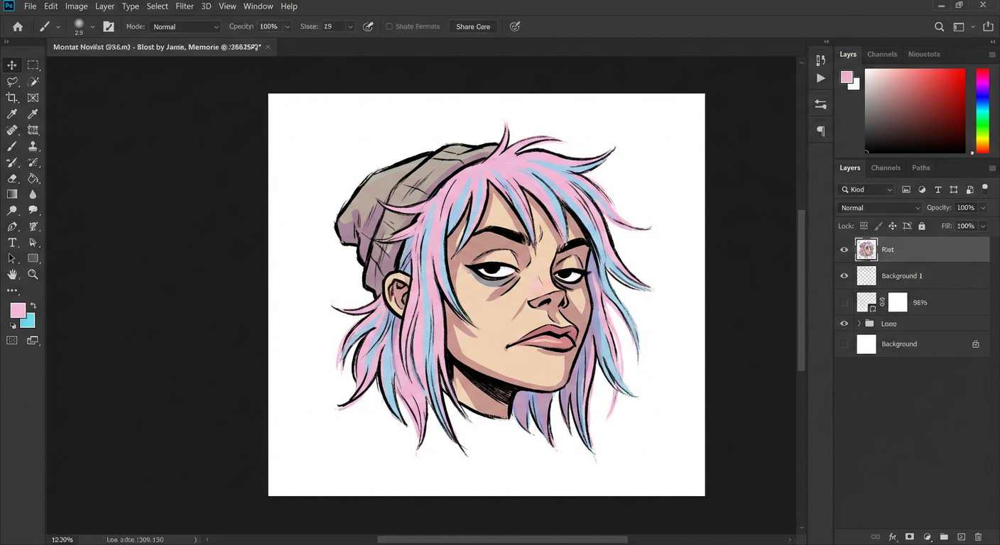

# 20260120 图片 prompt 记录

### 原图


## 高定时尚大片
```text
9:16 竖版，写实高定时尚大片风格。使用我上传的人物五官图作为唯一身份参考，100%还原同一张脸
画面内容：一位女性穿着超大体积的云朵感粉色礼服材质高级，且柔软，多层巨大的荷叶边褶皱堆叠，面料轻薄但有结构（organza / tulle / silk taffeta 质感），裙摆像棉花糖云一样膨胀，有裙子飘动起来挡住部分镜头（上下左右）人物很靠近镜头，层层涌动。人物自信，蹲在镜头前，露出大腿，齐耳短发，齐眉的刘海，几缕头发在脸上飘动，礼服的褶皱随着步伐产生明显的流体波动；允许在裙摆边缘出现自然的运动模糊来强调动态，但脸部必须清晰锐利。裙子摆动的同时，
摄影：低机位仰拍，Canon EOS R5 质感，85mm 镜头，大光圈浅景深，焦点锁定在人物面部与上半身；背景味复古色的蓝天+白色云朵。光线：柔和主光（soft key light）从地面打来，让粉色礼服呈现「发光、轻盈、梦境」的高级质感；整体色调干净、低脏度、偏高定杂志拍摄质感。
构图：人物偏左构图
```
### 效果图


## 爱播风格卡片
```text
使用[字体风格]字体帮我制作出一张[卡片风格]的卡片
图片上方为 [图片上方描述]
图片中上为 "[中文拼音]", 中部为 中文 "[中文名称]"
图片左侧为 [左侧描述]
图片右侧为 [右侧描述]
图片左下角与右下角分别为 根据上传图片生成的 两个不同的[角色姿态描述]的角色大头贴
eg:
使用动漫的梦幻字体帮我制作出一张如梦如幻的卡片
图片上方为 一棵参天大树，树上挂满了一个个充满梦幻色彩的梦境光球依稀可见里面的小人
图片中上为 "AI BO", 中部为 中文 "爱 播"
图片左侧为 一个小男孩儿在科技风的卧室睡姿四仰八叉
图片右侧为 一个小女孩儿在充满各种娃娃的卧室睡姿憨态可掬
图片左下角与右下角分别为 根据上传图片生成的 两个不同的夸张地可爱的，能带来幸福快乐的角色大头贴
```
### 效果图


## GORILLAZ 风格 头像插画
```text
[人物/角色名]。
担任虚拟乐队“Gorillaz”的首席角色设计师（风格类似Jamie Hewlett）。
成分（严格浮动头）：
只生成[角色/人物]头部的插图。
关键限制：绝对不能有脖子、肩膀、身体部位。头部必须完全独立地悬浮在画面中央。可以把它想象成一个被斩首的头像，或者悬浮在太空中的面具。
构图与角度：正中。头部略微倾斜，呈三分之四视角以增强动态音量。头部周围留有充足的负空间。
视觉风格（“GORILLAZ”美学）：
插画必须模仿Gorillaz动画阶段（塑料海滩/恶魔时代）标志性、粗犷的漫画风格。
线条（粗糙墨水）：不要使用干净均匀的矢量线条。使用富有表现力、有质感的“刷笔”描线。线条的粗细必须变化，看起来粗糙、生涩、不完美，并且有轻微的墨水渗出纹理。它应该感觉像手绘在纸上，都市风格且朋克。
角色塑造：赋予角色独特的Gorillaz态度：略带愤世嫉俗、疲惫的眼神、夸张的表情嘴巴、棱角分明的五官，以及酷炫的地下氛围。
色彩与阴影（粉彩漫画）：
调色板：使用柔和的粉彩调色板来处理头发、服装细节和背景元素。
肤色（尊重）：关键：保持肤色自然且尊重[角色/人物]的种族。除非原角色是非人类，否则不要使用不自然的肤色（比如绿色或僵尸灰）。
阴影技巧：使用硬边的卡通渲染。没有软喷涂。用鲜明、锐利的深色粉彩色块来勾勒鼻子、眉毛和下颌线下的阴影。
背景：
纯白（#FFFFFF）。平坦、干净、空气充沛。
```
### 效果图


## 官方商标标志
```text
[BRAND NAME]，官方商标标志，严格呈现为实心3D物体，保持原始矢量形状和比例，未进行任何艺术上的重新诠释或扭曲。
该标志由深色、高度抛光的镀铬金属制成，表面有细微划痕和瑕疵，破坏了镜面表面。
该物体完美地置中于一个广阔、无限纯白的虚空中，没有可见的背景元素或摄影棚设备。
灯光在金属边缘形成柔和的电影光晕（光晕效果）。
50mm镜头美学，浅景深轻柔地模糊物体最远处的点。
在整个图像上会覆盖明显且可见的胶片颗粒。
```
### 效果图
