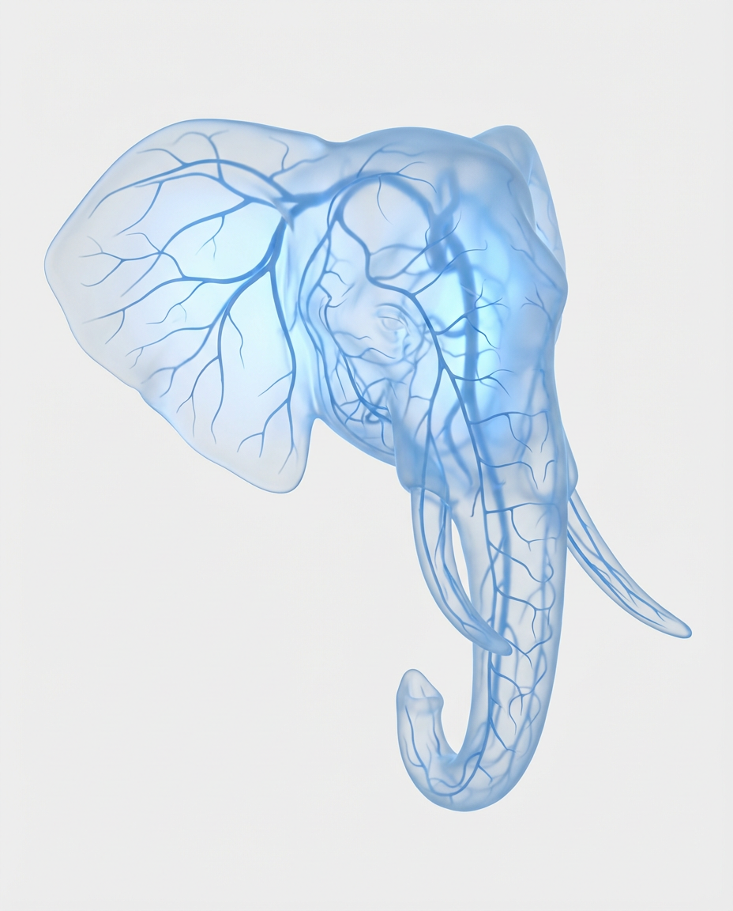

# 20260123 图片 prompt 记录

### 原图


## 生物血管场域图 (适用于任意物体)
```text
{
  "项目名称": "心血管_血管化_效果_任意对象",

  "用户自定义": {
    "使用说明": "将下方对象更改为任意物品，以便将心血管血管化效果应用到该对象上",
    "对象": {
      "当前设置": "大象的头部",
      "描述": "选择任意对象——系统将自动为其应用血管化的心血管视觉效果"
    }
  },

  "设置": {
    "风格": "心血管血管半透明效果",
    "画面比例": "4:5",
    "配色方案": "浅蓝色调叠加于极浅灰色背景"
  },

  "提示词构建": {
    "关键配色规范": {
      "背景": "纯平 #FEFEFE —— 接近白色，无渐变，完全平整且颜色一致",
      "主色": "仅允许蓝色系 —— 明确限定为 #BED1E9、#84AED2、#8DBCE4，禁止紫色及其他颜色",
      "浅蓝": "#BED1E9 —— 用于较亮区域及精细毛细血管",
      "中蓝": "#84AED2 —— 用于中等层级区域与血管",
      "亮蓝": "#8DBCE4 —— 用于主要血管与高光区域",
      "色彩范围": "仅使用上述三种蓝色，通过明暗变化创建层次与深度",
      "绝不允许紫色": "禁止紫色、薰衣草色、紫罗兰色 —— 仅限蓝色",
      "始终保持一致": "始终使用这三种指定蓝色，不允许任何变化",
      "对比度": "使用三种明确区分的蓝色形成更高对比度，使对象清晰突出"
    },

    "心血管血管效果": {
      "核心概念": "仅显示心血管静脉与血管——复杂精细的血管网络遍布整个物体内部",
      "关键禁止心脏": "绝对禁止出现心形、心脏器官或任何心脏结构",
      "禁止嵌套对象": "禁止在物体内部放置心脏、大脑、器官、肺、肾或任何其他物体——仅允许血管网络",
      "仅限血管": "仅显示心血管系统中的血管、静脉、动脉与毛细血管——禁止器官、结构或其他形态",
      "非真实解剖": "不呈现真实解剖器官——仅为抽象化的血管分支网络",
      "血管网络": "血管状结构形成的复杂分支网络，覆盖整个物体内部，呈现有机树状分支形态",
      "血管外观": "纤细精致的线条与管状结构，使用蓝色调（#BED1E9、#84AED2、#8DBCE4）构成复杂网络",
      "分支模式": "自然有机分支结构——较粗血管逐渐分裂为细小毛细网络",
      "主血管必须连接": "主要血管必须彼此连接，整体连续流动，禁止随机中断",
      "连续流动": "血管网络连续流动，逻辑连接清晰，不允许断裂或漂浮片段",
      "血管层级": "明确层级关系：主血管（#8DBCE4 亮蓝）→ 中级血管（#84AED2）→ 细微毛细血管（#BED1E9）",
      "连接节点": "所有血管在分支点自然连接，形成连续的血管树结构",
      "密度": "高密度、复杂精细的网络覆盖整个物体内部",
      "三维结构": "血管贯穿整个物体纵深，呈现三维连续网络",
      "抽象模式": "抽象血管分支图案，而非真实解剖器官"
    },

    "磨砂玻璃半透明关键规范": {
      "表面质感": "磨砂玻璃外观——半透明、乳白色、柔和",
      "半透明性": "半透明状态——可部分透视，且光线被扩散",
      "非透明玻璃": "不是清澈玻璃，而是磨砂扩散型半透明质感",
      "不透明度": "部分不透明，具有柔和乳白感，可显示内部结构",
      "纹理": "平滑的磨砂玻璃纹理，柔和哑光半透明表面",
      "光线扩散": "光线通过磨砂表面扩散，形成柔和光晕",
      "内部可见性": "血管网络可透过磨砂半透明表面清晰可见"
    },

    "内部柔光关键规范": {
      "光源": "柔和光线从物体内部发出，形成内发光效果",
      "光晕质量": "温和柔软的内发光，而非强烈刺眼的光",
      "光线扩散": "光线通过磨砂半透明材质扩散，营造柔和氛围",
      "背光元素": "物体后方存在柔和背光以增强通透感",
      "血管照明": "血管网络被内部柔光微妙照亮，清晰可见",
      "整体亮度": "物体从内部散发柔和、空灵的光感",
      "非外部光源": "光线来源于物体内部，而非外部强光"
    },

    "轮廓阴影照明": {
      "关键阴影位置": "阴影仅存在于物体表面轮廓，禁止投射到背景",
      "禁止投影": "绝对禁止在背景或地面产生任何投影",
      "仅限轮廓阴影": "阴影仅存在于物体自身的曲面、边缘与凹陷处",
      "表面阴影": "物体表面的阴影更加明显，用于增强三维立体效果",
      "阴影质量": "柔和但清晰的蓝色调阴影，保持整体蓝色体系",
      "阴影强度": "增强物体表面阴影强度，以清晰定义形态",
      "阴影颜色": "使用调色板中的深蓝色，而非灰色或黑色",
      "非生硬": "阴影边缘柔和但对比明确",
      "形态定义": "通过表面阴影清晰定义三维形态与曲面",
      "颜色一致性": "阴影保持蓝色体系，禁止使用灰或黑",
      "位置": "阴影集中在边缘、曲线和凹陷区域",
      "平滑动态": "阴影在物体表面自然流动，呈现雕塑感",
      "对比度": "物体表面阴影具有更强对比度以展现深度",
      "可见性": "阴影清晰可见，用于强化立体结构",
      "绝不在外部": "背景与地面绝不允许出现任何阴影"
    },

    "对象处理": {
      "基础对象": "使用用户自定义中的对象作为主体",
      "关键完整对象": "始终显示完整对象——从顶部到底部完全可见",
      "完整可见性": "对象整体必须完整出现在画面中，不得被裁切",
      "构图": "画面包含完整对象并保留适当留白",
      "关键三维性": "对象必须为三维形态，禁止平面化",
      "立体感": "对象具备明确体积、曲面与轮廓",
      "体量": "对象呈现真实体量与三维存在感",
      "深度线索": "通过表面轮廓阴影塑造立体深度",
      "外观": "磨砂半透明三维物体，内部血管网络可见",
      "颜色一致性": "整个对象仅使用指定三种蓝色",
      "对比度": "使用三种蓝色形成更高对比度",
      "表面": "磨砂玻璃表面，内部柔光，表面阴影清晰",
      "仅限表面阴影": "阴影仅存在于对象表面",
      "内部": "仅显示连续血管网络，绝无心脏或器官",
      "禁止心脏": "绝不显示任何心形或心脏器官",
      "边缘": "内部光照使边缘柔和发光，同时具备清晰轮廓阴影",
      "整体效果": "完整三维半透明对象，内部为连续抽象血管系统"
    },

    "背景关键规范": {
      "颜色": "纯平 #FEFEFE —— 精确色值",
      "平整度": "完全平整，无任何渐变或变化",
      "禁止任何阴影": "背景任何位置绝不允许出现阴影",
      "禁止投影": "不允许投射阴影或地面阴影",
      "一致性": "始终保持 #FEFEFE，不可变动",
      "均匀性": "画面整体零色阶变化",
      "质量": "干净、极简、无缝背景",
      "氛围": "冷静、临床、极简风格",
      "分离感": "通过蓝色与通透性使对象从背景中区分"
    },

    "风格与美学": {
      "整体": "医学/科学可视化与艺术空灵美感的结合",
      "参考": "临床解剖影像、医学三维可视化、科学插画",
      "情绪": "干净、空灵、理性而富有美感",
      "质量": "高端医学级可视化美学",
      "感受": "精致、复杂、生命系统的可视呈现"
    },

    "技术规格": {
      "质量": "8K 超高分辨率医学/科学级可视化",
      "渲染": "真实感半透明材质与内部结构渲染",
      "细节": "血管网络具备极高精细度",
      "半透明渲染": "准确的磨砂玻璃光扩散效果",
      "光照渲染": "内部柔光与背光营造空灵感",
      "色彩准确性": "精确一致的浅蓝色调应用",
      "背景渲染": "完美的超浅灰纯色背景"
    },

    "使用说明": {
      "如何使用": "仅需修改用户自定义中的对象字段即可应用血管效果",
      "适用对象": "任意对象——解剖结构、植物、水果、贝壳、水晶、产品、雕塑等",
      "始终包含": "完整对象、指定蓝色、纯平背景、三维体积、磨砂半透明、连续血管、内部柔光",
      "关键要求": "对象完整、三维、血管连续、无器官、阴影仅在对象表面",
      "自适应": "血管网络会自动适配对象的三维结构并保持连续性"
    }
  }
}
```
### 效果图
