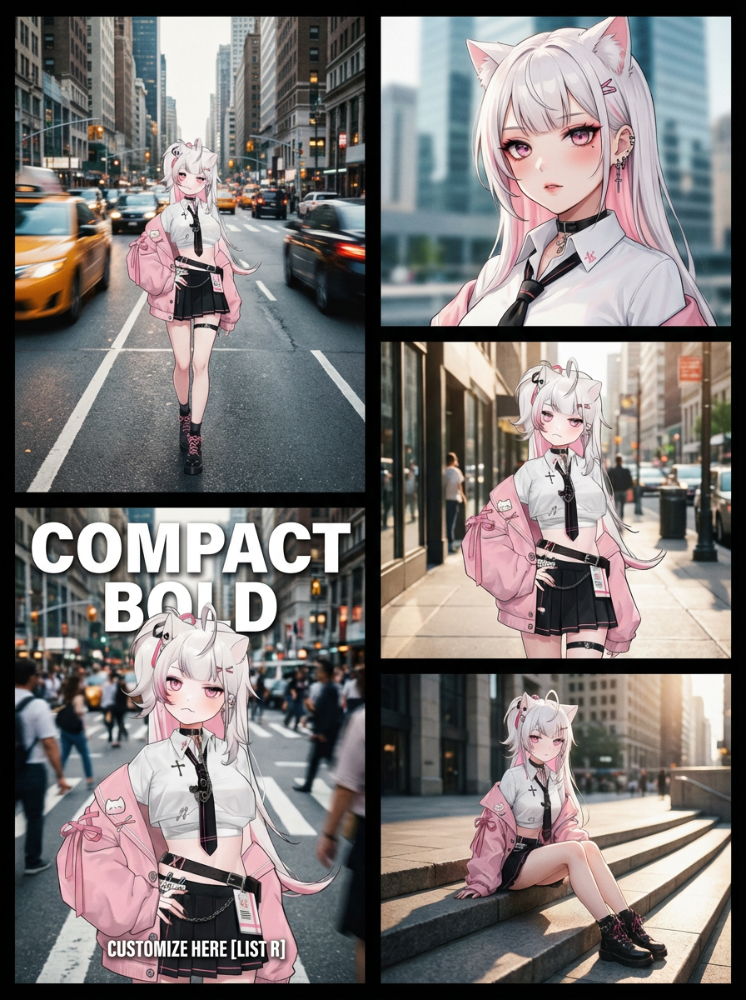

# 20260128 图片 prompt 记录

### 原图


## 1. 高级时尚街拍慢门拖影拼贴海报
```text
户外都市时尚特辑「紧凑黑体」2×3拼贴海报，以下是具体需求：
1.整体规格：3:4比例，均衡双栏布局；左侧2张竖向拼接图，右侧3张竖向拼接图，整体高度一致；搭配简约黑色外边框，内部分割线为纤细锐利黑线（分隔全部5张画面），无胶片齿孔或复古暗角设计
2.风格与质感：高街时尚大片风格，专业杂志级色彩调校；采用复刻柯达Portra 400胶片质感的专业时尚滤镜，高光柔和自然，冷色调适度低饱和，与暖调肤色相得益彰，对比度细腻考究；叠加细腻杂志纸纹理、动感模糊光轨效果、时尚大片级柔肤质感、城市背景柔和虚化纹理
3.核心要求：人物外貌、全套穿搭及配饰需完全统一连贯
4.分栏画面细节：
- 左侧上栏（frame_top_left）：动感街拍（滤镜加持），场景为繁华都市主干道；视觉效果为强烈慢门拖影（城市车流模糊动感，人物主体清晰锐利），叠加电影感时尚大片滤镜；人物姿态沉稳优雅
- 左侧下栏（frame_bottom_left）：杂志封面大片（滤镜加持），场景为繁华城市十字路口；视觉效果为背景动感模糊，叠加专业时尚杂志滤镜；添加杂志叠加文字——主标题“此处自定义[清单R]”（紧凑黑体/超紧凑黑体，全部大写字母，纯净白色油墨质感，字号醒目、字体加粗），副标题“此处自定义[清单R]”（同字体，全部大写字母，纯净白色油墨质感，字号偏小、干净雅致，置于主标题下方）
- 右侧上栏（frame_top_right）：美妆特写（滤镜加持），场景为现代都市建筑背景；视觉效果为浅景深，背景奶油般虚化，搭配高街时尚色彩调校
- 右侧中栏（frame_middle_right）：街拍随拍（滤镜加持），场景为城市人行道；视觉效果为自然光拍摄，叠加时尚大片色调，焦点清晰锐利
- 右侧下栏（frame_bottom_right）：创意中景人像（滤镜加持），场景为建筑楼梯或城市广场；视觉效果为侧光打造戏剧化光影，后期精修对标专业时尚杂志水准
[打卡R]重点提示：保持角色的五官长相和穿搭完全一致，生图逻辑-先各生成需求中描述的五张图
```
### 效果图


## 1. 逆向图片 prompt 生成提示词
```text
你是一位精通商业摄影布景与Midjourney/Stable Diffusion提示词工程的专家。你的任务是深度解析参考图片，将其转化为一段可以直接用于AI生成的、能够高度还原场景细节的Prompt。
解析用户提供的参考图，目的是**保留场景、光影、构图和道具完全不变**，仅准备将画面主体的“产品”进行替换。
(必须严格按此逻辑提取)
1. **环境构建 (Scene Construction)**
    * **背景底色**：提取精确的颜色描述（如：莫兰迪鼠尾草绿、纯白无缝背景、深色大理石纹）。
    * **地面材质**：描述承载物体的平面（如：哑光纸面、倒影亚克力、粗糙水泥）。
    * **空间感**：是平面拍摄(Flat lay)、45度俯拍、还是正视透视？
2. **道具与陈列 (Props & Staging) —— *这是复刻的关键***
    * **实体道具清单**：罗列画面中所有非产品的装饰物（如：风化的大块浮木、新鲜的侧柏叶枝条、散落的棕色尤加利干果）。
    * **位置关系**：描述道具相对于画面的位置（如：浮木呈对角线贯穿画面左下至右上，枝叶点缀在边缘）。
3. **光影与氛围 (Lighting & Mood)**
    * **光源类型**：自然窗光、硬光聚焦、柔光箱(Softbox)。
    * **阴影质感**：长阴影、漫射柔和阴影、无影。
    * **整体色调**：低饱和度、高对比度、冷暖倾向。
4. **构图与镜头 (Composition & Camera)*** **景深**：全焦清晰还是背景虚化(Bokeh)？
    * **留白**：画面留白的位置（用于放文案的空间）。
5. **变量槽位 (The Variable Slot)**
    * **原主体描述**：描述原图中的产品是什么（方便在生成新Prompt时将其剔除）。
    * **替换建议**：指出新产品应该放置的位置和角度（如：中心位置，依附于浮木倾斜放置）。
请按以下 JSON 格式输出分析结果，并在最后生成一段英文 Prompt (适用于 Midjourney/Nona banana)：
```json
{
"scene_setup": "...",
"props_detailed": "...",
"lighting_style": "...",
"composition_camera": "...",
"variable_slot": "原产品为[图像文件名]，建议替换点为[Y位置]"
}
```