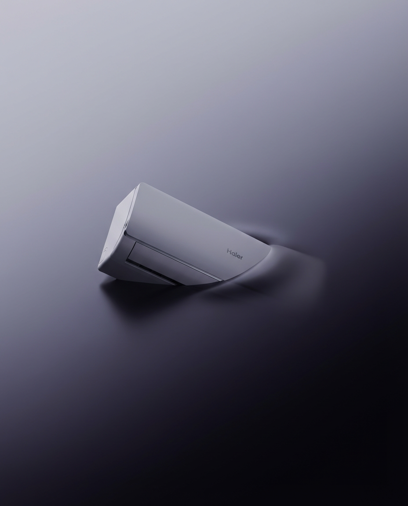

# 20260130 图片 prompt 记录

### 原图


## 1. 浸没产物效应
```text
{
  "项目名称": "浸没产物效应",
  "版本": "10.0_FINAL",
  "用户自定义": {
    "说明": "自定义您的产品和渐变颜色。产品将沉入浓厚的不透明液体中。",
    "产品描述": "一台最新的海尔空调",
    "渐变深色": "#09080E",
    "渐变浅色": "#AEB4C2"
  },
  "设置": {
    "风格": "高端奢侈品摄影，低角度视图，几乎平躺的产品，一端深深沉入液体中，背景仅为平滑渐变。",
    "宽高比": "4:5",
    "相机角度": "低角度，向上看，几乎平躺的产品一端沉入液体"
  },
  "提示词构建": {
    "主要主体": {
      "主体": "{{用户自定义.产品描述}}",
      "展示": "产品几乎平躺/水平放置。一端（最远/底部端）沉入液体中，远比另一端沉得更深。产品呈倾斜沉入状态——一端沉入液体，而另一端保持较多可见。液体表面上方仅有 20-30% 的产品可见。沉入深处的一端完全隐藏——70-80% 的产品被不透明液体完全遮挡。",
      "沉没不对称": "关键不对称沉没：产品的一端沉入液体中远比另一端深。这创建了一个倾斜的液体线，一端深深消失在液体中，而另一端则较少沉没。产品不是均匀浮动——它偏向一侧沉没。"
    },
    "产品在液体中，而非表面": {
      "关键规则": "产品必须完全沉入液体中，沉浸在液体里，而非放置在表面上或平台上。液体包围并环绕沉没的部分——产品已沉入液体介质中。",
      "禁止事项": "产品下方不得有表面，不得有支撑产品的平台，产品不得放置在任何东西上，产品不得悬浮在任何物体上。产品在液体内部，完全沉没并被液体包围。"
    },
    "液体介质": {
      "液体类型": "浓稠、粘稠、哑光、不透明的液体，渐变颜色。液体与背景共享同一渐变色。",
      "不透明度": "100% 不透明。沉没部分完全看不见——没有模糊效果、没有影像残留、没有微弱可见性。完全被不透明液体遮盖。",
      "液体状态": "完全静止、平静、光滑。没有涟漪，没有波纹，没有纹理。",
      "位移": "产品沉入液体时，液体产生自然的柔和有机圆形阴影深度。光滑的阴影——绝不描绘轮廓，绝不显示产品轮廓。"
    },
    "无平台或表面_关键规则": {
      "绝对禁止平台": "产品下方、底部或下方不能有任何平台、任何表面。没有紫色平台、没有紫色表面、没有任何颜色的表面。产品漂浮/沉没在液体渐变环境中，不能坐在任何物体上。",
      "液体是渐变色": "液体就是渐变色——它们是同一件事。没有单独的“紫色液体”或“彩色液体”——只有从 {{用户自定义.渐变深色}} 到 {{用户自定义.渐变浅色}} 的平滑渐变。"
    },
    "背景渐变唯一": {
      "准确渐变": "仅有一个平滑的对角线渐变。右下角：{{用户自定义.渐变深色}} (#09080E)。左上角：{{用户自定义.渐变浅色}} (#AEB4C2)。这两个颜色是画面中的唯一两种颜色。",
      "绝对禁止颜色": "不允许有紫色平台色，不允许有额外紫色，不允许有黄色背景、不允许有米色、不允许有棕色、不允许有暖色调、不允许有桃色，不允许有任何其他颜色。仅有这两种渐变色。",
      "不允许其他元素": "不允许有对角线、不允许有三角形、不允许有几何形状、不允许有色块、不允许有框架、不允许有边框围绕图像。"
    },
    "产品框架": {
      "完整产品可见": "产品的可见部分（液体上方的 20-30%）必须完全显示在画面中。不得切掉产品的边缘。不得裁剪产品。图像本身不得有框架或边框。",
      "禁止事项": "产品不得被图像边缘切掉，产品不得裁剪，图像周围不得有框架，图像周围不得有边框。"
    },
    "无模糊或影像残留": {
      "关键规则": "沉没部分仅由不透明液体遮盖——不能模糊、不能出现影像残留、不能微弱可见。液体完全隐藏它，仿佛它不存在。",
      "禁止事项": "沉没部分不得有运动模糊，不能有高斯模糊效果，不能出现影像残留，不能有微弱模糊的产品显示在表面下方。"
    },
    "相机视角": {
      "相机角度": "相机位置低于产品，略微向上看。",
      "禁止角度": "绝对不能是平视，绝对不能是俯视，绝对不能是向下看的角度。"
    },
    "关键限制": {
      "绝对禁止": [
        "产品坐在表面/平台上",
        "紫色平台在产品下方",
        "紫色表面",
        "任何支撑产品的表面",
        "产品坐在任何东西上",
        "产品均匀浮动",
        "产品均匀沉没",
        "两端均匀沉没",
        "运动模糊或影像残留",
        "高斯模糊效果",
        "模糊产品",
        "影像残留",
        "微弱可见的产品",
        "背景中有对角线",
        "三角形背景元素",
        "几何形状背景元素",
        "色块",
        "硬边背景",
        "产品被切掉",
        "产品裁剪",
        "产品边缘被框架切掉",
        "框架",
        "边框",
        "图像边框",
        "图像框架",
        "产品呈 45 度角",
        "产品直立",
        "产品垂直",
        "平台",
        "表面",
        "地板",
        "桌面",
        "地平线",
        "透明液体",
        "透视液体",
        "涟漪",
        "波纹",
        "平视",
        "俯视",
        "向下看"
      ]
    },
    "负面约束": [
      "产品坐在表面",
      "产品在平台上",
      "紫色平台",
      "紫色表面",
      "产品下方有彩色表面",
      "表面支撑产品",
      "产品坐在物体上",
      "产品悬浮均匀",
      "均匀沉没",
      "两端均匀沉没",
      "两端同深",
      "对称沉没",
      "沉没部分的运动模糊",
      "高斯模糊效果",
      "产品模糊",
      "影像残留",
      "产品微弱可见",
      "表面下方模糊可见",
      "紫色以外的渐变色",
      "额外紫色",
      "黄色背景",
      "米色背景",
      "棕色背景",
      "暖色调",
      "桃色",
      "渐变以外的颜色",
      "额外颜色",
      "第三种颜色",
      "第四种颜色",
      "背景中的对角线",
      "三角形背景",
      "几何形状",
      "色块",
      "背景中的硬边",
      "产品被切掉",
      "产品裁剪",
      "产品边缘被框架切掉",
      "框架",
      "边框",
      "图像框架",
      "产品呈 45 度角",
      "产品直立",
      "产品垂直",
      "平台",
      "表面",
      "地板",
      "桌面",
      "地平线",
      "透明液体",
      "波纹"
    ]
  }
}
```
### 效果图


## 2. 湿发效果图
```text
一、主体与视角
1 人物：根据参考图
2 构图：特写近距离肖像
3 角度：侧面轮廓
4 状态：湿润效果为核心
二、头发与贴肤细节
1 发丝：深色湿发
2 贴肤：发丝自然黏附在皮肤上
3 自然感：不刻意造型，强调真实
三、面部水分与质感表现
1 水滴：细小水珠清晰可见
2 汗膜：薄汗自然反光
3 肌理：柔和自然的皮肤纹理
四、眼部与唇部重点
1 眼睛：根据参考图来
2 反射：真实的眼部反光与映射
3 嘴唇：湿润发亮，保持自然
五、光线与色调背景
1 光线：柔和布光
2 色调：偏冷的整体色调
3 背景：浅灰与白色虚化光斑背景
六、整体风格与清晰度要求
1 风格：逼真写实倾向
2 画质：超清细节取向
3 氛围：偏电影感，强调真实直出感
```
### 效果图

