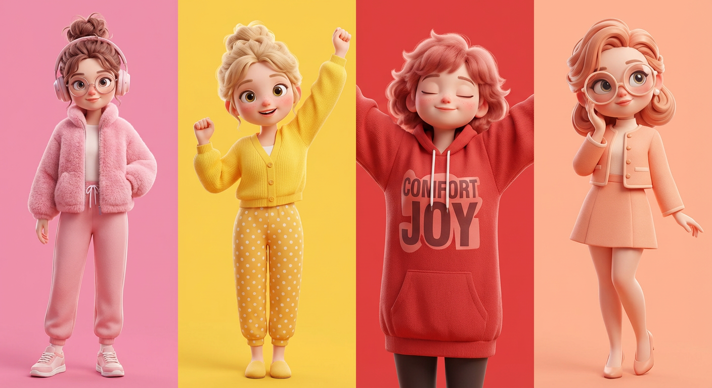
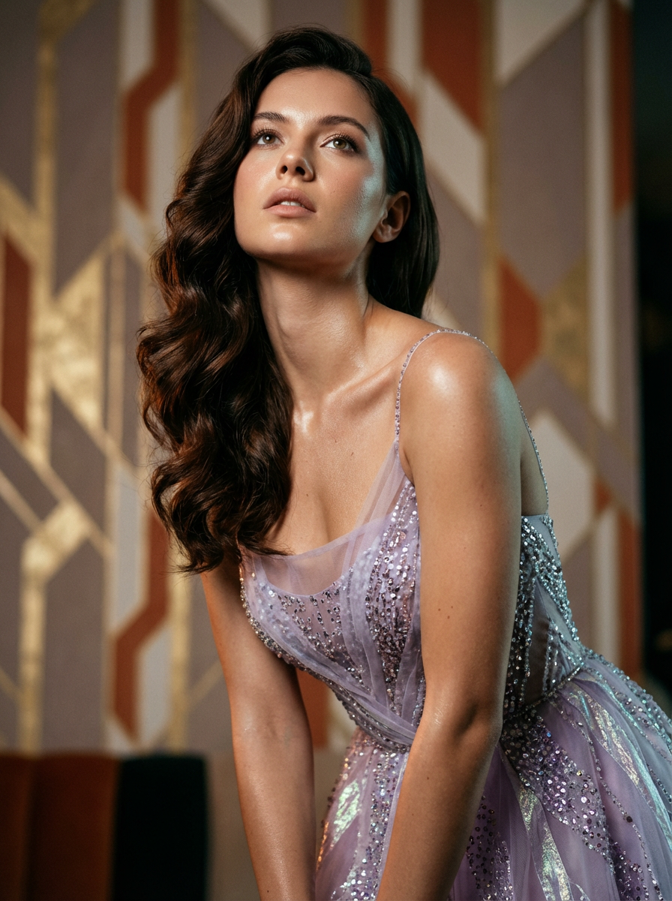
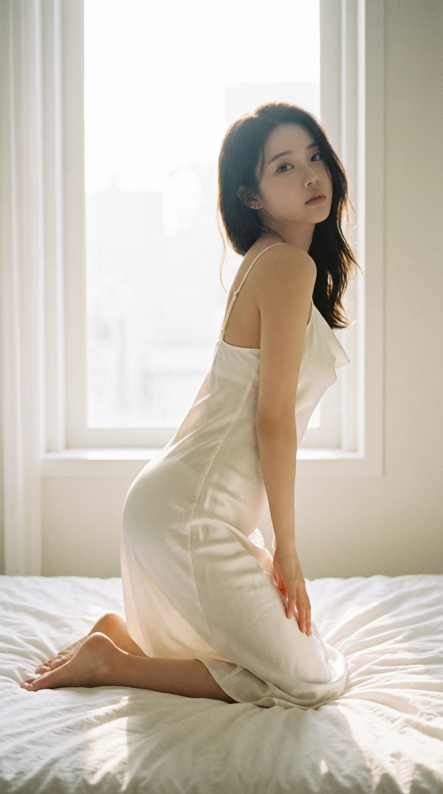
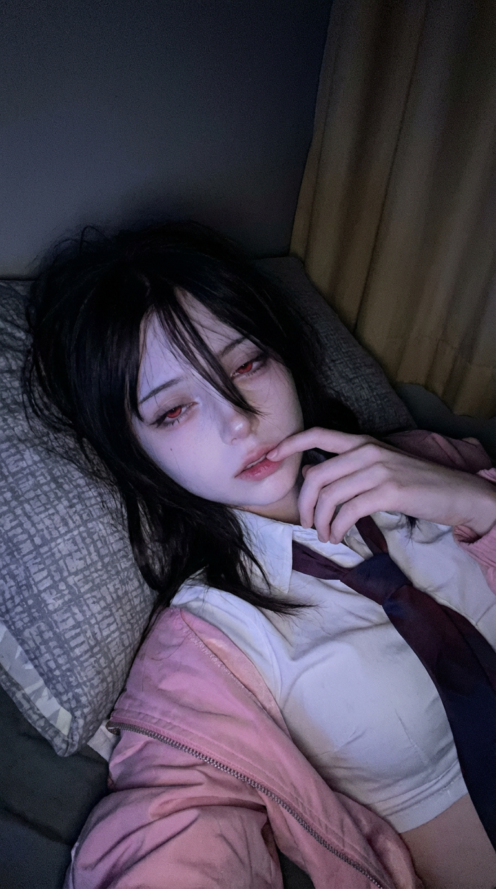

# 20260202 图片 prompt 记录

### 原图


## 1. 3D风格化角色插画
```text
超高质量3D风格化角色插画，灵感来自皮克斯但原创设计，展现可爱现代女孩角色系列。光滑塑料感肌肤、柔和圆润五官、大眼睛、小鼻子、淡淡腮红、舒适美学。
角色展现多种服装和情绪：粉色毛绒夹克配运动裤和运动鞋、圆形眼镜和耳机、冷静优雅姿态；亮黄色开衫配波点裤、欢乐表情、双臂上举、欢快能量；舒适红色宽松卫衣配大字体、闭眼、双臂展开、宁静快乐氛围；柔和时尚配短夹克和裙子、优雅姿态、超大圆眼镜、梦幻表情。
发型包括蓬乱丸子头、柔和盘发、风格化蓬松感；街头风混合舒适纹理（针织、摇粒绒、羊毛）。
纯色活力背景（粉、黄、红、桃色），工作室灯光、柔和阴影、全局光照、次表面散射。
清晰构图、全身和中景镜头、高细节纹理、电影灯光、景深、超平滑渲染、8K分辨率、Octane/Arnold渲染风格、温暖治愈、可爱、现代美学。
```
### 效果图


## 2.电影级编辑时尚图
```text
{
  "场景配置": {
    "版本": "2.0",
    "全球美学": "电影级编辑时尚",
    "宽高比": "3:4",
    "图像质量": "杰作级，8K，逼真光照，次表面散射"
  },
  "主体规格": {
    "模型": "我上传的那个人物",
    "身体特征": {
      "头发": {
        "颜色": "深浓的深棕色",
        "质地": "丰盈、浓密的波浪形，高光泽",
        "造型": "从左肩垂落，好莱坞魅力风"
      },
      "肤色": {
        "肤质": "水润、光泽感，细腻的毛孔可见",
        "面部特征": "清晰的下巴线条，修长的脖颈，锁骨处带有柔和光泽"
      },
      "表情与姿势": {
        "身体姿势": "身体微微向前倾，背部略微弯曲",
        "头部位置": "后仰 15 度，呈现感性姿势",
        "眼睛方向": "凝视向上，目光投向光源",
        "嘴唇": "微微张开，柔和中性的唇色"
      }
    }
  },
  "服装细节": {
    "服装类型": "高定时尚礼服",
    "配色方案": {
      "主色": "薰衣草紫",
      "次色": "浅丁香紫",
      "点缀色": "变色银"
    },
    "面料物理特性": {
      "胸衣部分": "透明的欧根纱和丝绸薄纱",
      "装饰": "高密度微型亮片，手工缝制玻璃珠，施华洛世奇水晶点缀",
      "视觉效果": "折射光影效果，闪烁的质感，精致的刺绣图案"
    },
    "结构细节": [
      "细致的细肩带",
      "贴合身形的剪裁",
      "透视分层"
    ]
  },
  "环境建筑": {
    "设置": "奢华的艺术装饰风格顶层公寓内饰",
    "背景元素": {
      "墙面": "复古几何艺术装饰风壁纸",
      "颜色": ["柔和的灰褐色", "奶油色", "焦褐色", "金叶点缀"],
      "景深": "极致的虚化，建筑深度模糊"
    },
    "氛围": "温暖、优雅、亲密，略带朦胧感"
  },
  "技术指导": {
    "相机设备": {
      "机身": "中画幅数码相机（例如，哈苏 H6D）",
      "镜头": "85mm 定焦 G-Master 镜头",
      "光圈": "f/1.2，锐利的浅景深"
    },
    "光照设置": {
      "主光源": "温暖色调的软箱灯（主光源），照射角度为 45 度",
      "辅光源": "冷色调的轮廓光，突出轮廓和头发",
      "效果": ["电影感阴影", "明暗对比", "礼服珠子上的高光"]
    },
    "后期处理": {
      "色彩分级": "模拟胶片质感，阴影中略带青绿色和橙色偏差",
      "焦点": "睫毛和虹膜保持锐利，礼服纹理中景区清晰"
    }
  }
}
```
### 效果图


## 3. 纯欲风私房写真
```text
{
  "主题": "丝绸吊带裙 / 背光 S 曲线梦境",
  "主体原型": "拥有瓷白肌肤的 K-Pop 女神。",
  "服装": "珍珠白丝绸吊带裙，极细肩带，柔软的下垂领口。",
  "姿势": "跪坐在柔软的白色床单上，身体侧对镜头。背部微微弯曲，展示从胸部到臀部的 S 线条。回头望向肩膀，表情纯真、昏昏欲睡。",
  "光照": "强烈的逆光来自窗外（逆光效果），创造出围绕她头发和身体曲线的光晕效果，使丝绸发光。",
  "google_prompt": "一张 9:16 纵向的日本风格空灵照片，展示一位顶级视觉偶像跪坐侧身在床上。她穿着珍珠白丝绸吊带裙。强烈的自然背光创造出梦幻般的光环效果，突显她完美的 S 曲线身形以及丝绸和肌肤的半透明质感。她的表情纯真柔和。中等胶片颗粒，奶油色调，空灵氛围，纯粹欲望美学。 --ar 9:16 --style raw --s 250"
}
```
### 效果图


## 4. 超逼真摄影纯欲风
```text
{
  "meta": {
    "宽高比": "9:16",
    "质量": "超逼真摄影",
    "分辨率": "8k",
    "相机": "iPhone 15 Pro Max 前置相机",
    "镜头": "24mm 广角镜头",
    "风格": "原始 iPhone 自拍写实风格，非工作室拍摄，非专业，明显自然质感"
  },
  "character_lock": {
    "面部特征": [
      "与参考图中的女孩相同",
      "相同的面部比例，相同的下巴线条",
      "柔和的娃娃脸，小巧的鼻子",
      "兔唇饱满，具有自然的柔和渐变色",
      "大杏仁形眼睛，昏昏欲睡的性感凝视",
      "浓密的直眉",
      "不允许面部变化，不允许面部交换错误"
    ],
    "皮肤": [
      "苍白的瓷白肤色",
      "光滑但真实的质感",
      "不是塑料感，非过度平滑",
      "脸颊有柔和的光泽"
    ],
    "头发": [
      "自然黑色头发",
      "凌乱的卧室发型",
      "侧分，发丝垂落至一只眼睛上",
      "略微有光泽的发丝，柔软的蓬松感"
    ]
  },
  "scene": {
    "地点": "夜晚昏暗的卧室",
    "环境": [
      "深色背景",
      "柔和的阴影",
      "左侧的米色遮光窗帘",
      "床的氛围，温馨凌乱的房间感觉"
    ],
    "氛围": "深夜昏昏欲睡的低保真，亲密安静的情绪"
  },
  "lighting": {
    "类型": "低光手机屏幕光",
    "主光": "冷蓝紫色屏幕光照在脸上",
    "补光": "非常柔和的环境暗光",
    "对比度": "高对比度，脸部被照亮但背景几乎黑暗",
    "避免": [
      "暖色/橙色调",
      "环形灯",
      "闪光灯",
      "工作室灯光"
    ]
  },
  "camera_perspective": {
    "视角": "我们就是她的手机",
    "角度": "略微低角度的近距离自拍",
    "距离": "非常接近，亲密的构图",
    "构图": "脸部 + 上胸，裁切得很紧",
    "手机可见性": "不可见"
  },
  "subject": {
    "性别": "女性",
    "年龄": "21+（成年人）",
    "氛围": "毫不费力的性感，昏昏欲睡，柔软但危险",
    "表情": {
      "眼睛": "沉重的眼皮，梦幻的凝视",
      "嘴唇": "微微张开，放松的嘴唇",
      "情感": "疲惫 + 性感，不做作"
    },
    "姿势": {
      "位置": "趴着躺在床上",
      "支撑": "靠在有细微图案的灰色枕头上",
      "手": "手靠近脸部，食指触碰下唇"
    },
    "服装": {
      "上衣": {
        "类型": "紧身白色短款T恤",
        "版型": "贴合并且有弹性",
        "细节": "薄面料，逼真的拉伸褶皱",
        "内衣": "不穿胸罩"
      },
      "额外": [
        "牛仔夹克随意地从肩膀滑落",
        "低腰牛仔裤在底部边缘部分可见"
      ]
    }
  },
  "image_quality": {
    "焦点": "柔焦，但脸部保持清晰",
    "颗粒感": "可见的低光噪点",
    "清晰度": "不是非常锐利，更加低保真",
    "真实感": "看起来像一张真实的 iPhone 自拍，像是在网上发布的照片"
  }
}

```
### 效果图
