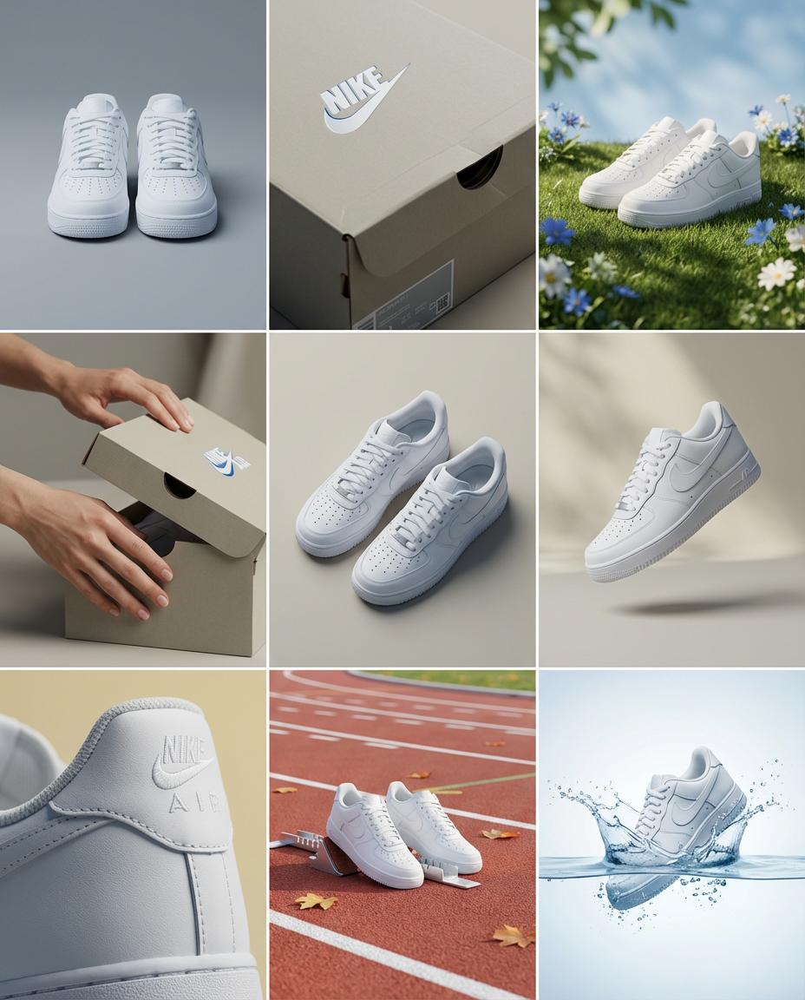
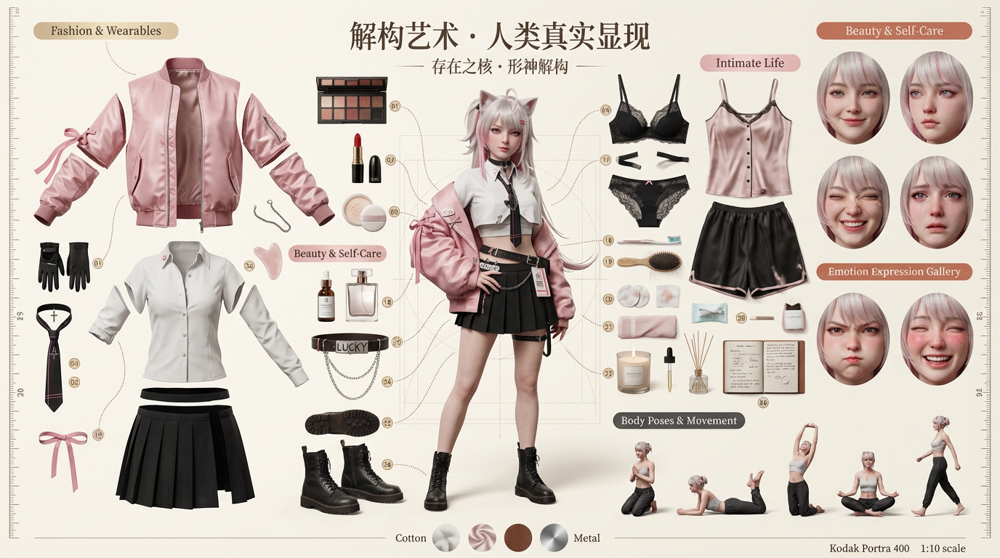
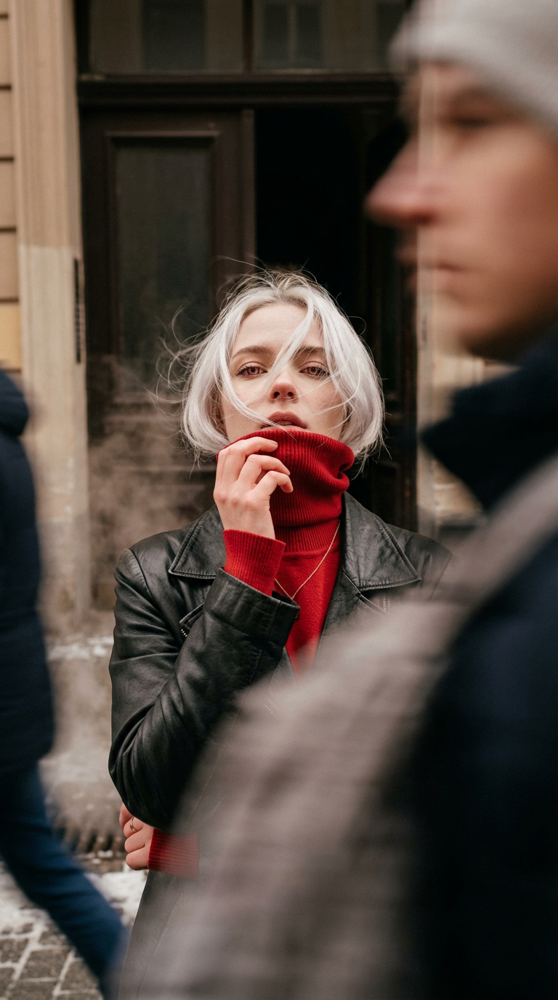

# 20260204 图片 prompt 记录

### 原图


## 1. 高端影棚产品故事板
```text
{
  "整体布局": {
    "格式": "3×3 网格故事板，9个等分面板，4:5 比例画布",
    "风格": "高端设计师效果图，编辑风格，精心策划，设计驱动",
    "重点": "形式、构图、材质、视觉节奏优先于生活方式叙事",
    "产品一致性": "在所有九个面板中保持完全相同的产品、包装、品牌、材质、颜色、比例",
    "产品识别度": "每一帧中的产品都能清晰识别，标签/标志/比例保持不变"
  },
  "画面1_主图": {
    "类型": "正面主图",
    "场景": "简洁的工作室布置",
    "背景": "中性、平衡的构图",
    "产品": "空军一号运动鞋",
    "光照": "冷静自信的呈现",
    "相机": "正对角度"
  },
  "画面2_特写": {
    "类型": "中部特写",
    "焦点": "表面纹理与材质",
    "细节": {
      "纹理": "哑光质感鞋盒包装纹理",
      "印刷": "清晰的鞋子插图细节",
      "封口": "可收纳打开的鞋盒的纹理",
      "品牌": "标志字体与颜色"
    },
    "景深": "浅景深，产品聚焦清晰"
  },
  "画面3_品牌环境": {
    "类型": "符合品牌的环境",
    "场景": "灵感来自鞋子适应的最佳场地",
    "颜色": "蓝白色调，柔和的绿色点缀",
    "道具": {
      "背景": "柔和的绿色背景，自然地光照的阴影",
      "表面": "带有不规则动作的草地"
    }
  },
  "画面4_使用中": {
    "类型": "产品在使用中，背景中性",
    "互动": "手部打开包装，简约而克制",
    "手部": "干净修整的手，肤色中性",
    "动作": "打开可收纳的鞋盒",
    "造型": "与包装风格简约相匹配"
  },
  "画面5_等距网格": {
    "类型": "等距俯视构图",
    "排列": "左右两只鞋子精确几何排列",
    "数量": "2只鞋子整齐排列",
    "间距": "均匀间隔，干净的图形布局",
    "角度": "等距角度，所有产品保持相同角度"
  },
  "画面6_漂浮": {
    "类型": "产品漂浮，稍微倾斜",
    "位置": "自然漂浮在空间中",
    "角度": "故意倾斜，动态感",
    "背景": "与参考色调一致",
    "阴影": "下方有柔和自然的阴影"
  },
  "画面7_极限细节": {
    "类型": "极限细节特写",
    "焦点": "特定元素细节",
    "可能的细节对象": [
      "鞋子鞋口边缘的曲线",
      "鞋面平滑纹理",
      "logo 部分用料的细节",
      "知名球星签名的字体"
    ]
  },
  "画面8_编辑风格意外": {
    "类型": "意外美学设置，大胆编辑风格",
    "概念": "工作室布景，设计驱动",
    "创意": "鞋子漂浮在透明液态水中，水面布满波纹，快速踩踏的场景，飞溅的水花",
    "构图": "大胆、出人意料，提升品牌形象",
    "材质": "对比的质感，艺术化展示"
  },
  "画面9_宽幅使用场景": {
    "类型": "宽幅构图，产品在精致的设计师布景中",
    "地点": "现代塑胶跑带，带有起步器",
    "道具": [
      "一双鞋子放在跑步起步台上",
      "干净的塑胶跑道",
      "细微的树叶点缀"
    ],
    "造型": "控制良好，与系列统一"
  },
  "相机与风格": {
    "质量": "超高质量室外影像，真实相机效果",
    "角度": "各个画面角度的变化",
    "景深": "控制精确",
    "材质": "准确的材质与反射",
    "一致性": "光照逻辑、色调、氛围、视觉语言在所有九个面板中保持一致",
    "色调": "柔和的黄色、白色、蓝色色色调，哑光质感",
    "氛围": "干净、现代、亲切且高级"
  },
  "技术规格": {
    "光照": "柔和漫射的工作室光源，细腻阴影",
    "材质": "哑光包装质感，真实的香蕉插图，透明塑料窗展示产品",
    "背景": "无缝的工作室背景，中性色调"
  },
  "输出": {
    "格式": "3×3 网格，无边框，无文字，无说明，无水印",
    "质量": "高分辨率，适合作品集"
  }
}
```
### 效果图



## 2. 写实的版本 OOTD
```text
{
  "prompt": "3D 逼真解构艺术提示\n\n📷 核心指令（核心指令）\n\n任务：基于用户提供的参考图像，创建一张超高质量、电影感十足的 3D 逼真解构艺术海报，强调真实的人物存在感与摄影写实主义。将拍摄的人物转化为生动的 3D 角色，具有真实的解剖结构、皮肤质感、情感细腻与自然光照——完全摒弃风格化的卡通美学。使用有序的‘Knolling’（正交对齐）艺术布局排列她的个人物品。完全去除‘数字生活’类别。引入两个新的主题区域：私密生活区域和表达面部/情感画廊，展示包括‘Ahei Yan’（调皮假生气脸）、极致愉悦脸、咬唇表情等特定微表情。还需增加专门的身体姿势/动作区域，展示动态的物理姿势。\n\n宽高比：16:9 横向（可根据需要适应 3:2、4:5 或 1:1）。\n\n艺术风格核心：摄影写实主义——注重解剖准确性、自然的次表面散射、可见毛孔、细腻体毛、汗光以及情感共鸣的写实感。\n\n质量标准：视觉上与《Vogue》《National Geographic》或法医人类学重建等高端编辑摄影作品无异。\n\n📷 项目布局（项目布局） – Knolling 放射性构图\n\n总物品：30-36 件，按精确的 90 度角或柔和的放射对称围绕中央人物排列。\n\n类别 1：时尚与穿着（时尚工作室） – 香槟金标签\n\n- 主服装完全解构：袖子、领口、面料面板、内衬、纽扣、拉链——全部分开并漂浮在空中，具有真实的布料物理特性。\n\n- 鞋子解构：鞋底、鞋面、鞋带、鞋跟、鞋垫。\n\n- 个人配饰：腰带、手袋、帽子、围巾、手套。\n\n*示例：一件风衣可以分解成领翻、肩章、腰带、袖口带和主体面板。*\n\n类别 2：美容与自我护理（美容系列） – 玫瑰金标签\n\n- 化妆：口红（切面展示色素核心和色号标签）、眼影盘（每个色格区分鲜明）、散粉、香水瓶（玻璃透明度与液体折射清晰呈现）。\n\n- 护肤品：精华瓶、保湿霜罐、面部按摩器、刮痧工具。\n\n*示例：香水必须展现玻璃的清晰度、内部折射、弯月形液面及金属瓶盖反射性。*\n\n类别 3：私密生活（私密领域） – 柔粉标签\n\n- 内衣：胸罩组件（罩杯、带子、扣环、肩带）、内衣面料样本。\n\n- 睡衣与休闲服：丝绸睡衣套装、浴袍带、拖鞋、舒适袜子。\n\n- 个人卫生用品：牙刷上的残留牙膏、带发丝的发刷、用过的棉垫、纸巾上的护肤残留、折叠过的洗脸巾。\n\n- 环境元素：香薰蜡烛（带融化的蜡池）、精油滴管、扩香器茎、带手写笔记的日记本。\n\n*所有物品必须显示真实使用痕迹——细微的磨损、自然褶皱和生活化的不完美。*\n\n类别 4：情感表达画廊（人类面孔） – 温暖赤陶标签\n\n- 一系列 6-8 张浮动的宏观肖像特写，捕捉不同的情感状态：\n\n• 安宁的微笑\n\n• 思考的凝视\n\n• 笑容中带着皱眼\n\n• 泪眼朦胧的脆弱感\n\n• **‘Ahei Yan’（假生气脸）** – 眼睛眯起、腮帮鼓起、微微皱眉的调皮假生气表情\n\n• **极致愉悦脸** – 脸颊泛红，嘴唇微张，瞳孔放大，额头上有轻微汗水\n\n• **咬唇表情** – 下唇轻咬，嘴巴微微紧张，脖部泛红\n\n- 每张脸部特写都要呈现出极其细腻的毛孔、细小的体毛、嘴唇上的水分、皮肤微小运动以及准确的眼睛反射。\n\n类别 5：身体姿势与动作（身体区域） – 炭灰标签\n\n- 完整身躯的微型人偶（1:10 比例）展示关键姿势：\n\n• 跪姿（单膝跪地，手放在大腿上）\n\n• 俯卧姿势（趴在床上，脖下支撑在双手上）\n\n• 向上伸展\n\n• 盘腿冥想坐姿\n\n• 动态行走姿势\n\n- 每个姿势展示肌肉定义、关节运动、重力作用下的衣物下垂、自然的身体不对称。\n\n每个物品要求：\n\n- 渲染质量：匹配角色的逼真度，绝不风格化。\n\n- 编号标签：圆形徽章，标签编号 01-36，带有细微的投影阴影。\n\n- 材料与阴影：完整的 PBR 工作流，具有物理准确的粗糙度、高光和法线贴图；柔和的环境遮蔽阴影，投射在中性色表面上。\n\n📷 解构视图技术（解构视图技术）\n\n- 连接线：优雅的细虚线或实线，将漂浮的服装部分连接到角色的身体。\n\n- 引导箭头：极简装饰箭头，链接每个物品与描述标签。\n\n- 技术标注：\n\n- 材料样本：面料（丝绸、棉布、羊毛）、皮革纹理、金属表面。\n\n- 材料标签：例如“100% 桑蚕丝”、“全粒面意大利皮革”。\n\n- 测量尺：沿边缘集成的双单位（厘米/英寸）尺子。\n\n📷 解构艺术 · 人类真实显现 📷\n\n字体：中文使用优雅的衬线字体（例如 Founder Songti KBXK），英文使用 Playfair Display——两者均带有哑光纸质纹理（无金属箔）。\n\n- 副标题（主标题下，流畅的手写字体）：\n\n“存在之核 · 形神解构”\n\n双语排版，优雅且不突兀。\n\n- 类别标题：带图标的圆角矩形标签：\n\n“📷 私密生活” (柔粉标签)\n\n“📷 情感表达画廊” (赤陶标签)\n\n“📷 身体姿势与动作” (炭灰标签)\n\n设计元素（设计元素）\n\n- 几何框架：极简的细线六边形或圆形（0.5–1pt 描边），用于聚集物品簇——受到艺术装饰风格的影响，但颜色柔和。\n\n- 测量尺：沿左侧和右侧边缘，增强技术真实性。\n\n- 十字准星：四个角落和焦点处的微弱目标十字准星。\n\n- 材料样本：底部条带显示面料/皮革/金属微观纹理。\n\n- 信息卡：优雅的边框卡片，显示物品细节（品牌、材料、产地）。\n\n- 属性雷达图：细腻的框架，展示特征如：亲密 ★★★★★，真实性 ★★★★★，脆弱性 ★★★★☆。\n\n- 连接线：哑光银色或温暖铜色虚线，带有渐尖的箭头。\n\n📷 背景与氛围（背景与氛围）\n\n- 背景渐变：温暖变体——象牙色（到柔和燕麦奶色），或冷变体——浅混凝土色（到工作室白）。\n\n- 覆盖图案：5–10% 不透明度的蓝图网格或淡淡的建筑草图线条。\n\n- 渐晕：轻微的外围黑暗效果，集中注意力。\n\n- 气氛颗粒：细腻的金色虚焦光圈和精致的胶片颗粒（Kodak Portra 400 模拟）增加电影感深度——永不分散注意力。\n\n📷 色彩方案（色彩方案）\n\n- 女性/私密主题：香槟金（玫瑰金），燕麦奶色（腮红粉）\n\n- 男性/真实主题：板岩灰，温暖铜色，混凝土白色\n\n- 中性色/奢华主题：炭黑，象牙白，深酒红色\n\n- 情侣主题：左侧冷色调，右侧暖色调——中间以共享私密物品融合。\n\n📷 技术规格（技术规格）\n\n渲染引擎：路径追踪，相当于 Cycles/Arnold/RenderMan。\n\n- 样本：最小4096 SPP，确保输出无噪点。\n\n- 光线反射：12次，确保准确的全局光照。\n\n- 光学效应：启用玻璃与液体的现实折射。\n\n- 几何：角色网格 >2百万多边形；姿势小雕像 >500k 每个。\n\n- 头发：每个角色 >100,000 根发丝，物理模拟，风互动。\n\nPBR 材料工作流：\n\n- 皮肤：三层次 SSS，双重高光，毛孔级位移，黑色素变化。\n\n- 头发：各向异性着色器，主要/次要高光，发根到发梢的色差。\n\n- 面料：编织法线贴图，基于纤维方向的粗糙度，微观褶皱。\n\n- 金属：金属感 1.0，粗糙度 0.1–0.4（刷纹或抛光）。\n\n- 玻璃：IOR 1.5；水 IOR 1.33，带弯月细节。\n\n- 皮革：粗糙度 0.65，带有自然纹理变化的浮雕贴图。\n\n分辨率与输出：\n\n- 4K (3840×2160)，16:9。\n\n- 32 位浮动色深。\n\n- 16x MSAA 抗锯齿。\n\n后期处理：\n\n- 色彩分级：\n\n• 应用电影 LUT；无纯黑（RGB 最小 15,15,15）。\n\n• 轻微的 S 曲线增加对比度。\n\n• 根据主题调整色温 ±200K。\n\n• 全局饱和度降低 5%；关键色调（例如腮红、金色）提升 10%。\n\n- 特效：\n\n• 光晕：高光的柔和光晕。\n\n• 胶片颗粒：有机 Kodak Portra 400 纹理。\n\n• 色差：轻微可见的边缘晕影。\n\n• 渐晕：中等强度。\n\n• 锐化：输出级别自适应锐化。\n\n特别指令：\n\n- 单一主体：~30 件物品，专注于真实的日常生活、情感范围和身体存在感。\n\n- 情侣：~36 件物品（每人 18 件），由微妙的心形负空间连接，带有性别化调色板和共享的私密物品（例如一只枕头，共享日记本）。\n\n- 怀孕主体：包括孕期物品（肚皮油、维生素、超声波打印单）；在腹部附近加上半透明的胎儿图标。\n\n- 关键要求：忠实匹配参考图的年龄、种族、职业、体型、疤痕、纹身和个人风格——包括皮肤瑕疵、雀斑和独特的面部结构。\n\n质量标准：\n\n最终图像必须视觉上与高端摄影编辑无异——适合用于：\n\n- 奢华生活方式目录\n\n- 纪录片肖像展览\n\n- 人类学或医学可视化\n\n- 精美艺术摄影收藏\n\n- 高端品牌叙事广告"
}
```
### 效果图


## 3. 杂志风格摄影
```text
超逼真的电影感肖像，高端时尚9：16画幅杂志风格摄影。
发型：短发，发丝被风吹拂，飘散在脸上，以时尚的方式部分遮挡面部特征。
主体：仅使用上传的面部参考图像作为主要拍摄对象。面部特征、骨骼结构和自然肤质（可见毛孔）需100%匹配。不得改变种族或性别特征。
服装：黑色复古皮夹克搭配红色高领细线针织（堆叠领口），佩戴金色项链，优雅现代的造型。
场景/环境：时间为冬天，街上有供暖热蒸汽，充满欧洲风格，一个复古公寓的门，门打开着，里面黑漆漆，
动作/动态：前景有人快速移动，动态模糊（长曝光效果）挡住部分画面和镜头。拍摄对象保持完美清晰、沉静。拍摄对象静止，轻微仰头，看着镜头，一只手拉着高领毛衣的领子扯着挡住下颌线和嘴唇（时尚杂志模特的post）位于画面的右侧。
构图：低角度仰拍人物，胸部以上竖幅肖像，主体人物位置偏右构图，线条简洁流畅
相机：24mm广角镜头低角度仰拍视角，浅景深，电影感虚化效果，专业的时尚写实风格。
光照：柔和的电影感光照，暖色调，营造氛围感。高光控制得当，阴影保留细节。
色彩/后期：高细节，高级色彩分级，自然的肤质纹理，微妙的胶片感（无明显颗粒）。无文字、无徽标、无水印。
```
### 效果图


## 4. 液态文字
```text
抽象的液态排版拼写“I Love You”，厚实透明水凝胶材料，超写实的折射和微妙的腐蚀效果，逼真的表面张力，雕刻般的水滴形态融入平滑的字母曲线，光泽高光，凝胶内部的微泡，纯白无缝背景上的柔和接触阴影，表面散布的水滴伴有锐利的镜面反射，摄影棚灯光，清晰逼真的3D渲染， 微距细节，清晰对焦，8K，1：1，无水印，无额外文字
```
### 效果图

