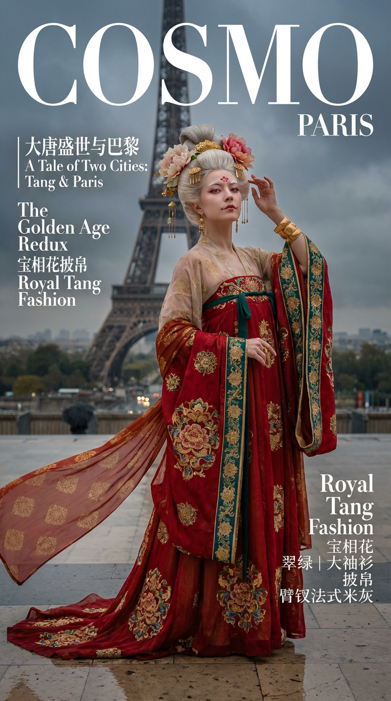
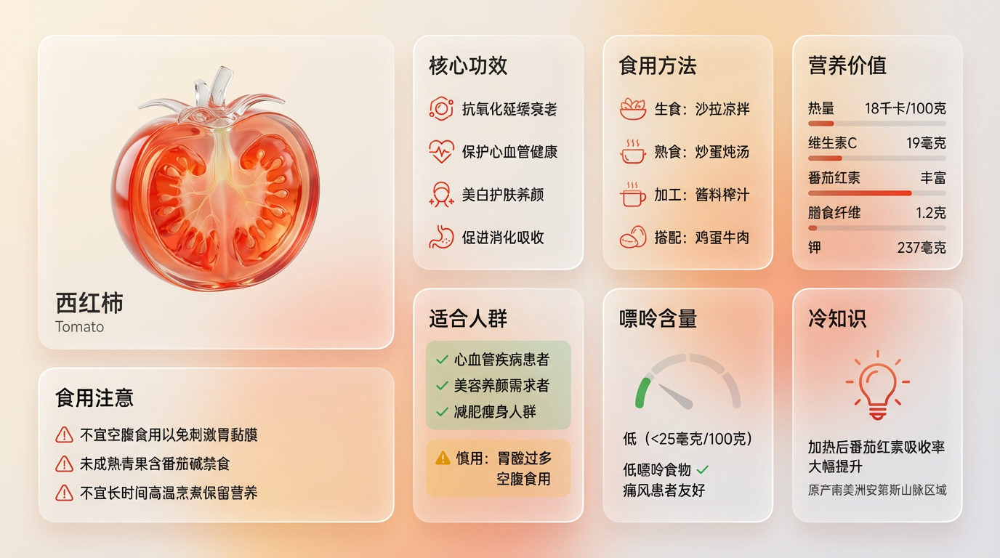

# 20251229 图片 prompt 记录

### 原图


## 1. 大唐盛世与巴黎写真照
```text
生成一张 9:16 竖版「大唐盛世与巴黎」写实照片：以我上传的 FACE_REF 为人物身份参考，100%还原五官与骨相；人物身穿“唐代（盛唐）宫廷贵妃方向”的重工礼服（齐胸衫裙、大袖衫、牡丹纹样、金饰），在巴黎埃菲尔铁塔下的特罗卡德罗广场或塞纳河畔拍摄。画面具备COSMO时尚杂志级别的摄影、造型与封面设计，保持杂志的一贯设计风格（英文设计）。
【INPUTS | 输入】 FACE_REF：我上传的人物五官参考图（身份锁定）
【ABSOLUTE PRIORITY | 身份锁定（最高优先级）】 100%还原 FACE_REF 的五官与骨相：脸型、容貌、眼距、鼻梁鼻翼、唇形、下颌线、颧骨结构完全一致，不得漂移。 真实皮肤质感：可见细微纹理与毛孔，不要过度磨皮与网红化。 成年女性形象。
【SHOT TYPE | 景别二选一（由模型随机选其一，且必须真实统一）】 A) 半身封面：胸口到腰上方，头面与上身刺绣最清晰，眼睛对焦最锐利（主推） B) 全身封面：从头到脚完整呈现层叠礼服与裙摆纹样，铁塔的钢结构透视更强（备选） （无论A/B：都必须保持“封面构图”，有留白空间给排版，但不要撕纸/手绘效果。）
【LOCATION | 场景（巴黎埃菲尔铁塔）】 巴黎埃菲尔铁塔：经典的钢结构塔身背景。天气二选一（随机）：1) 巴黎阴雨（地面微湿，光线柔和高级灰色调，时尚感强） 2) 绚丽黄昏（夕阳余晖，金色光影，浪漫氛围） 背景干净：无游客、无现代标识、无手机状态栏UI、无水印字幕、无护栏。
【LIGHTING & CAMERA | 摄影质感（杂志级）】 镜头感：85mm人像质感（半身）或 50mm/70mm（全身），浅景深，眼睛最清晰。 光线：自然光（强调环境光） + 电影级补光；金饰有真实高光但不爆；丝绸光泽清晰可辨。 色彩：高级电影感，法式米灰/蓝灰色调与唐代服装的“红绿金”配色形成强烈视觉张力；整体干净、通透、质感厚。
【WARDROBE | 唐代宫廷礼服（丰腴、飘逸、色彩浓烈）】 目标审美：“金饰华丽、面靥花钿、齐胸裙、披帛飘逸、大红大绿大金、极度张扬”。
轮廓与层次（必须体现唐代特征） 内层：诃子（抹胸），露出颈部与上胸肌肤（唐代开放风气） 中层：对襟短衫（直领），材质透明轻薄（罗/纱） 外层：大袖衫（极宽大的袖子，拖地），像翅膀一样张开 装饰：披帛（长长的丝带），挽在手臂间，随风飘舞 下装：齐胸破裙（裙腰系在胸口，裙摆宽大，多色拼接或印花） 面料与工艺（重手艺必须“看得见”） 主面料：丝绸、织锦、印金纱（轻盈与厚重结合） 主要工艺：印染（蜡染/夹路）、金线刺绣、织金 纹样主题（适配大唐）：宝相花、缠枝牡丹、瑞兽（狮子/麒麟）、团花（图案巨大、饱满） 细节：花钿（额头红色装饰）、面靥（嘴角红点）、臂钗（大臂上的金属饰品） 头面（唐代雍容华贵头饰） 核心结构：高耸的发髻（云髻/坠马髻），插戴大朵牡丹花（真花或绢花） 装饰：金梳背（插在发髻上的金梳子）、步摇（走动摇曳）、金钗 耳饰：贵重金玉
【COLOR MATRIX | 颜色矩阵搭配（必须执行，且必须“浓烈唐风”）】 （调整为唐代流行色：红绿撞色、金碧辉煌） 从以下三套“主色方案”中随机选 1 套作为【底色/大面积主面料色】。
Scheme G（石青/翠绿底）： 底色：翠绿/石青（常用的间色） 刺绣/印染：茜红、金色、橘黄、米白 Scheme A（牡丹红底）： 底色：牡丹红/石榴红（最经典的唐风） 刺绣/印染：金色、翠绿、宝蓝、紫 Scheme R（紫底）： 底色：紫/葡萄色（高贵） 刺绣/印染：金色、朱红、草绿、银
【颜色执行规则】 色彩对比要强烈，体现盛唐气象，但整体色调要统一在高级感中。
【POSE | 封面姿态（自信、舒展、女王感）】 半身：微昂头，眼神睥睨，一手轻抚发髻或披帛 全身：双臂张开带动大袖衫和披帛，展现服装的体积感，气场全开 表情：自信、张扬、妩媚、大方；不要羞涩。
【OUTPUT | 输出】 1 张 9:16 竖版写实杂志封面级照片 随机：半身 or 全身（A/B二选一） 随机：阴雨 or 黄昏（天气二选一） 随机：翠绿 / 牡丹红 / 紫（颜色矩阵三选一） 造型：唐代宫廷礼服方向 + 牡丹花/金梳头面 + 齐胸大袖 + 披帛
```
### 效果图


## 2. 现代Bento网格布局产品展示设计
```text
现代Bento网格布局产品展示设计,采用磨砂亚克力透明玻璃材质。适用于任何产品类型(食物/药品/科技产品/元素等)。
【布局结构】8个模块,非对称Bento网格排列,横向landscape格式:
模块1: 【3D玻璃产品主体展示】(中等尺寸1x1,占20-25%空间)
- 3D透明玻璃/亚克力材质的[产品名称]雕塑
- [产品特色]:
* 食物 → 展示切面/内部结构(如番茄种子腔室、胡萝卜横切面)
* 药品 → 药片/胶囊的透明玻璃形态
* 科技产品 → 产品外观的玻璃艺术化呈现
- 材质效果: 透明红橙/蓝色/绿色等[产品主色]玻璃,光泽表面,光线折射,真实反射
- 正下方文字标注: "[中文产品名] / [English Name]"
- 不占用过多空间,为信息模块留足展示区域
模块2: 【核心功效/特点】(标准卡片1x1)
标题: "核心功效" 或 "核心特点" 或 "主要功能"
内容: 4个核心卖点,用 "/" 分隔
- 食物 → "抗氧化延缓衰老 / 保护心血管健康 / 美白护肤养颜 / 促进消化吸收"
- 药品 → "解热镇痛 / 抗炎消肿 / 抗血小板聚集 / 预防心血管疾病"
- 科技 → "主动降噪 / 空间音频 / 自适应均衡 / 20小时续航"
配合简洁图标
模块3: 【使用方法/应用场景】(标准卡片1x1)
标题: "食用方法" 或 "使用方法" 或 "应用场景"
内容: 4种使用方式/场景
- 食物 → "生食: 沙拉凉拌 / 熟食: 炒蛋炖汤 / 加工: 酱料榨汁 / 搭配: 鸡蛋牛肉"
- 药品 → "口服: 餐后温水送服 / 剂量: 成人100mg / 频次: 每日1-2次 / 疗程: 遵医嘱"
- 科技 → "音乐欣赏 / 通勤降噪 / 居家办公 / 观影娱乐"
配合场景图标
模块4: 【关键数据/参数】(标准卡片1x1)
标题: "营养价值" 或 "技术参数" 或 "产品规格"
内容: 5个关键数据点
- 食物 → "热量 [X]千卡/100克 / 维生素C [X]毫克 / [特色成分] 丰富 / 膳食纤维 [X]克 / 钾 [X]毫克"
- 药品 → "成分: [化学式] / 规格: [X]mg / 起效时间: [X]分钟 / 半衰期: [X]小时 / 代谢途径: [途径]"
- 科技 → "芯片: [型号] / 续航: [X]小时 / 重量: [X]克 / 驱动单元: [规格] / 充电: [X]小时"
配合简洁数据可视化图表
模块5: 【适用人群/目标用户】(标准卡片1x1)
标题: "适合人群" 或 "目标用户" 或 "适用场景"
内容: 分为推荐(✓)和警示(⚠️)两部分
- 食物 → "✓ 心血管疾病患者 / ✓ 美容养颜需求者 / ✓ 减肥瘦身人群 / ✓ 便秘消化不良 / ⚠️ 慎用: 肾功能不全 / 胃酸过多 / 空腹食用"
- 药品 → "✓ 发热患者 / ✓ 轻中度疼痛 / ✓ 炎症性疾病 / ⚠️ 禁忌: 孕妇 / 哮喘患者 / 胃溃疡"
- 科技 → "✓ 音乐发烧友 / ✓ 商务人士 / ✓ 通勤人群 / ✓ 内容创作者"
用绿色✓和琥珀色⚠️区分
模块6: 【注意事项/使用指南】(标准卡片1x1)
标题: "食用注意" 或 "使用注意" 或 "重要提示"
内容: 4条重要提醒事项
- 食物 → "不宜空腹食用以免刺激胃黏膜 / 未成熟[产品]含[有毒物质]禁食 / 不宜长时间高温烹煮保留营养 / [特殊人群]需控制摄入量"
- 药品 → "需餐后服用避免胃部不适 / 不可与[禁忌药物]同服 / 服药期间避免饮酒 / 出现过敏反应立即停药就医"
- 科技 → "首次使用需配对设备 / 避免极端温度环境 / 定期清洁保养 / 长期不用请充电保存"
配合警示图标
模块7: 【特殊指标】(标准卡片1x1)
标题: 根据产品类型调整
- 食物 → "嘌呤含量" 显示 "[X]毫克/100克" + "低嘌呤食物 ✓" + "痛风患者友好"
- 药品 → "不良反应" 列举常见副作用
- 科技 → "兼容性" 显示支持的系统/设备
配合指示器或图标
模块8: 【趣味知识/产品洞察】(标准卡片1x1)
标题: "冷知识" 或 "产品故事" 或 "有趣事实"
内容: 2-3条有趣的知识点
- 食物 → "[产品]加热后[成分]吸收率提升X倍 / [产品]原产[地区]已有[X]年历史 / 未成熟[产品]含[有害物质]"
- 药品 → "[产品]是世界上使用最广泛的[类别]之一 / 每年全球生产超过[X]吨 / [发明年份]年由[人名]发明"
- 科技 → "[产品]采用[技术]专利技术 / [品牌]首次将[功能]应用于消费级产品 / 全球销量突破[X]万台"
【磨砂亚克力材质规格】(CRITICAL 核心灵魂):
卡片材质效果:
- 透明度: 80-85% 半透明(TRANSLUCENT),可以看穿卡片看到背景
- 磨砂效果: 柔和的frosted glass blur模糊,backdrop-filter风格
- 底色调: 轻微白色/奶油色霜化效果(15-20%不透明度),提升可读性但保持透明
- 边框: 细致的发光边框,捕捉光线反射
- 阴影: 柔和的分层阴影,营造浮空深度感
- 玻璃物理: 真实的玻璃边缘高光、光线折射、表面反射效果
- 视觉特征: 背景渐变可以透过卡片清晰看见,像真实的磨砂亚克力板
重要: 卡片必须保持TRANSLUCENT透明质感,不能变成不透明白卡片!
【色彩方案】:
基础色彩配比: 90% 中性色 + 10% 产品主题色点缀
- 基础层: 透明玻璃、浅灰色、米白色
- 文字色: 中等深灰 #3A3A3A (柔和但清晰,适合透明背景)
- 主题色点缀(10%使用):
* 食物 → 产品天然色(番茄红橙、胡萝卜橙、菠菜绿等)
* 药品 → 医疗蓝、药品白、红十字标志色
* 科技 → 品牌主色(Apple银灰蓝、小米橙、华为红等)
- 点缀位置: 仅用于关键图标、重要数字、警示符号、3D主体
- 警示色: 琥珀橙 #FF9800 用于⚠️警告内容
- 肯定色: 绿色 #4CAF50 用于✓推荐内容
【背景设置】:
- 类型: 柔和渐变,2-3个相近色过渡
- 产品色调适配:
* 食物 → 奶油白-淡桃红-浅橙色(温暖色调)
* 药品 → 浅灰白-淡蓝-医疗白(清洁专业)
* 科技 → 太空灰-银白-淡蓝(科技感)
- 装饰元素: 极度柔和的抽象形状,可透过玻璃卡片隐约看见
- 重要: 背景要柔和不抢眼,通过透明卡片可见但不干扰阅读
【排版布局】:
- 格式: 横向 landscape 16:9 或类似比例
- 网格类型: 非对称Bento网格,卡片大小不一
- 空间分配:
* 3D玻璃主体: 20-25% (中等尺寸,不过度占用)
* 信息卡片: 75-80% (7个标准卡片)
- 卡片间距: 适度留白,不拥挤,呼吸感良好
- 视觉层次: 通过卡片大小、位置、色彩点缀建立信息优先级
- 阅读流: 从左上3D主体开始,自然流向各信息卡片
【文字规范】:
- 语言: 全中文内容(产品名可双语标注)
- 字体层级:
* 模块标题: 粗体,大号
* 正文内容: 常规体,中号
* 数据数字: 粗体,突出显示
- 可读性: 中等深灰文字在磨砂玻璃上清晰易读
- 单位规范:
* 重量: 克、千克、毫克
* 能量: 千卡、卡路里
* 时间: 分钟、小时、天
* 容量: 毫升、升
【图标风格】:
- 类型: 极简线条图标 (line icons)
- 尺寸: 小巧不喧宾夺主
- 颜色: 浅灰线条,关键图标用主题色点缀
- 用途: 辅助说明,增强视觉识别
【使用方法】:
1. 将 [产品名称] 替换为实际产品
2. 根据产品类型(食物/药品/科技)选择对应的内容示例
3. 填充8个模块的具体信息
4. 调整主题色为产品代表色
5. 确保保持磨砂亚克力的透明质感
【质量标准】:
✓ 透明度正确(80-85%,可看穿)
✓ 磨砂模糊效果明显但不过度
✓ 背景可透过卡片看见
✓ 3D主体占比适中(20-25%)
✓ 信息完整(8个模块内容齐全)
✓ 全中文显示清晰
✓ 色彩克制优雅(90%中性+10%点缀)
✓ 排版舒适不拥挤
✓ 玻璃质感真实(边缘高光、反射、折射)
【典型应用示例】:
食物: 🍅西红柿、🥕胡萝卜、🍎苹果、🥑牛油果
药品: 💊阿司匹林、维生素C、布洛芬、青霉素
科技: 🎧AirPods Max、iPhone、MacBook、特斯拉
元素: ⚛️碳、氧、氢、氮
```
### 效果图
