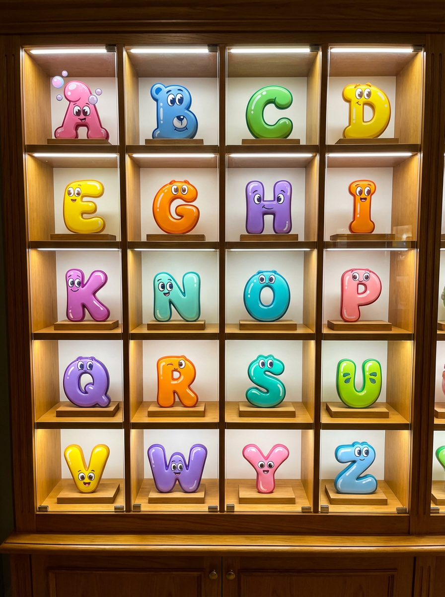
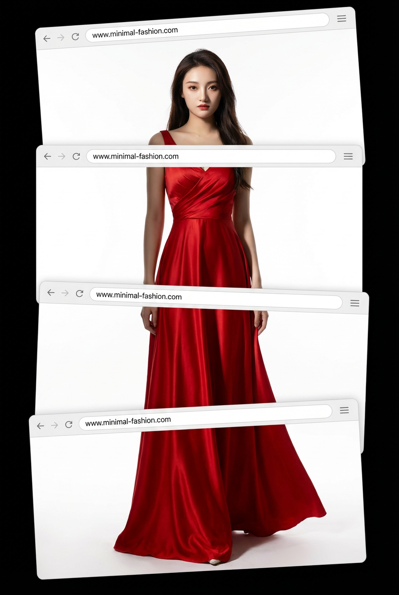

# 20260106 图片 prompt 记录

### 原图


## 1. 自定义特色单词
```text
用这个草图制作全尺寸的英文单词字体<不能出现重复的单词，保证每一个都是独一无二的>，并且为其加上与配图符合的有趣的色彩，每个单词之间使用四方格间隔开，像一个展柜
```
### 效果图


## 时尚大片写真图
```text
核心描述：
一张富有电影质感的高端[季节/场景]时尚大片，整体氛围[氛围描述]。
场景与人物：
[人物描述与场景描述]
服装与造型：
[服装与造型]
环境与光线：
[环境与光线]
构图与摄影风格：
采用 85mm 镜头，以浅景深突出主体，焦点锐利。构图采用居中、极简的电影风格，强调画面的奢华社论感。
色彩与质感：
[色彩与质感]

eg:
核心描述：
一张富有电影质感的高端热带时尚大片，整体氛围奢华、性感而放松。
场景与人物：
一位年轻的女性，坐在一块被海水冲刷过的、带有优美纹理的浮木上。她的姿态舒展而自信，双腿优雅地交叠，一只手轻轻拂过被海风吹起的发丝。
服装与造型：
她身穿一件剪裁简约的白色亚麻长款衬衫，衬衫随意敞开，露出里面的黑色比基尼。赤着脚，脚踝上戴着一条精致的金色脚链。头上戴着一顶宽边的手工编织草帽，为她增添了一丝神秘感。
环境与光线：
场景位于一片原始的白色沙滩上，背景是碧绿清澈的海洋和远处若隐若现的热带岛屿。正值“黄金时刻”（日落前一小时），温暖的阳光以一个较低的角度照射过来，在沙滩上投下柔和而长长的影子，营造出温暖、奢华且略带戏剧性的光影效果。
构图与摄影风格：
采用 85mm 镜头，以浅景深突出主体，焦点锐利。构图采用居中、极简的电影风格，强调画面的高级社论感。
色彩与质感：
画面主色调为温暖的金色、沙滩的米白色、海洋的绿松石色以及植物的葱绿色。要求图像达到超高分辨率和照片级的真实感，无论是人物皮肤上的微光、亚麻衬衫的褶皱，还是湿润沙滩的颗粒感，都必须清晰、逼真
```
### 效果图


## 模拟模特图
```text
正面提示 (Prompt):
（核心构图）一张极具创意的艺术作品：一位中国女性模特的超现实感全身肖像，被四个垂直堆叠、略微倾斜的白色手机浏览器窗口分割。每个浏览器窗口顶部都写着 "www.minimal-fashion.com"。浏览器窗口外的区域是纯黑色的UI框架。
（主体与姿势）画面中心是一位如图所示图片，她穿着一件鲜红色的丝绸长裙，优雅地站立，双手自然垂在身侧，表情平静，直视镜头。
（光照与风格）(volumetric studio lighting:1.3)，强烈的伦勃朗光照亮模特，在她身上塑造出深刻的3D轮廓和逼真的阴影。皮肤纹理和丝绸褶皱清晰可见。整张照片是超写实风格，4K分辨率，色彩饱和度高，但背景是完全纯白、无缝的工作室背景。照片带有轻微的胶片颗粒感。
负面提示 (Negative Prompt):
floor shadows, flat lighting, 2D look, blurry, oversaturated, HDR, watermark, text, error, malformed, UI elements on the model, shadows on the background
```
### 效果图

