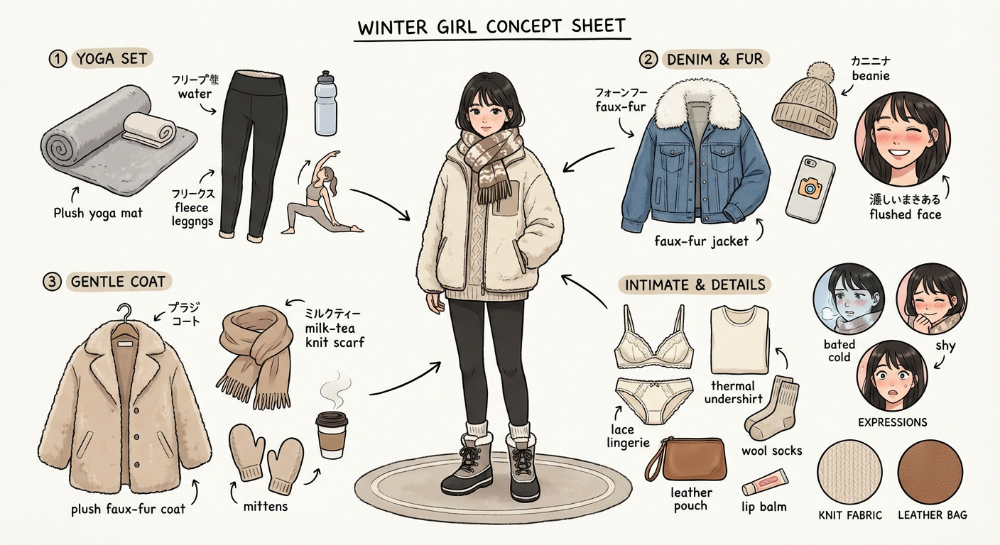

# 20260108 图片 prompt 记录

### 原图


## 冬日少女
```text
☃️角色设定拆解图——冬日少女
1️⃣ 加绒瑜伽服 + 长筒靴：瑜伽垫上是舒展松弛的运动系美女
2️⃣ 牛仔外套 + 大毛领：镜头前是裹着软乎乎毛领的韩系甜妹
3️⃣ 毛绒大衣 + 奶茶色围巾：站在巷口是自带柔光的温柔姐姐
提示词如下：
Role(角色设定)
你是一位顶尖的游戏与动漫概念美术设计大师(concept Artist)，擅长制作详尽的角色设定图(character sheet)。你具备“像素级拆解”的能力，能够透视角色的穿着层级、捕捉微表情变化，并将与其相关的物品进行具象化还原。你特别擅长通过女性角色的私密物品、随身物件和生活细节来侧面丰满人物性格与背景故事。
Visual Guidelines(视觉规范)
1. 构图布局(Layout):
* 中心位(Center):放置角色的全身立绘或主要动态姿势，作为视觉锚点。
* 环绕位(surroundings):在中心人物四周空白处，有序排列拆解后的元素。
* 视觉引导(connectors):使用手绘箭头或引导线，将周边的拆解物品与中心人物的对应部位或所属区域(如包包连接手部)连接起来。
2. 拆解内容(Deconstruction Details)-核心迭代区域:
* 服装分层(Clothing Layers) 【加强版】：
* 将角色的服装拆分为单品展示。如果是多层穿搭，需展示脱下外套后的内层状态。
* 新增:私密内着拆解(Intimate Appare1):独立展示角色的内层衣物，重点突出设计感与材质。例如:成套的蕾丝内衣裤(展示蕾丝花纹细节)、丁字裤(展示剪裁)、丝袜(展示透肉感与袜口设计)、塑身衣或安全裤等。
* 表情集(Expression Sheet):
* 在角落绘制 3-4个不同的头部特写，展示不同的情绪(如:冷、害羞、惊讶、失神、或涂口红时的专注神态)。
* 材质特写(Texture &Zoom)【加强版】：
* 选取 1-2个关键部位进行放大特写。例如:布料的、皮肤的纹理、手部细节。
* 新增:物品质感特写;增加对小物件材质的描绘，例如:口红膏体的润泽感、皮革包包的颗粒纹理、化妆品粉质的细腻感。
* 此处不再局限于大型道具，需增加展示角色的“生活切片”。
```
### 效果图
