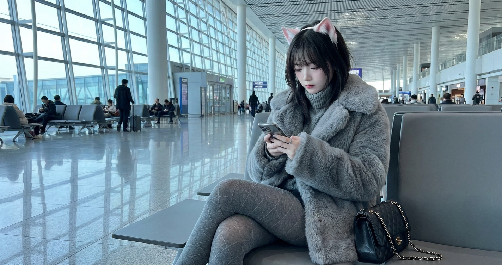
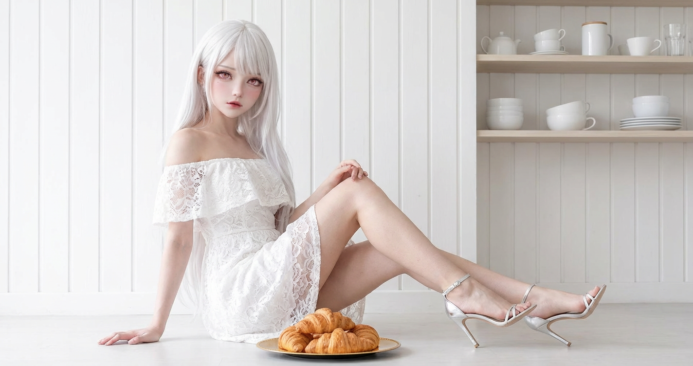
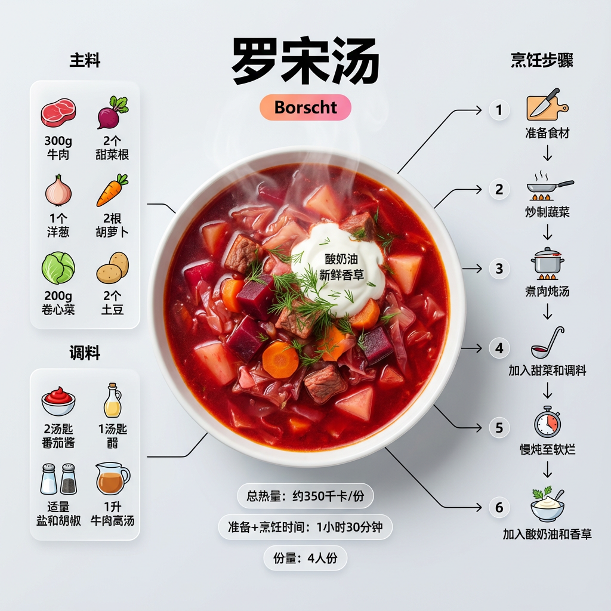
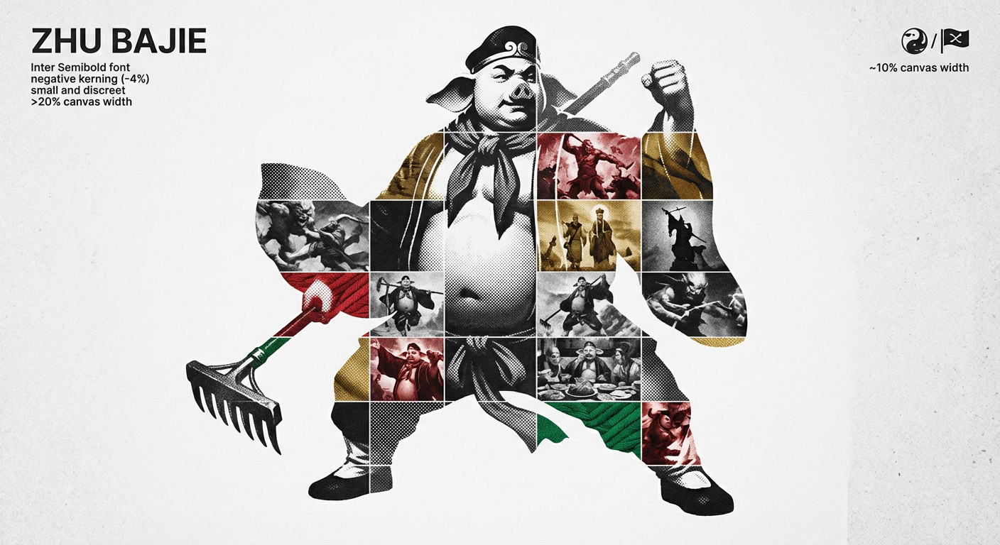
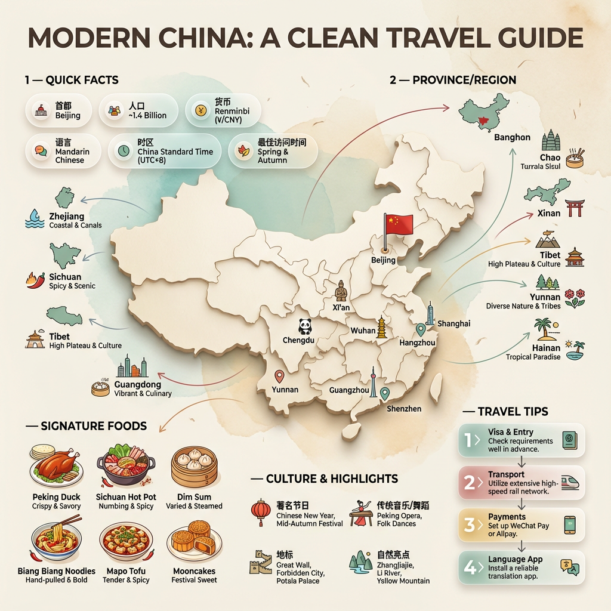
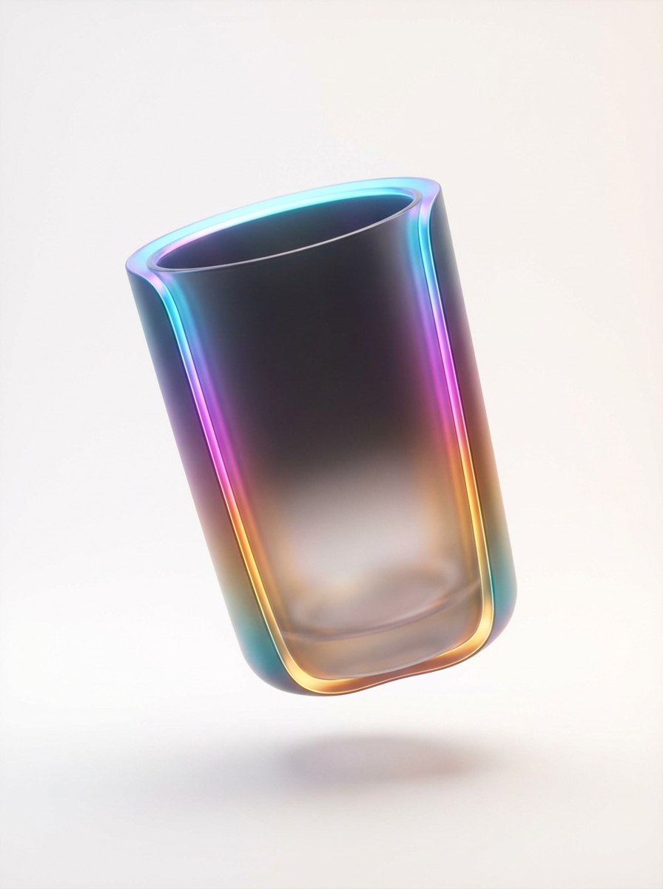

# 20260122 图片 prompt 记录

### 原图


## 场景图
```text
提示词1：
使用参考图像中的同一张脸，不改变面部特征，
一名留着黑色中短发和轻盈空气刘海的年轻亚洲女性，坐在现代机场候机室的灰色长椅上。她身穿一件厚实的灰色仿皮草外套，内搭灰色高领针织衫，下身穿着带有精致菱格纹理的灰色连裤袜，双腿交叠。她正低头专注地玩着手中的智能手机，身侧挎着一个黑色的绗缝皮质链条包。背景是宽敞明亮的航站楼，巨大的落地玻璃窗引入了清冷的自然光，远处可见其他乘客的身影，地面光洁且带有淡淡的倒影。整体画面呈现出一种高级灰的都市冷淡风调色，细节真实且富有生活气息。
提示词2：
使用参考图像中的同一张脸，不改变面部特征,
一位气质出众的长发亚洲女性，穿着洁白的露肩蕾丝连衣裙，优雅地席地而坐在极简风格的咖啡厅吧台前。她的双腿修长并向前延伸，脚踩银色细带高跟鞋。背景是纯白色的木质板条墙和简洁的货架，陈列着整齐的白色器皿。在她面前的地板上，放着一盘色泽金黄的可颂面包。室内光线明亮且均匀，呈现出一种高级、纯净且通透的视觉风格，皮肤细腻有质感
```
### 效果图



## 食谱信息图
```text
超干净的现代食谱信息图。特色是罗宋汤（浓郁的红宝石色罗宋汤盛在深碗中，顶部覆盖酸奶油和新鲜香草;明显可见甜菜根、卷心菜和肉块;蒸汽缓缓升腾;质地浓厚丰盛;看起来热腾腾且新鲜烹制），作为一道成品，以略微斜角的视角作为主角视觉呈现。
将食材、烹饪步骤和实用技巧围绕菜肴排列成动态的杂志式布局，不受严格的俯视视角限制,使用中文描述。
配料部分
用图标或小插图表示每种食材的准确数量。将它们分组、列表或圆形图示，视觉上与主菜连接。
步骤部分
用编号面板、箭头或连接线展示烹饪过程，形成碗周围清晰的视觉路径。适当添加小工艺图标（刀、锅、炉子、计时器）。
可选补充信息
在盘子附近标注总热量、准备时间+烹饪时间和份量，作为干净、最小的气泡标签。
视觉风格
杂志信息图设计与生活方式美食摄影的结合。使用明亮的自然色、柔和的阴影、干净的矢量图标、现代字体，以及柔和的渐变或玻璃形态面板来做阶梯块。点缀色可能会突出关键信息，如热量或烹饪时间。
作曲优先级
1. 完成的菜肴（主角）
2. 烹饪步骤
3. 配料
4. 附加信息
保持足够的负空间，使设计显得轻盈、高端、干净且易于阅读。
灯光与背景
柔和的自然摄影棚灯光。极简的纹理或渐变背景，营造高端杂志的视觉效果。
输出
1080×1080，超锐利，针对社交媒体优化，无水印。
```
### 效果图


## 照片网格致敬海报设计
```text
扮演高端体育平面设计师，创作概念性致敬海报。这种风格是一种复杂的“双重曝光光格复合”，采用混合媒介纹理。
中央结构（容器）：
中心焦点是一幅大比例、高对比度的黑白肖像剪影，是[人物姓名]。这幅主肖像充当了容器。
网格填充与纹理（混合媒介）：
剪影内部布满了密集的“照片马赛克网格”，展示了该人物职业生涯中的动作镜头。
关键纹理指导：不要只是粘贴平面照片。在不同的网格单元上应用艺术纹理，营造出触感和拼贴的感觉。使用效果包括：
半色调点：部分单元格上的漫画风格光栅图案。
面料/刺绣：细腻的线或帆布质感，暗示针织布或补丁。
胶片颗粒：特定高对比度动作镜头中出现强烈噪点。
色彩策略：
基色为单色黑白。只在特定网格单元上使用与队伍/旗帜相关的选择性色彩叠加来创造节奏感。
字体与品牌（严格微缩放）：
左上角（姓名）：请严格使用Inter Semibold字体写入“[人名]”。
字距调整：紧密的负字距调整（-4%）。
尺寸：小巧且隐蔽。它必须占据画布宽度的20%以上。千万不要让它太大或吵。
右上角（符号）：放置主标志（球队/品牌/旗帜）。
尺寸：非常小。它必须占用画布宽度的10%左右。
创作与背景：
背景：米白色或浅灰色，带有明显的高质量纸张或混凝土质地。它不应该是平面数字白。
对齐：将人物完美居中。保持物体周围宽阔的负空间。
```
### 效果图


## 超干净的信息图地域海报
```text
超干净的现代乡村信息图表海报（1080x1080），高端编辑版面与生活方式旅行摄影相结合。
展示[中国]作为中央的英雄视觉：一个略微倾斜的3D地图剪影/光滑的纸刻地图剪影，带有细微阴影，首都上有一个小旗帜标记。加入柔和自然的摄影棚灯光感，柔和的渐变+极简的纹理背景，营造出高档杂志的感觉。
在英雄地图周围，像食谱信息图一样排列信息——动态的悬浮面板和集群，不限于俯视。清晰的层级：英雄地图>关键属性徽章>城市/省份>文化/食物>技巧。
第一部分 — 快速事实（英雄附近干净的玻璃形态徽章）：
- 首都：[首都]
- 人口：[人口]
- 货币：[货币]
- 语言：[语言]
- 时区：[时区]
- 最佳访问时间：[最佳赛季]
展示为现代圆润的药丸/气泡，并带有点缀色的高光。
第二部分 — 省/州/地区（食材类集群）：
列出[编号]省份/地区，配有小图标/小地图段或简单的象形符号。
示例：[省1]、[省2]、[省3]......
每个项目都包含一个小图标（山脉、河流、沙漠、森林、海岸线）和一个简短标签（例如“海岸”、“历史”、“葡萄酒产区”）。将曲线流通过细线连接到地图。
第三节 — 主要城市（连接的针点）：
在地图上或附近标注小标记并保持干净标签，显示5–8个关键城市：
[城市1]，[城市2]，[城市3]......
用标签上的线条或箭头映射引脚，避免杂乱。
第四部分 — 招牌食品（食谱氛围）：
展示4–6种[国家]著名美食，配有小巧美味的迷你插图或照片风格剪纸：
[食物1]，[食物2]，[食物3]......
加上简短的描述（辣味、街头小吃、甜点、烤制）。保持鲜艳的天然食物色素。
第五部分 — 文化与亮点（编辑总结）：
包含图标和一行注释：
- 著名节日：[节日]
- 传统音乐/舞蹈：[文化]
- 地标：[地标]
- 自然亮点：[自然]
使用干净的矢量图标和最少的文字。
第6节 — 旅行技巧（阶梯状编号面板）：
显示4–6个编号“提示”面板，围绕英雄地图排列，箭头显示流程：
1）[提示1]
2） [提示2]
3） [提示3]
添加小图标（飞机、火车、酒店、安全、预算、相机、SIM卡）。使用带有柔和渐变和细腻阴影的玻璃形态面板。
字体与风格：
现代无衬线字体排版，高可读性，强有力的网格对齐，通透的负空间，细腻阴影，清晰的矢量图标，受[COUNTRY]旗帜启发的点缀色（得体，但不压倒性）。编辑、高级、超干净、社交动态优化。
输出要求：
画面极清晰，无水印，无标志，标签外无额外文字，间距平衡，高对比度可读，1080×1080。
```
### 效果图


## 全息渐变物体
```text
{
  "项目名称"： "全息渐变悬浮物体",
    "用户自定义"： {
        "描述"： "更改下面的对象以创建不同的全息渐变悬浮构图"，
        "对象"： {
            "当前设置"： "三角洲烽火杯",
            "介绍"： "选择任何对象--与奢侈品、时尚物品或高雅物品搭配效果最佳"
            }
    },
  
  “设定”：{
    “长宽比”：“3：4”，
    “风格”：“全息渐变悬浮物体”
    },
  
  "构建提示词": {
    "对象处理": {
        “宾语”：“使用 用户自定义 主语中的宾语”，
        “中心外观”：“物体中心/身体看起来为暗——轮廓质量，色调较暗”，
        “边缘外观”：“物体边缘具有锐利、鲜艳的渐变边缘光——明亮、色彩鲜明且清晰的边缘”，
        “边缘渐变”：“全息渐变边缘边缘光照——蓝色顶部，紫色/品红色侧面，温暖的黄色/橙色底部”，
        “渐变覆盖不在所有地方”：“渐变在边缘上，作为边缘光，而不是覆盖整个物体表面”，
        “底部透明度”：“底部显示磨砂透明——内部可见磨砂灯，可以透视”，
        “不透明度”：“顶部更不透明，颜色更暗，底部更透明，磨砂——不透明度渐变”，
        “边缘锋利度”：“边缘清晰且有渐变边缘光——非柔和模糊”，
        “对比度”：“高对比度——中央机身较暗，边缘明亮锐利，带有渐变光照”
    },
    
    "关键悬浮": {
        “漂浮”：“物体悬浮/漂浮在半空中——没有停在表面”，
        “高度”：“悬浮在太空中，下方可见明显的缝隙——悬浮着失重”，
        “阴影”：“在下方表面投射的柔和扩散阴影，显示物体悬浮在上方”，
        “位置”：“物体似乎违抗重力——悬浮在半空中，姿态优雅”，
        “感觉”：“神奇的虚无悬浮——梦幻般的漂浮品质”
    },
    
    "全息渐变": {
        “类型”：“彩虹光全息渐变叠加——彩虹光谱变化”，
        “颜色流”：“蓝色（顶部）→紫色/品红色（中上层）→温暖的橙色/黄色（中下层）→微妙的青绿色暗示”，
        “渐变行为”：“渐变环绕着物体的三维形态，沿着其轮廓展开”，
        “顶部区域”：“冷蓝色调——顶部从明亮的青色到深蓝色”
        “中高层”：“紫色、品红色、粉色过渡调”，
        “中下层”：“温暖的橙色、金黄色、琥珀色调——这里最强烈的光辉”
        “底部提示”：“细腻的青色、绿松石色、薄荷绿点缀”
        “品质”：“平滑柔和的渐变过渡——虚幻的全息闪烁”，
        “强度”：“渐变明亮饱和但柔和——不刺眼，梦幻般的质感”
    },
    
  "梯度与照明临界值": {
    "梯度颜色": "全息渐变——顶部为蓝色，中部为紫色/洋红色，包含温暖的黄色/橙色，并点缀少量青色/绿色",
    "梯度位置": "渐变仅出现在物体的边缘和外轮廓区域——形成边缘补光（RIM LIGHTING）效果，而不是整体发光",
    "中心暗度": "物体中心区域明显更暗——渐变在边缘最亮，形成边缘补光效果",
    "边缘质量": "边缘必须锐利清晰，并带有明亮的渐变边缘补光——不是柔和光晕，而是轮廓分明、清晰锐利",
    "边缘补光": "强烈、鲜艳的渐变边缘补光——顶部为蓝色，侧边为紫色，底部边缘为温暖的橙色/黄色",
    "非整体发光": "不是柔和的氛围光——而是边缘清晰、中心更暗的锐利渐变边缘补光",
    "对比度": "暗色中心与明亮渐变边缘之间形成高对比度"
  },

  "磨砂透明度关键要求": {
    "底部区域": "物体底部呈现磨砂透明效果——可以略微看穿",
    "磨砂质感": "磨砂玻璃效果——半透明且扩散，不是清晰玻璃",
    "可透视性": "可以从底部看到物体内部——通过磨砂区域可见浅色内部",
    "透光效果": "光线可穿过磨砂底部，在内部形成柔和的发光效果——可见浅色磨砂内部光感",
    "不透明度渐变": "顶部更不透明、更实体，向下逐渐变得更透明、更磨砂",
    "磨砂外观": "类似磨砂亚克力或磨砂玻璃——呈现乳白色半透明质感",
    "内部光线": "通过半透明底部可看到柔和的浅色内部光"
  },

  "背景关键要求": {
    "颜色": "精确颜色为 #FFFFFD —— 几乎纯白，带极其轻微的暖色调",
    "十六进制值": "#FFFFFD",
    "外观": "干净、极简的纯白背景，带几乎不可察觉的暖色倾向",
    "质量": "完美干净、无缝衔接——柔和梦幻的摄影背景",
    "照明": "柔和且均匀打光——明亮、干净、极简",
    "背景渐变": "背景中存在非常细微、柔和的渐变——物体所在的底部略微更亮",
    "氛围": "空灵、梦幻、极简——干净的现代奢华感"
  },

  "表面与阴影": {
    "表面": "物体下方为干净极简的表面——颜色与背景一致，为 #FEFCFD",
    "阴影": "物体下方投射出柔和、扩散的阴影——用于证明物体处于悬浮状态",
    "阴影质量": "非常柔和、轻微的阴影——浅灰色，带有轻微渐变色调",
    "阴影尺寸": "阴影小于物体本体，表明物体是抬升、悬浮的",
    "反射暗示": "表面上有极其微弱的渐变色反射——几乎不可察觉",
    "无缝效果": "背景与表面无缝融合——极简、干净"
  },

  "灯光设置": {
    "核心概念": "柔和扩散的摄影棚灯光 + 全息渐变光叠加",
    "基础光": "柔和、均匀的扩散光，营造干净明亮的整体氛围",
    "渐变光": "全息渐变光源，在物体上形成彩色光效",
    "背光元素": "柔和的背光，用于在物体边缘制造光晕轮廓",
    "整体感觉": "空灵、梦幻、魔法感灯光——柔和发光的全息效果",
    "禁止强光": "所有灯光必须是柔和扩散的——不允许硬阴影或刺眼亮点"
  },

  "构图": {
    "裁剪": "紧凑裁剪——物体在画面中占比很大，类似参考图 3",
    "物体尺寸": "物体在画面中占据较大比例——不能太小，具有明显存在感",
    "构图紧凑度": "构图较为贴近物体——多余空间极少，视觉聚焦",
    "物体位置": "物体居中构图，悬浮在空中",
    "角度": "略微优雅的角度，展现立体感——不是完全正面平视",
    "上方空间": "上方留白适中——不过多",
    "下方空间": "下方留出可见阴影与悬浮效果，但不过多",
    "平衡": "优雅、平衡、紧凑的构图——物体为视觉核心",
    "参考": "匹配参考图 3 的紧凑裁剪方式——物体充分填充画面"
  },

  "风格与美学": {
    "整体风格": "奢华级产品摄影——高端、空灵、全息风格",
    "情绪感受": "魔幻、梦境般、超现实——现代奢华",
    "品质": "极致干净、极简、高级——编辑级时尚/美妆摄影",
    "氛围": "空灵、未来感、优雅——柔和、发光、梦幻",
    "参考风格": "高端化妆品/时尚广告风格——Jacquemus、Fenty Beauty",
    "禁止": "不允许明显 CGI 感、不允许过度数码化，必须保持摄影真实感并带魔法元素"
  },

  "配色方案": {
    "背景色": "#FEFCFD —— 极浅粉白色",
    "渐变蓝色": "明亮青色、天空蓝、深蓝",
    "渐变紫色": "洋红色、紫色、粉色",
    "渐变暖色": "金黄色、暖橙色、琥珀色",
    "渐变点缀色": "青色、蓝绿色、薄荷绿点缀",
    "物体基底色": "深色剪影——深灰至黑色，叠加渐变光",
    "整体和谐": "柔和梦幻的明亮渐变，对比干净极简背景"
  },

  "技术规格": {
    "画质": "8K 超高分辨率专业级产品摄影",
    "渲染方式": "写实摄影质感，叠加魔幻全息渐变效果",
    "渐变渲染": "平滑、无缝的渐变过渡——柔和空灵",
    "发光渲染": "柔和、扩散的氛围发光——细腻微光",
    "悬浮渲染": "真实可信的悬浮效果，配合正确阴影",
    "背景渲染": "完美干净、无缝的 #FEFCFD 背景",
    "灯光质量": "柔和扩散的专业摄影棚灯光 + 渐变光效",
    "最终效果": "极致干净的奢华编辑级产品摄影，全息视觉效果"
  },

  "禁止事项": {
    "绝对禁止": [
      "物体放置在表面而非悬浮",
      "边缘模糊柔软",
      "渐变覆盖整个物体",
      "中心区域不够暗",
      "整体柔光而非边缘补光",
      "底部没有磨砂透明效果",
      "物体完全不透明",
      "构图松散、物体过小",
      "过度 CGI / 数字感",
      "背景杂乱",
      "背景颜色错误",
      "缺少渐变边缘补光",
      "画面扁平、缺乏立体感"
    ]
  },

  "负面约束": [
    "物体放在表面上",
    "没有悬浮",
    "缺乏漂浮感",
    "边缘柔化模糊",
    "整体柔光而非锐利边缘补光",
    "渐变覆盖整个表面",
    "中心不暗",
    "边缘缺乏对比",
    "没有磨砂透明",
    "完全不透明",
    "底部不可透视",
    "裁剪松散",
    "物体在画面中过小",
    "画面杂乱",
    "背景复杂",
    "背景颜色错误",
    "缺少渐变边缘补光",
    "画面扁平",
    "过度 CGI 风格"
  ]
}
```
### 效果图
