# 20260126 图片 prompt 记录

### 原图
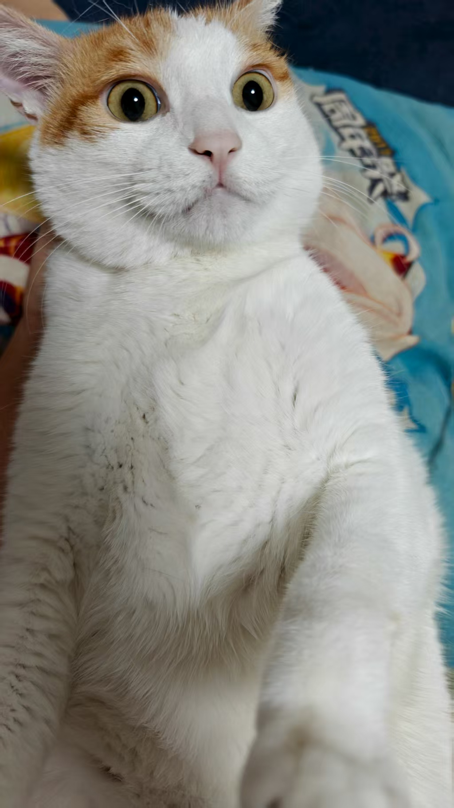
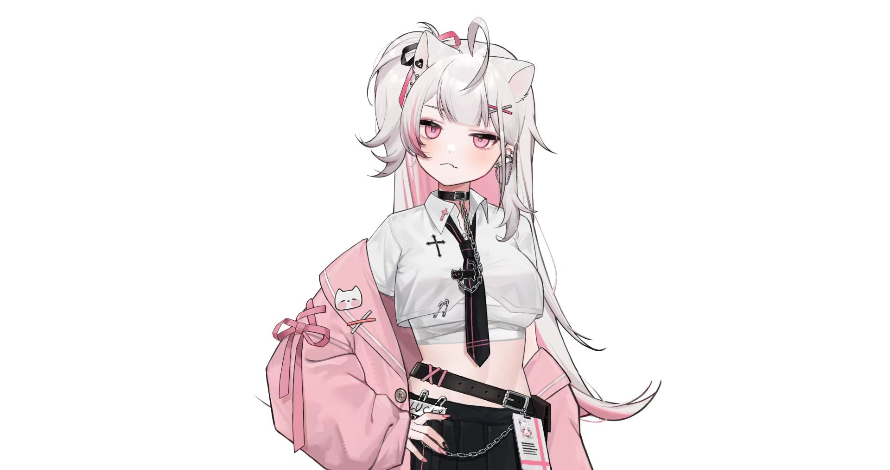

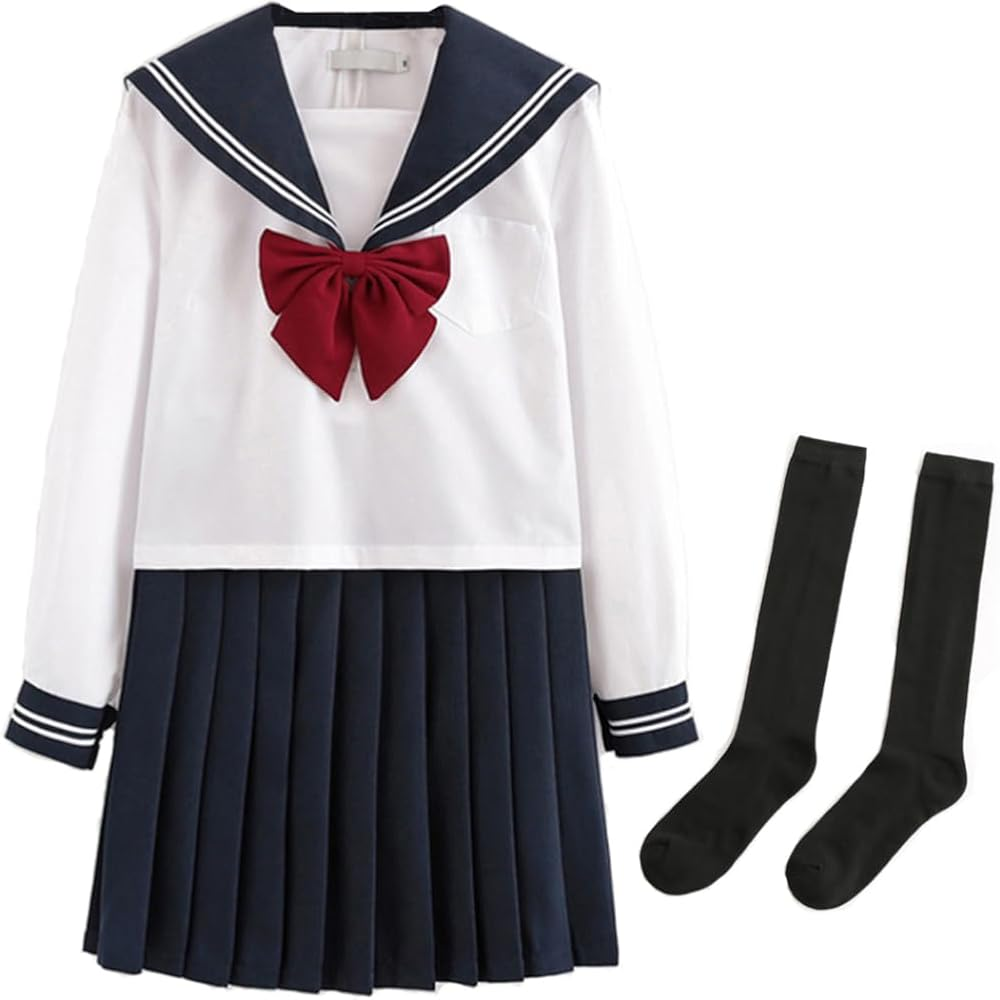
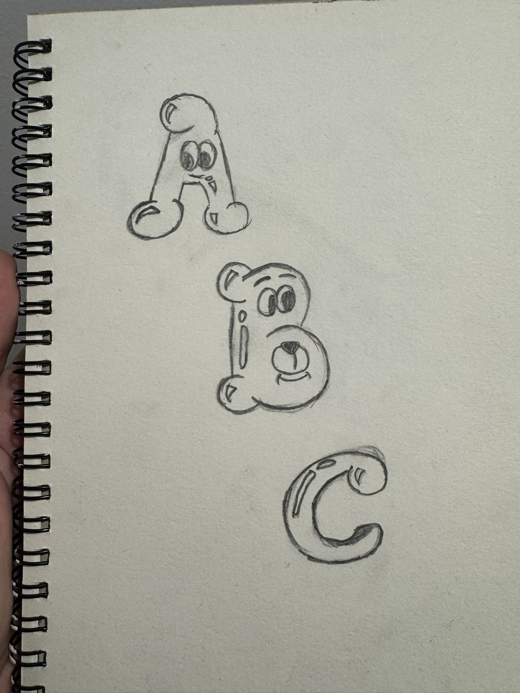

## 男友视角，女友情景特写
```text
一、人物与气质
1 人物设定：如图所示单人女性，韩国流行偶像风格
2 气质表现：可爱又性感，纯粹的性感氛围
3 表情神态：俏皮表情，轻佻微笑，直视观众，脸颊泛红
二、视角与构图
1 观看视角：男友视角，女友情景
2 镜头方式：特写镜头
3 姿态距离：微微抬头，亲密距离
三、服装与质感
1 穿着款式：白色蓬松毛衣，露肩设计
2 场景搭配：冬季约会穿搭
3 材质感受：柔软质地
四、光线与氛围
1 光影处理：重度柔焦，漫射效果
2 环境气氛：梦幻薄雾，浪漫夜间照明
3 画面效果：光晕效果，肌肤光泽，城市灯光散景
五、整体风格
1 美学取向：九十年代复古偶像美学
2 影像风格：胶片摄影，复古镜头
3 滤镜效果：雾状滤镜，审美取向
```
### 效果图


## 高难度姿势图
```text
一、核心目标与强约束
1 姿势精确复刻：以图二为姿势唯一参考，将图一人物的全身姿势进行“逐点对齐”复刻（头、颈、肩、胸、髋、膝、踝、手臂、手腕、手指的朝向与弯曲程度一致）。
2 视角与镜头一致：相机机位、拍摄角度、镜头高度、俯仰角、左右偏转角、透视关系、景深效果与图二一致。
3 构图一致：人物在画面中的位置、占比、留白比例、裁切方式（是否截到脚/头顶/手）与图二一致。
4 头部与视线一致：头部倾斜角度、下巴抬/收程度、视线方向与图二一致。
5 外观禁止改动：严格保留图一人物的身份特征与风格（脸型五官、发型发色、肤色、服装款式与颜色、材质、配饰、纹理、体型比例、年龄气质、画风/渲染风格），只改变姿势与镜头构图以匹配图二。
二、执行方式与校准要求
1 对齐方法：以图二人物骨架为“目标骨架”，将图一人物骨架“重定向”到目标骨架；四肢角度、重心位置、躯干扭转幅度必须匹配。
2 关键点优先级：先匹配重心与骨盆朝向，再匹配躯干旋转与肩线，再匹配四肢末端（手、脚），最后微调手指与表情细节。
3 允许变化范围：姿势与镜头的误差尽可能为0；若不可避免，误差必须极小且不可肉眼明显。
4 禁止项：禁止新增或删除物体；禁止改变服装造型与细节；禁止改变人物风格；禁止换背景风格导致构图变化；禁止把图二人物的外观特征迁移到图一人物身上
```
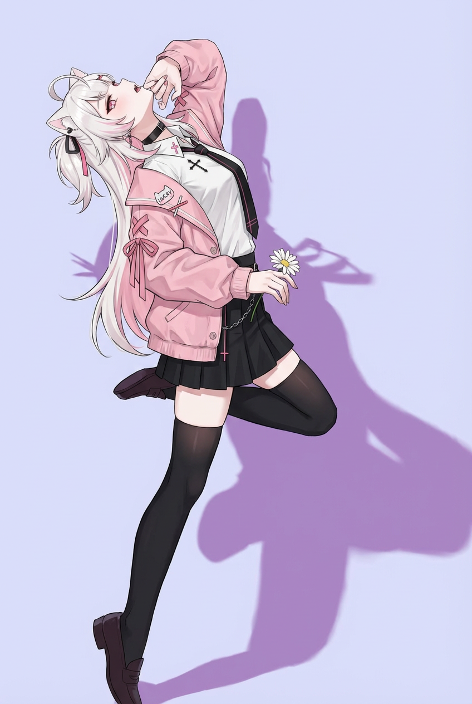

## 高端护肤广告
```text
[产品]，居中俯拍平铺，周围是[成分]，新鲜切片和完整的食材，光泽湿润效果，
产品周围冷冻水花飞溅，标签和表面有露珠，温暖米色无缝背景，柔和定向阳光，清晰逼真的阴影，
高端护肤品广告，超真实微距产品摄影，
100mm镜头效果，f/8清晰对焦，干净的构图，无额外文字，8k，1:1
eg:
[玫瑰花香果酸沐浴露]，居中俯拍平铺，周围是[玫瑰花,果酸原材料]，新鲜切片和完整的食材，光泽湿润效果，
产品周围冷冻水花飞溅，标签和表面有露珠，温暖米色无缝背景，柔和定向阳光，清晰逼真的阴影，
高端护肤品广告，超真实微距产品摄影，
100mm镜头效果，f/8清晰对焦，干净的构图，无额外文字，8k，1:1
```
### 效果图
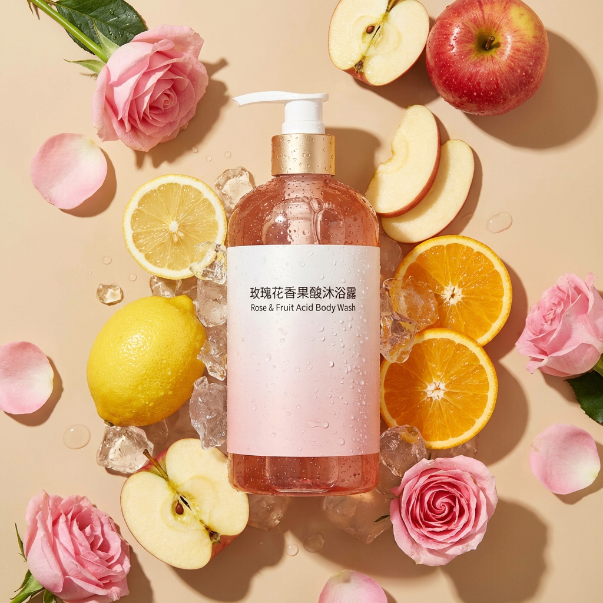

## 网红风格社交媒体生活照健身房对镜自拍
```text
{
  "图像分析": {
    "整体风格": {
      "类型": "社交媒体生活照",
      "子类型": "健身房对镜自拍",
      "美学风格": "网红风格",
      "氛围": "休闲运动、身材展示、年轻潮流"
    },
    "色彩体系": {
      "主色调": [
        {
          "颜色": "工业灰",
          "近似色值": "",
          "用途": "地面、天花板、主体服装"
        },
        {
          "颜色": "哑光黑",
          "近似色值": "",
          "用途": "健身器材框架、导轨"
        }
      ],
      "强调色": [
        {
          "颜色": "安全橙",
          "近似色值": "",
          "用途": "健身房立柱、器械调节旋钮或配重片"
        },
        {
          "颜色": "千禧粉",
          "近似色值": "",
          "用途": "iphone手机壳（作为视觉中心的小面积点缀）"
        }
      ],
      "色温": "冷白色灯光，辅以轻微暖色环境光"
    },
    "构图与相机": {
      "取景方式": "全身构图",
      "透视关系": "广角透视",
      "拍摄角度": "平视略微仰拍",
      "拍摄技术": "镜面反射拍摄",
      "对焦": "主体清晰，背景景深较深",
      "视觉重心": "居中构图，利用背景透视线引导视线"
    },
    "光照与阴影": {
      "光源": "室内人造顶光",
      "光质": "硬光",
      "阴影": "地面存在明显人物投影，光线垂直向下",
      "高光": "大腿与发丝区域存在明显高光反射"
    },
    "主体元素": {
      "服装": {
        "服饰": "灰色紧身连体衣或连体短裤",
        "鞋袜": "黑色运动袜搭配黑白条纹拖鞋",
        "风格": "运动休闲风"
      },
      "姿态": {
        "描述": "站立姿势，单腿向前伸出",
        "肢体语言": "手持手机遮挡面部，强调腰臀比例",
        "发型": "深棕色长直发"
      }
    },
    "环境与道具": {
      "场所": "商业健身房",
      "背景元素": [
        "龙门架",
        "哑铃架",
        "外露的工业风天花板管道",
        "大型墙面镜子"
      ],
      "文字元素": [
        "背景墙上的模糊海报文字",
        "LED 数字时钟（绿色显示“35”）"
      ]
    },
    "视觉效果与后期处理": {
      "畸变": "轻微广角拉伸效果（腿部被视觉拉长）",
      "质感": "皮肤质感光滑",
      "清晰度": "主体具有较高锐度"
    }
  }
}
```
### 效果图
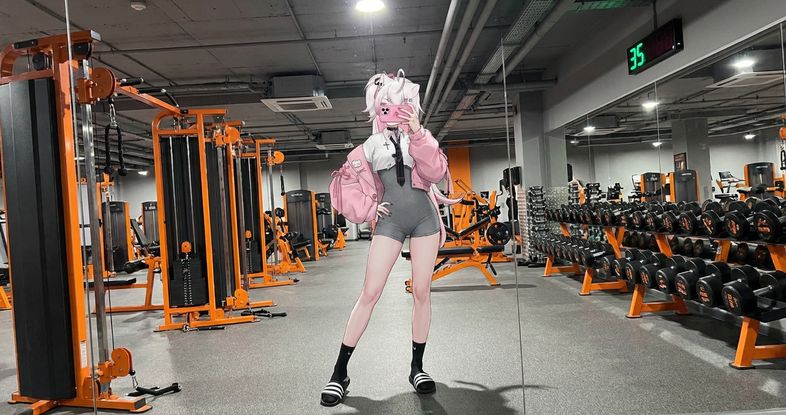

## 电影拼贴画
```text
这是一幅由六幅特写和中景肖像组成的电影拼贴画
[角色描述]
未来感十足的Z世代美学，梦幻飘渺的氛围，带有略带摇晃模糊的感觉。
每一帧都采用数字摄像机录制屏幕的样式，屏幕上有显示叠加层：电池图标、红色“REC”符号、白色定时器（00：02：17、00：00：47、00：00：49、00：01：02、00：00：37、00：00：22），以及分钟计时器（203分钟-206分钟）。
这六格展示了同一模特的不同姿势和表情：极近的眼睛特写、紧凑裁剪的面部肖像，以及正面中等肖像。
灯光是干净的工作室风格，背景是中性浅灰色，带有柔和的阴影。
剪辑时尚摄影美学，复古VHS/数码摄录机界面，超写实、电影感十足，对模特的聚焦极为锐利，同时保持梦幻超现实氛围
不能重复帧：每一帧必须有独特的姿势、表情和摄像机角度。每一帧使用不同的计时器值。
eg:
这是一幅由六幅特写和中景肖像组成的电影拼贴画
[角色初始穿着如图所示,展示角色从初中乖乖女到高中开始叛逆再到肄业后的放肆最终到中年的醒悟的不同姿态，六幅特写组成了角色人生中的六个不同的特殊阶段]
未来感十足的Z世代美学，梦幻飘渺的氛围，带有略带摇晃模糊的感觉。
每一帧都采用数字摄像机录制屏幕的样式，屏幕上有显示叠加层：电池图标、红色“REC”符号、白色定时器（00：02：17、00：00：47、00：00：49、00：01：02、00：00：37、00：00：22），以及分钟计时器（203分钟-206分钟）。
这六格展示了同一模特的不同姿势和表情：极近的眼睛特写、紧凑裁剪的面部肖像，以及正面中等肖像。
灯光是干净的工作室风格，背景是中性浅灰色，带有柔和的阴影。
剪辑时尚摄影美学，复古VHS/数码摄录机界面，超写实、电影感十足，对模特的聚焦极为锐利，同时保持梦幻超现实氛围
不能重复帧：每一帧必须有独特的姿势、表情和摄像机角度。每一帧使用不同的计时器值。
```
### 效果图
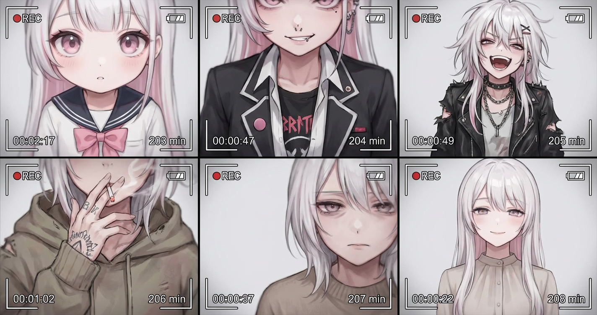

## 有趣的商业摄影
```text
[人物]、[姿势]，附图中作为主角道具的超大件产品，充满趣味的活力，时尚编辑风格，干净的极简背景，高调的摄影棚灯光，清晰柔和的阴影，超写实商业摄影，广角低透视，清晰对焦，8K，1：1
eg:
[上传的图片角色]、[泰坦尼克中跳水名场面]，附图中作为主角道具的超大件产品，充满趣味的活力，时尚编辑风格，干净的极简背景，高调的摄影棚灯光，清晰柔和的阴影，超写实商业摄影，广角低透视，清晰对焦，8K，1：1
```
### 效果图
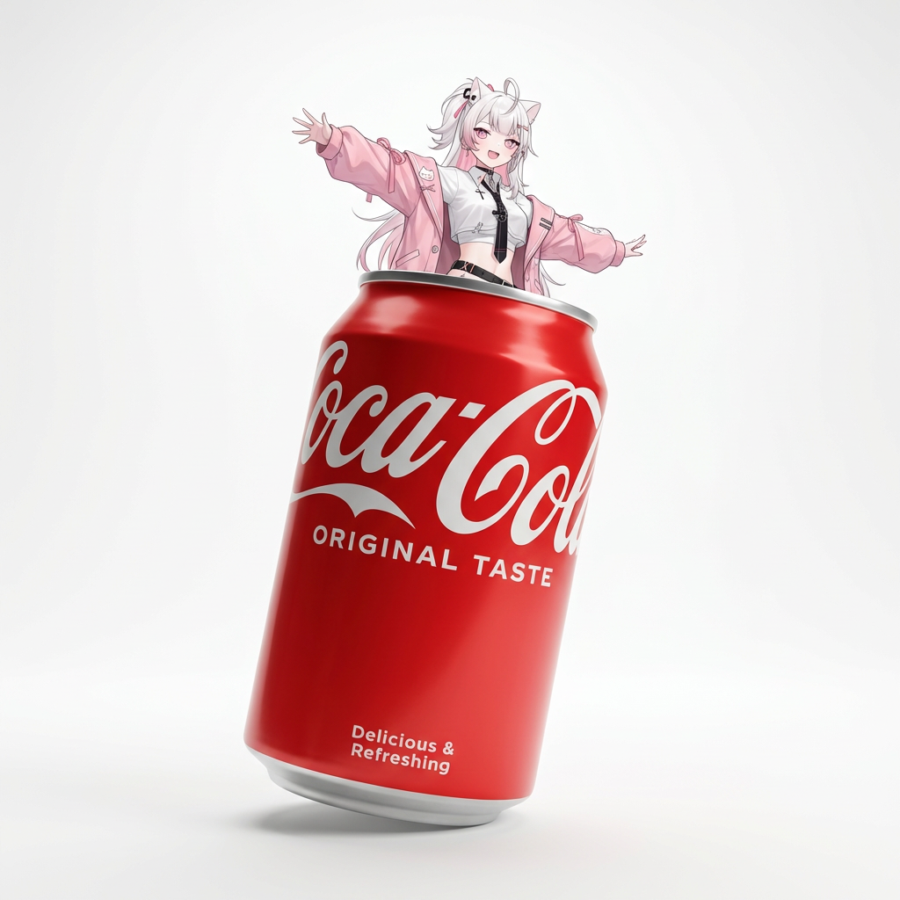

## 3x3 产品分镜
```text
{
  "产品参考": "[PRODUCT]",
  "描述": "创建一个干净的 3×3 故事板网格，共有九个等分面板，比例为 4:5，主要展示该产品。保持产品的外观、颜色、质感和识别性在所有九个面板中保持一致。每个画面中都应清晰可辨，确保其比例、设计细节和材质准确无误。",
  "目标": "此故事板是一个高端的编辑效果图，强调构图、形态、材质感和视觉节奏，而非现实主义或生活方式叙事。整体风格应为精心策划、设计驱动，适合展示作品集。",
  "帧": {
    "帧 1": "正面视角的主图，置于干净的白色工作台面，居中构图，展示冷静自信的表现。",
    "帧 2": "局部特写，突出显示关键的质感、材质或独特细节。",
    "帧 3": "放置在一个以其设计、颜色和材质为灵感的极简工作室环境中。可选道具应简约且有节制。",
    "帧 4": "互动镜头：产品被使用、触摸或轻轻操作。干净的编辑式构图。",
    "帧 5": "等距俯视图，几何结构精准。",
    "帧 6": "稍微倾斜或浮动的视角，强调形状、外形和设计。",
    "帧 7": "特写镜头，突出显示特定细节：边缘、标志、质感或某个特点。",
    "帧 8": "大胆的编辑式构图，配有视觉冲击力强的工作室灯光和设计驱动的布局。",
    "帧 9": "宽阔的构图，展示产品在白色工作台面上的整体效果。整体风格统一、极简且编辑化。"
  },
  "相机与风格": {
    "高质量影像": "超高质量的工作室摄影，配有真实感的相机构图",
    "多个视角": "多种角度：特写、等距视角、浮动视角、宽幅视角",
    "控制景深": "精确的景深控制、精准的光线和真实的材质渲染",
    "纯白背景": "纯白色工作室背景",
    "风格要求": "干净的编辑风格，适合展示作品集的美学"
  }
}
eg:
{
  "产品参考": "[iPhone 15 Plus]",
  "描述": "创建一个干净的 3×3 故事板网格，共有九个等分面板，比例为 4:5，主要展示该产品。保持产品的外观、颜色、质感和识别性在所有九个面板中保持一致。每个画面中都应清晰可辨，确保其比例、设计细节和材质准确无误。",
  "目标": "此故事板是一个高端的编辑效果图，强调构图、形态、材质感和视觉节奏，而非现实主义或生活方式叙事。整体风格应为精心策划、设计驱动，适合展示作品集。",
  "帧": {
    "帧 1": "正面视角的主图，置于干净的白色工作台面，居中构图，展示冷静自信的表现。",
    "帧 2": "局部特写，突出显示关键的质感、材质或独特细节。",
    "帧 3": "放置在一个以其设计、颜色和材质为灵感的极简工作室环境中。可选道具应简约且有节制。",
    "帧 4": "互动镜头：产品被使用、触摸或轻轻操作。干净的编辑式构图。",
    "帧 5": "等距俯视图，几何结构精准。",
    "帧 6": "稍微倾斜或浮动的视角，强调形状、外形和设计。",
    "帧 7": "特写镜头，突出显示特定细节：边缘、标志、质感或某个特点。",
    "帧 8": "大胆的编辑式构图，配有视觉冲击力强的工作室灯光和设计驱动的布局。",
    "帧 9": "宽阔的构图，展示产品在白色工作台面上的整体效果。整体风格统一、极简且编辑化。"
  },
  "相机与风格": {
    "高质量影像": "超高质量的工作室摄影，配有真实感的相机构图",
    "多个视角": "多种角度：特写、等距视角、浮动视角、宽幅视角",
    "控制景深": "精确的景深控制、精准的光线和真实的材质渲染",
    "纯白背景": "纯白色工作室背景",
    "风格要求": "干净的编辑风格，适合展示作品集的美学"
  }
}
```
### 效果图
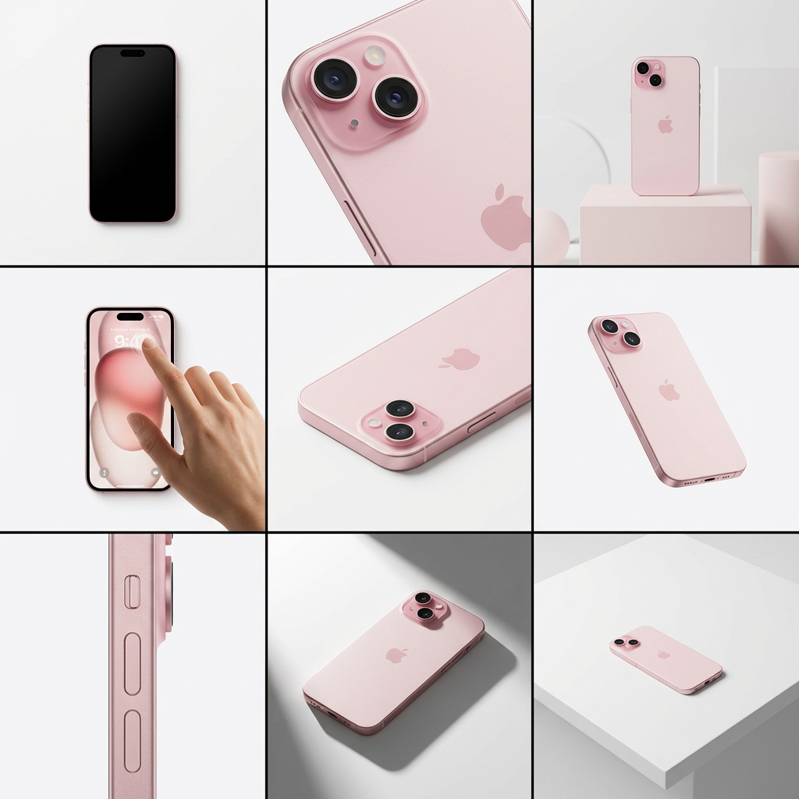

## 第一人称超现实VR 视角
```text
{
  "提示": "第一人称视角，位于一个明亮的超市过道内。真实的手部正在将一瓶芬达汽水靠近镜头。瓶中鲜艳的橙色饮料被多层次的全息增强现实界面包围，界面上显示了营养数据，包括卡路里、糖分含量、咖啡因水平、新鲜度指示器、过期日期，以及基于芬达推荐的清爽饮品和鸡尾酒食谱。",
  "界面元素": "界面元素根据观看者的视线方向平滑地移动和重新排列，仿佛动态响应用户的聚焦。在左侧的外围视野中，出现了一个半透明的垂直购物清单，清单中打勾的项目显示了当前选中的芬达。",
  "视觉效果": "超真实的混合现实，干净的未来感AR设计，玻璃般的UI面板，柔和的环境光，逼真的光线和阴影，自然的景深，沉浸式的第一人称界面，展示下一代零售技术。"
}
```
### 效果图
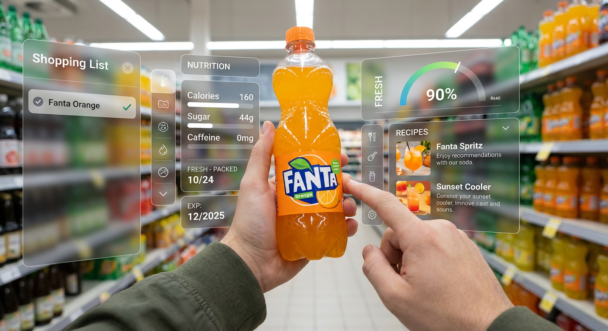