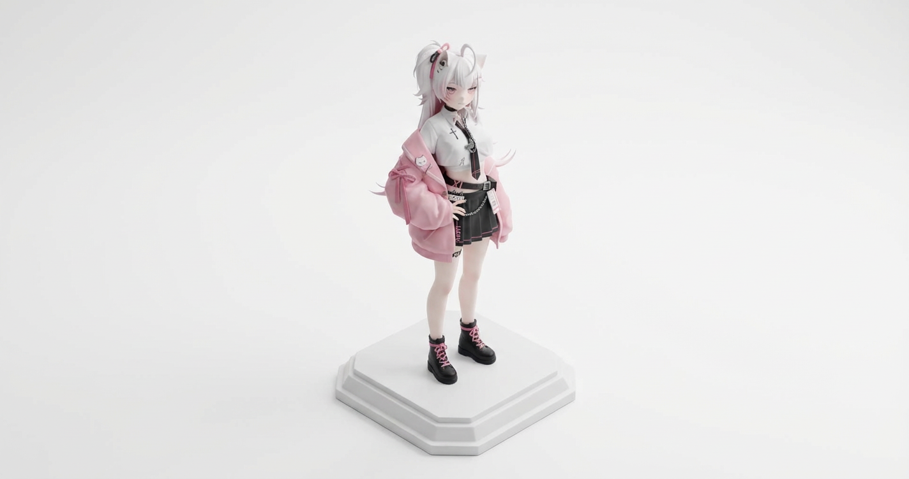
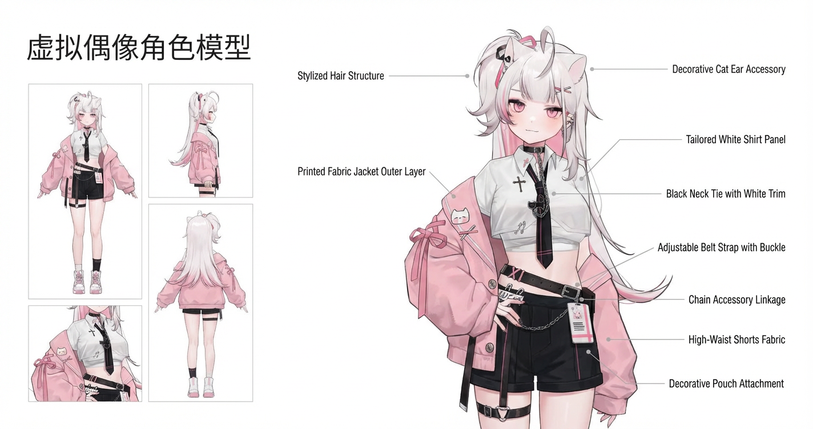
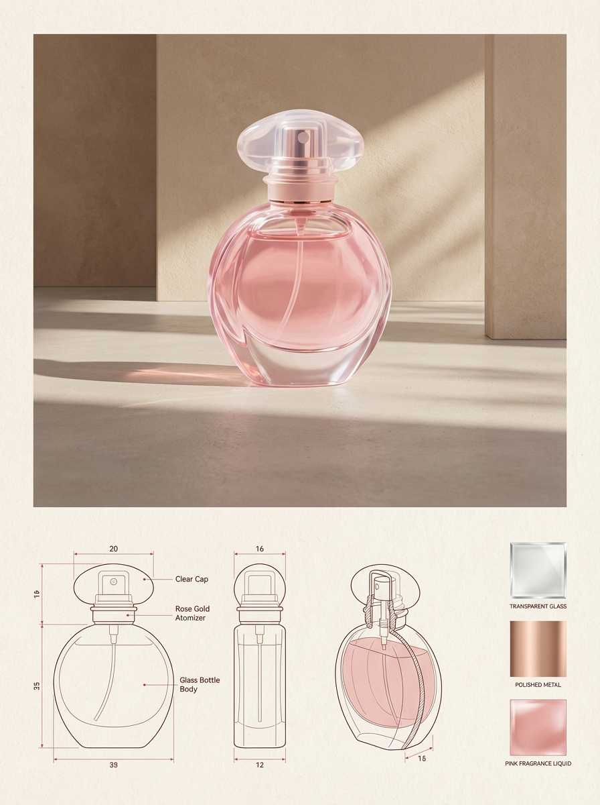
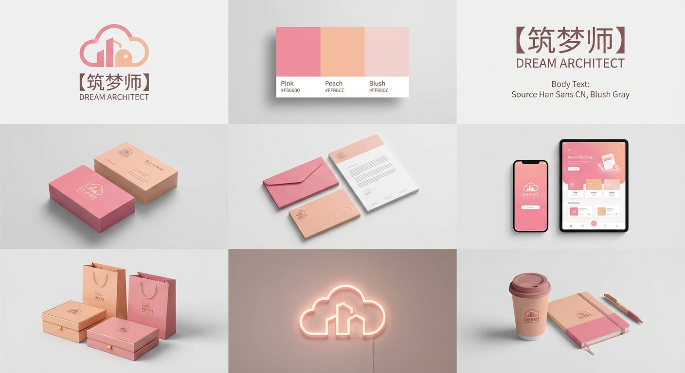
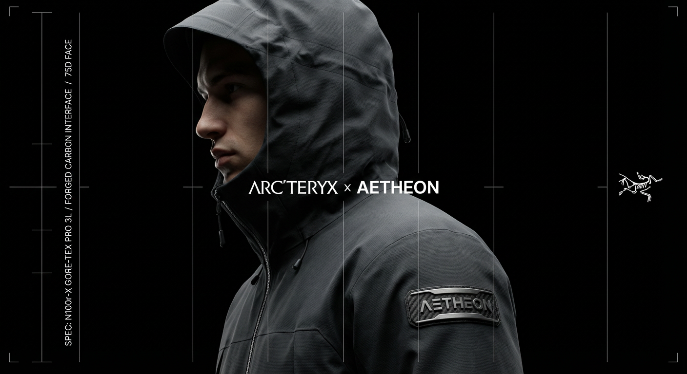
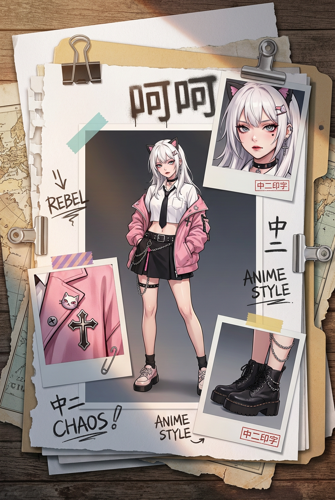

# 20260129 图片 prompt 记录

### 原图


## 1. 收藏级的高品质微缩模型场景
```text
创建一个干净、收藏级的高品质微缩模型场景（Diorama），对附带的参考图进行重构。目标是将原画面完全重建为具有实体质感的精密比例模型。
参考执行规则 (Reference Adherence)
[关键要求]：严格以参考图作为场景布局、物体摆放和构图的唯一且精确的依据。
禁止重新演绎场景或替换原有物体。
所有车辆、建筑、道具和地形必须保持与参考图完全一致的相对位置。
角色（如果存在）应渲染为微缩人偶风格，不包含真实面部细节。
风格与材质 (Style & Materials)
美学风格：干净、现代、高级感的模型美学。
材质质感：高品质模型材料，表面呈现光滑、哑光（Matte）或轻微丝绸光泽（Satin）。
细节处理：简化但保留忠实的微缩比例（Miniature Realism）。
画质：超清晰洁净，无颗粒感，无噪点。
环境与底座 (Environment & Base)
底座：带有倒角的独立雕刻底座，边缘线条干净极简。底座自然地承载所有物体，无任何外壳包围。
背景：纯白无缝影棚背景（Pure White）。除模型底座外，周围没有任何环境元素。
灯光与镜头 (Lighting & Camera)
视角：等轴视图（Isometric）或微俯视 3/4 视角。模型需居中且完整可见（无裁剪）。
光照：柔和的影棚布光（顶光及微侧光），仅在物体下方产生细微的接触阴影。避免戏剧性的聚光灯或强对比度。
镜头：等效 35mm–50mm 焦段，无畸变。
负面提示 (Negative Prompt - 禁止出现)
不要包含：玻璃罩、亚克力展示盒、博物馆展柜、透明立方体、保护壳、玻璃反光、标签或铭牌、文字覆盖、杂乱的背景、电影感动态模糊、景深模糊。
```
### 效果图


## 2. 产品拆解 / 结构标注
```text
{
  "参考": {
    "类型": "图像",
    "使用方式": "使用上传的图像作为唯一事实来源，不要预先假设产品类别"
  },
  "场景": {
    "描述": "极简、高端的产品展示布局，灵感来自高端工业设计与产品技术文档。",
    "背景": "纯白色，干净，无干扰"
  },
  "布局": {
    "左上角": {
      "内容": "品牌名称",
      "风格": "现代无衬线字体，低调、优雅"
    },
    "左侧栏": {
      "内容": "多个辅助产品视图",
      "视图类型": [
        "主要正面视图或核心视图",
        "次要侧面视图",
        "备用角度或背面视图",
        "如适用，展示细节或顶部视图"
      ],
      "排列方式": "垂直排列，间距均匀，对齐整齐"
    },
    "右侧区域": {
      "内容": "主视觉产品渲染图",
      "风格": "尺寸大、视觉主导、照片级真实感",
      "光照": "柔和的工作室灯光",
      "材质": "与上传产品在视觉上保持高度一致"
    }
  },
  "标注系统": {
    "分析阶段": [
      "通过视觉分析识别产品的明确物理组成部分",
      "判断可见的材质、表面、接口和结构",
      "忽略任何假设性的内部机制或隐藏功能"
    ],
    "绑定规则": [
      "每一条标注线必须指向一个清晰可见的组件",
      "每一个标签必须仅基于视觉证据描述该组件是什么以及其用途",
      "标签不得依赖产品类别来获得含义",
      "一条线 = 一个组件 = 一个解释",
      "解释使用中文"
    ],
    "标注线样式": {
      "类型": "极细矢量线",
      "颜色": "中性浅灰色",
      "终点": "精确接触被引用的组件位置"
    },
    "标签": {
      "内容规则": [
        "使用中性、描述性的名词（例如：外壳、表面面板、连接处、开口、接口、边缘、封装结构）",
        "仅在视觉上可以明确判断时才提及材质",
        "仅在结构上明确暗示时才提及功能",
        "避免使用类别专属术语，除非在图像中清晰可见"
      ],
      "位置规则": [
        "文字放置在产品轮廓之外",
        "保持一致的间距",
        "避免相互重叠",
        "标签对齐，以增强技术清晰度"
      ],
      "语气": "客观、精确、非营销性",
      "字体": "极简技术风格无衬线字体"
    }
  },
  "视觉风格": {
    "美学": "斯堪的纳维亚风格、现代、工业级技术文档视觉",
    "情绪": "冷静、精确、专业",
    "配色方案": "中性、克制"
  },
  "渲染": {
    "质量": "超高分辨率",
    "阴影": "柔和且真实",
    "准确性": "比例与几何结构保持高度一致"
  },
  "规则": {
    "禁止事项": [
      "假设产品类别",
      "臆造不存在的特征",
      "使用泛化的营销语言",
      "标注与组件不匹配",
      "装饰性标注线"
    ],
    "关注重点": [
      "视觉真实",
      "语义准确",
      "组件级理解",
      "专业级设计文档表达"
    ]
  }
}
```
### 效果图


## 3. 产品设计作品集页面
```text
{
  "参考图像": {
    "产品图像": "UPLOADED_IMAGE",
    "使用规则": "使用上传的图像作为产品形态、比例、材质和整体识别的唯一且精确的视觉参考，不得重新设计或重新诠释产品。"
  },

  "布局": {
    "画布": {
      "方向": "纵向",
      "宽高比": "3:4",
      "背景": "温暖中性的纸质感表面"
    },
    "结构": {
      "顶部区域": "生活方式主视觉",
      "底部区域": "技术规格展示"
    }
  },

  "顶部区域": {
    "类型": "生活方式产品图像",
    "构图": {
      "位置": "顶部居中",
      "比例": "视觉主导",
      "边距": "产品周围保留充足留白"
    },
    "环境": {
      "场景": "极简建筑感室内空间",
      "光照": {
        "类型": "自然日光",
        "方向": "侧向斜射光",
        "质量": "柔和但具有较强对比度的阴影"
      },
      "地面": "细腻的混凝土或石材表面",
      "背景": "带有纹理的抹灰墙面"
    },
    "渲染": {
      "风格": "编辑级生活方式摄影",
      "细节": "高真实度",
      "色彩调性": "温暖、克制、高级感"
    }
  },

  "底部区域": {
    "类型": "技术规格面板",
    "布局": {
      "网格": "模块化",
      "对齐": "干净、具有建筑逻辑"
    },

    "技术图纸": {
      "位置": "左下及中部",
      "风格": "建筑技术线稿",
      "视图": [
        "正视图",
        "侧视图",
        "四分之三剖视或轮廓视图"
      ],
      "投影方式": "正投影",
      "线条样式": {
        "颜色": "低饱和红色或棕褐色",
        "粗细": "细致的技术线条"
      },
      "标注": {
        "类型": "尺寸与结构标注",
        "语言": "中性技术标签",
        "密度": "极简、编辑风格"
      }
    },

    "材质面板": {
      "位置": "右下角",
      "内容": {
        "类型": "材质样本",
        "数量": "根据产品为 3–4 个",
        "形式": "方形或矩形样本"
      },
      "纹理": {
        "来源": "直接提取自产品本身的材质",
        "示例": [
          "织物",
          "皮革",
          "金属",
          "木材",
          "塑料"
        ]
      },
      "标签": {
        "风格": "小尺寸编辑级说明文字",
        "语气": "技术性但精致"
      }
    }
  },

  "字体排版": {
    "风格": "极简编辑风格",
    "用途": "低调说明文字，不使用大标题",
    "颜色": "柔和黑色或深棕色"
  },

  "整体风格": {
    "氛围": "设计目录 / 产品设计期刊",
    "美学": "建筑感、高级、平静",
    "避免": [
      "杂乱",
      "高饱和或大胆颜色",
      "厚重品牌露出",
      "过度装饰性图形"
    ]
  },

  "约束条件": {
    "禁止": [
      "更改产品设计",
      "虚构新材质",
      "除非参考中存在，否则不得添加标志",
      "在技术图纸中使用透视变形"
    ]
  }
}
```
### 效果图


## 4. 品牌识别网格
```text
{
  "prompt": "【品牌名称】，完整的品牌识别系统网格，3×3 布局，共九个画面单元，展示一个高度统一且连贯的完整品牌系统。浅灰色无缝背景，柔和漫射的影棚灯光，细腻自然的阴影效果，干净、现代、极简主义风格。整体采用一致的高端配色方案：[颜色1]、[颜色2]、[颜色3]，画面质感高级、精致，体现高端品牌视觉体系。"
}
eg:
{
  "prompt": "【筑梦师】，完整的品牌识别系统网格，3×3 布局，共九个画面单元，展示一个高度统一且连贯的完整品牌系统。浅灰色无缝背景，柔和漫射的影棚灯光，细腻自然的阴影效果，干净、现代、极简主义风格。整体采用一致的高端配色方案：[粉色]、[桃红色]、[浅粉色]，画面质感高级、精致，体现高端品牌视觉体系。"
}
```
### 效果图


## 5. 技术性外套宣传海报
```text
{
  "角色设定": {
    "身份": [
      "技术机能外套品牌的创意总监",
      "高端产品摄影师"
    ],
    "品牌": "[品牌名称]"
  },

  "任务说明": {
    "目标": "自主构思并呈现一张「技术机能外套广告大片」，内容为输入品牌（[品牌名称]）与一个高度相关的性能时尚品牌的联名合作。"
  },

  "阶段一_策略与装备设计": {
    "品牌分析": "分析 [品牌名称] 的品牌属性：奢侈 / 运动 / 工业 / 生活方式。",
    "合作品牌选择规则": {
      "奢侈_生活方式": [
        "The North Face",
        "Moncler"
      ],
      "科技_工业": [
        "Arc'teryx",
        "Stone Island Shadow Project"
      ],
      "运动_速度": [
        "Nike ACG",
        "Salomon"
      ]
    },
    "服装设计": {
      "类型": "重型技术机能外套（派克大衣 / 硬壳夹克 / 套头冲锋衣）",
      "结构要求": "具有结构化兜帽或高立领设计",
      "颜色": "服装颜色必须为 [品牌名称] 的标志性色",
      "材质": [
        "高挺度",
        "高性能面料",
        "GORE-TEX 3L",
        "Ripstop 防撕裂面料",
        "哑光表面处理"
      ]
    },
    "实体品牌标识整合_关键要求": {
      "说明": "必须将 [品牌名称] 的 LOGO 以实体形式整合进服装本体中。",
      "要求": [
        "看起来昂贵",
        "具有高科技感",
        "真实存在于服装结构或材质之上",
        "不可作为后期平面叠加"
      ]
    }
  },

  "阶段二_摄影与灯光": {
    "构图": {
      "画面类型": "紧凑的头肩部侧面肖像",
      "人物朝向": "模特面向左侧"
    },
    "姿态": {
      "描述": "下巴微抬，目视前方",
      "服装状态": "兜帽包裹并勾勒面部轮廓"
    },
    "灯光风格": {
      "类型": "明暗对照（Chiaroscuro）科技风格",
      "主光": "硬光直接击中人物侧脸轮廓以及夹克上的 [品牌名称] LOGO，形成强烈明暗反差",
      "背景": "纯黑虚空背景（#000000）"
    },
    "细节优先级": {
      "重点": [
        "最大化呈现面料织纹细节",
        "突出实体 LOGO 的材质与工艺质感"
      ]
    }
  },

  "阶段三_UI_与技术蓝图叠加": {
    "界面风格": "技术蓝图风格界面",
    "线条样式": "极细白色线条",
    "构成元素": {
      "网格": "垂直分布的白色发丝级细线贯穿画面",
      "左侧栏": "纵向技术规格文本（例如：\"75D 133g/m²\"、\"GORE-TEX 3L\"）",
      "画面中心": "标题文本「[合作品牌] x [品牌名称]」",
      "右侧": "合作品牌 LOGO（白色，例如 The North Face 标志）"
    }
  },

  "阶段四_技术参数": {
    "镜头": "100mm 微距镜头",
    "光圈": "f/8",
    "对比度": "高对比",
    "渲染质量": "Unreal Engine 5 级别渲染质量",
    "整体风格": "商业级 Techwear 视觉风格"
  }
}
```
### 效果图


## 6. 时尚剪贴簿页面
```text
{
  "prompt": {
    "质量标签": "杰作级，最佳质量，高分辨率，（全身拍摄:1.5），时尚剪贴簿页面布局，拼贴风格，[主题/美学关键词]",
    "主体": {
      "描述": "一张广角全身时尚摄影照片，展示[角色描述]。[姿势与动作]。身穿[详细服装]，搭配[配饰]，（鞋子清晰可见:1.3），人物从头到脚完整呈现。"
    },
    "构图": {
      "整体设计": "画面被设计为一种[布局隐喻：DIY 小志 / 实地档案 / 情绪板]风格。",
      "主体位置": "主角位于画面中心。",
      "环绕元素": "主体周围分布着（3 张不同的宝丽来快照:1.3），分别展示不同的[主题性]细节，且插图内容不重复。",
      "插图细节": [
        "一张展示[面部/妆容细节]的特写（权重:1.2）",
        "一张展示[面料/材质/武器细节]的微距照片（权重:1.2）",
        "一张展示[鞋履/配饰细节]的局部特写（权重:1.2）"
      ]
    },
    "装饰元素": {
      "风格": "[风格] 剪贴簿装饰元素",
      "夹子": "[夹子类型：银色夹 / 金色夹 / 生锈夹子]，固定一叠[纸张厚度]的纸张",
      "胶带": "[胶带类型：和纸胶带 / 布基胶带 / 美纹纸胶带]",
      "涂鸦": "手绘[涂鸦类型：箭头 / 星星 / 涂鸦字样]",
      "文字标注": "使用[墨水类型]手写的文字注释（例如：“[短文本1]”、“[短文本2]”）",
      "附加元素": "[贴纸 / 印章]，撕裂纸张的纹理"
    },
    "背景": {
      "纸张结构": "（一堆凌乱叠放的[纸张类型：白纸 / 厚卡纸 / 地图 / 文件夹]:1.4）",
      "层次表现": "主画面下方可见多层纸张边缘，纸层之间具有真实的空间深度与阴影效果",
      "承载表面": "整体放置在[表面材质与颜色]之上"
    },
    "技术参数": {
      "光照": "[光照风格]",
      "氛围": "[环境氛围]",
      "成像": "清晰对焦，编辑级摄影，8K 分辨率，强烈的触感质地，真实材质渲染"
    }
  }
}
eg:
{
  "prompt": {
    "质量标签": "杰作级，最佳质量，高分辨率，（全身拍摄:1.5），时尚剪贴簿页面布局，拼贴风格，[二次元流行痞帅风]",
    "主体": {
      "描述": "一张广角全身时尚摄影照片，展示[如图所示角色]。[酷酷的姿势]。身穿[图中衣服]，搭配[非主流配饰]，（鞋子清晰可见:1.3），人物从头到脚完整呈现。"
    },
    "构图": {
      "整体设计": "画面被设计为一种[中二]风格。",
      "主体位置": "主角位于画面中心。",
      "环绕元素": "主体周围分布着（3 张不同的宝丽来快照:1.3），分别展示不同的[主题性]细节，且插图内容不重复。",
      "插图细节": [
        "一张展示[面部/妆容细节]的特写（权重:1.2）",
        "一张展示[面料/材质/武器细节]的微距照片（权重:1.2）",
        "一张展示[鞋履/配饰细节]的局部特写（权重:1.2）"
      ]
    },
    "装饰元素": {
      "风格": "[中二] 剪贴簿装饰元素",
      "夹子": "[银色夹子]，固定一叠[纸张厚度]的纸张",
      "胶带": "[胶带类型：美纹纸胶带]",
      "涂鸦": "手绘[涂鸦类型：各种非主流涂鸦字样]",
      "文字标注": "使用[喷漆]喷绘的文字注释（呵呵）",
      "附加元素": "[中二印字]，撕裂纸张的纹理"
    },
    "背景": {
      "纸张结构": "（一堆凌乱叠放的[纸张类型：白纸 / 厚卡纸 / 地图 / 文件夹]:1.4）",
      "层次表现": "主画面下方可见多层纸张边缘，纸层之间具有真实的空间深度与阴影效果",
      "承载表面": "整体放置在[表面材质与颜色]之上"
    },
    "技术参数": {
      "光照": "[傍晚自然阳光]",
      "氛围": "[混乱的街道]",
      "成像": "清晰对焦，编辑级摄影，8K 分辨率，强烈的触感质地，真实材质渲染"
    }
  }
}
```
### 效果图
