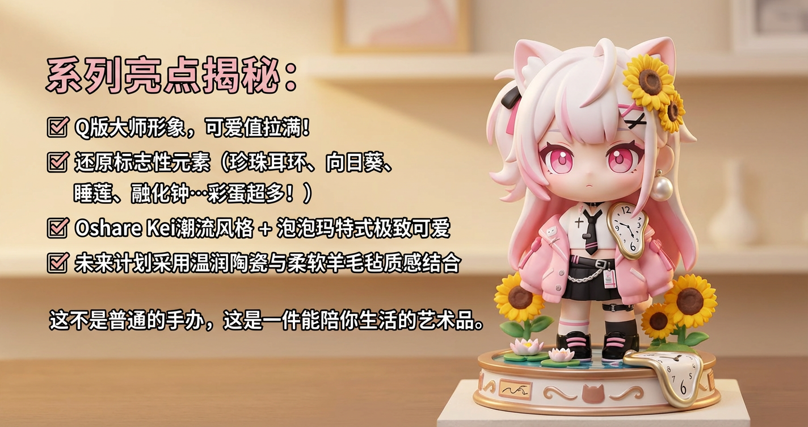
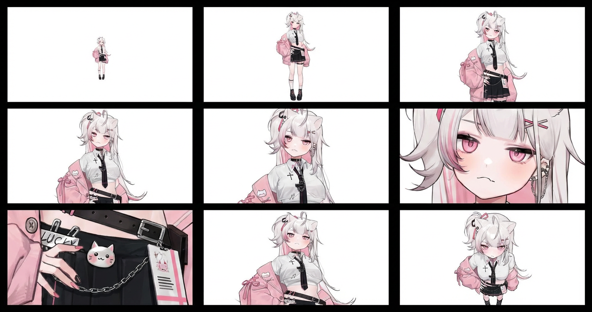
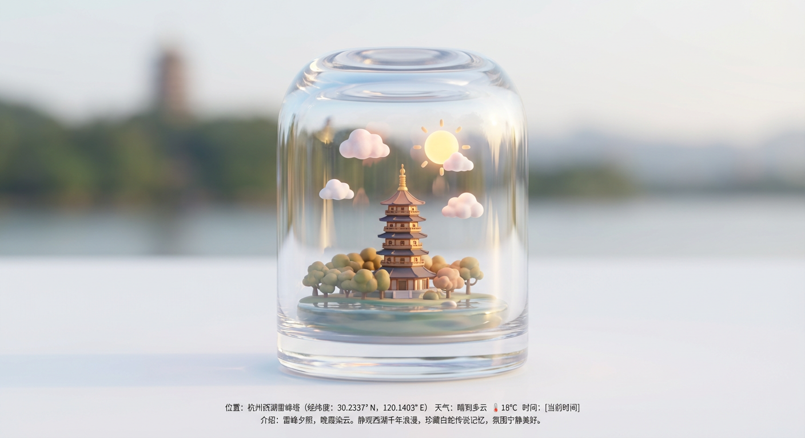
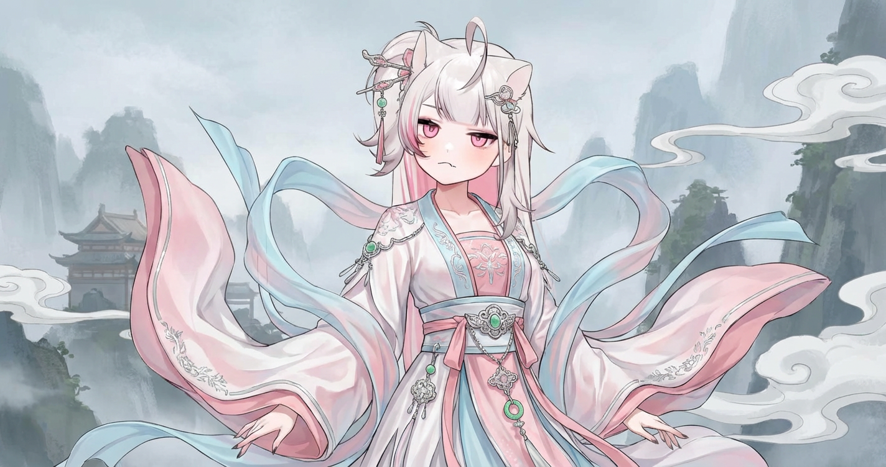

# 历史 图片 prompt 记录

### 原图


## 1. Q 版手办
```text
系列亮点揭秘：
✅ Q版大师形象，可爱值拉满！
✅ 还原标志性元素（珍珠耳环、向日葵、睡莲、融化钟…彩蛋超多！）
✅ Oshare Kei潮流风格 + 泡泡玛特式极致可爱
✅ 未来计划采用温润陶瓷与柔软羊毛毡质感结合
这不是普通的手办，这是一件能陪你生活的艺术品。
```
### 效果图

## 2. 电影网格 ai生图
```text
<instruction> (指令)
分析输入图像的整个构图。识别所有存在的关键主体（无论是单人、群体/情侣、车辆还是特定物体）及其空间关系/互动。
生成一个连贯的 3x3 网格“电影印样（Contact Sheet）”，展示在同一环境中完全是这些主体的 9 个不同镜头。
你必须调整标准的电影镜头类型以适应内容（例如，如果是群体，保持群体在一起；如果是物体，构图包含整个物体）：
第 1 行（建立背景）：
大远景 (ELS)： 主体在广阔的环境中显得很小。
全景 (LS)： 完整的主体或群体从上到下可见（从头到脚 / 从车轮到车顶）。
中远景 (美式镜头/四分之三)： 构图从膝盖以上（针对人物）或 3/4 视角（针对物体）。
第 2 行（核心覆盖）：
4. 中景 (MS)： 构图从腰部以上（或物体的中心核心）。聚焦于互动/动作。
5. 中特写 (MCU)： 构图从胸部以上。主要主体的亲密构图。
6. 特写 (CU)： 紧凑构图于脸部或物体的“正面”。
第 3 行（细节与角度）：
7. 大特写 (ECU)： 强烈聚焦于关键特征（眼睛、手、标志、纹理）的微距细节。
8. 低角度镜头 (仰视/虫眼)： 从地面仰望主体（壮观/英雄感）。
9. 高角度镜头 (俯视/鸟瞰)： 从上方俯瞰主体。
确保严格的一致性：所有 9 个面板中是相同的人物/物体、相同的衣服和相同的光照。景深应逼真地变化（特写镜头中的背景虚化）。
</instruction>
一个包含 9 个面板的专业 3x3 电影故事板网格。
该网格以全面的焦距范围展示输入图像中的特定主体/场景。
顶行： 宽广环境镜头，全视图，3/4 剪辑（膝上景）。
中间行： 腰部以上视图，胸部以上视图，脸部/正面特写。
底行： 微距细节，低角度，高角度。
所有帧均具有照片般逼真的纹理，一致的电影级调色，以及针对所分析的主体或物体特定数量的正确构图
```
### 效果图

## 3. 标志性景观玻璃景
```text
查找 [在此处输入地点名称 或 经纬度坐标] 的标志性景观或建筑，并获取该地点在特定时间的天气状况。 画面的主体是一个极其精致、透亮且带有厚度感的玻璃罐子（类似于圆顶玻璃罩、标本罐或复古水晶球），稳稳地放置在一个干净、柔和的平面上。玻璃罐子内部，封存着该地点代表性景观的Q版微缩模型。模型材质呈现出高级的软润感（类似软陶或磨砂树脂），色彩治愈。在罐内景观的上方，悬浮着对应天气的微缩模型（例如：Q版棉花糖般的云朵、发光的小太阳、或几滴晶莹的雨滴）。 风格为梦工厂动画风格，3D建模，光线极为柔和梦幻。强调玻璃材质的真实感，光线透过玻璃罐产生漂亮的折射、反光和焦散效果，让内部的景物显得更加珍贵。采用强烈的移轴摄影镜头效果，焦点清晰地集中在玻璃罐内的微缩景观上，罐子外部和背景完全虚化模糊。 画面周围大面积留白，保持干净高级感。画面底部居中位置，使用无衬线体小字清晰标注：位置信息（地点名称及具体的经纬度）、天气图标及温度、时间，以及一段关于这个旅行地点的精简中文介绍文案（侧重于描述记忆或氛围）。高品质画面输出，细节丰富惊人。
```
### 效果图

## 4. 服装或配饰图片
```text
在人物身上或上传的照片中给定的人物模拟穿着不同的服装或配饰，并使其具有逼真的褶皱和贴身效果。
风格为: 古风中国仙侠风
```
### 效果图

## 5. 三宫格写真
```text
将图片编辑为三宫格【胶片感/艺术感/电影感】写真。场景为【详细描述时地点，时间，氛围】。画面中【主体】与参考图一致，衣着为【描述穿着】。第一张画面：【景别】，【人物所处的场景位置，动作，（手持物/神态/氛围）】，（添加【中英文】字幕【】）。第二张画面：【景别】，【人物所处的场景位置，动作，（手持物/神态/氛围）】，（添加【中英文】字幕【】）。第三张画面：【景别】，【人物所处的场景位置，动作，（手持物/神态/氛围）】，（添加【中英文】字幕【】）。【整体色调，摄影参数，氛围】，字幕位于底部居中。字幕位于底部居中，三宫格合成一张图。比例【2:3/3:4/9:16】


eg: 将图片编辑为三宫格【胶片感/艺术感/电影感】写真。
场景为雷峰塔下、天空呈火红色夕阳与红橙色渐变，旁边西湖湖面平静。画面中有宠物和参考图一致。
第一张画面：近景，站在塔下的背影，添加英文字幕“I'm not interested in what's inside the tower.”。
第二张画面：宠物侧面放着宋代的油纸伞，侧身站立于塔前，添加中英字幕“I’m not gonna watch it anyway.”。
第三张画面：面部特写，背景依然是塔下，添加中英字幕“I'm afraid the white snake inside will crawl out and eat me.”。
整体色调清冷，带有富士胶片效果，过度曝光，画面粗粝且色调偏暖，暗部细节保留完整，高光区域呈现自然化、柔和漫射光，无明显硬边阴影，营造出文艺且充满自我探索情绪的氛围，字幕位于底部居中，三宫格合成一张图。
```
### 效果图

## 6. 表情包设计
```text
根据以上小女孩形象生成30张**可爱**, **Q版**的表情包图片偏向日系“Chibi”风格，请严格按照以下要求，不能做过多考虑

要求如下，请严格按照要求：
1.<半身><大头><可爱>的表情包，单个图片中只能有**一个表情**，不允许出现一张表情包内有多个角色
2. 为角色增加鹿角等与小鹿有关的服饰, 保持表情包样式不能有多余栏目等
3.表情**刻画细致**，不能有多余肢体等问题, 保持所有图片颜色一致
4.要求生成图片背景为**白色透明背景**
5.重点： 控制图片大小，原图不超过 10M,**规格:png格式|尺寸不限** 压缩后大小不超过 16KB, **规格:png格式|压缩后尺寸:162*162px(16kb以下)**
6.压缩格式为 zip, 安装p7zip，并用7z工具以UTF-8编码重新压缩图片,图片文件命名编码格式为 utf-8 防止 windows 打开出现乱码，返回两个zip压缩包一个为原图一个为压缩后的图片


## 表情包列表

1. **打call**：小女孩双手举起，做出打call的动作，手持应援棒，脸上带着兴奋的笑容。
2. **撒娇**：小女孩微微低头，眼神向上看，嘴巴微嘟，双手合十或轻抚脸颊，表现出可爱的撒娇姿态。
3. **哭泣**：小女孩眼含泪水，嘴巴向下撇，表情委屈，可以有小小的泪珠从眼角滑落。
4. **得意**：小女孩扬起下巴，眼睛微眯，嘴角上扬，露出自信又带点小骄傲的笑容。
5. **惊讶**：小女孩眼睛瞪大，嘴巴微张呈“O”形，眉毛上扬，表现出极度惊讶的表情。
6. **害羞**：小女孩脸颊微红，眼神躲闪，双手可能捂住脸颊或交叉在胸前，表现出不好意思的样子。
7. **生气**：小女孩眉毛紧蹙，嘴巴紧闭或向下撇，脸颊鼓起，表现出不高兴或生气的样子。
8. **开心**：小女孩眼睛弯弯，嘴巴大笑，露出洁白的牙齿，全身散发出快乐的气息。
9. **思考**：小女孩食指轻点下巴，眼睛看向一侧，眉毛微皱，表现出认真思考的表情。
10. **困倦**：小女孩眼睛半闭，打着哈欠，可能揉揉眼睛，表现出困倦想睡觉的样子。
11. **比心**：小女孩双手做出比心的动作，脸上带着甜美的笑容。
12. **点赞**：小女孩竖起大拇指，脸上带着鼓励或赞同的笑容。
13. **无语**：小女孩翻白眼，嘴巴紧闭，脸上带着一丝无奈或无语的表情。
14. **震惊**：小女孩张大嘴巴，眼睛瞪圆，双手可能捂住嘴巴，表现出极度震惊的样子。
15. **期待**：小女孩双手合十放在胸前，眼睛闪烁着光芒，脸上带着渴望和期待的表情。
16. **害怕**：小女孩身体微微颤抖，眼睛紧闭或半闭，表情惊恐，可能双手抱住自己。
17. **卖萌**：小女孩做出各种可爱的动作，如吐舌头、眨眼、嘟嘴等，表情萌化。
18. **加油**：小女孩握紧拳头，手臂弯曲，脸上带着坚定的表情，为他人加油打气。
19. **谢谢**：小女孩双手合十，微微鞠躬，脸上带着真诚的感谢笑容。
20. **再见**：小女孩挥手，脸上带着友好的笑容，表示告别。
21. **吃惊**：小女孩嘴巴微张，眼睛睁大，眉毛上扬，表现出轻微的吃惊。
22. **抱抱**：小女孩张开双臂，脸上带着温暖的笑容，仿佛要给一个拥抱。
23. **比耶**：小女孩双手比出“V”字手势，脸上带着俏皮的笑容。
```
### 效果图
[虚拟表情包示例](https://github.com/Forgotten-Forever/BilibiliVirtualAnchorEmojiPackage)